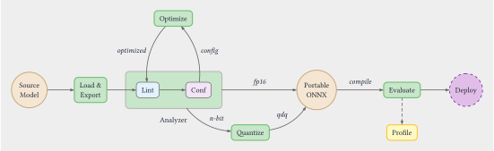

# WinML CLI

[](https://github.com/microsoft/winml-cli/actions/workflows/modelkit-ci.yml)

[](https://pypi.org/project/winml-cli/)


**Windows ML CLI** is a command line tool for building **portable, performant, and high-quality** AI models for Windows ML. It takes you from a source model — whether from Hugging Face or your own pipeline — to a hardware-optimized artifact in a reproducible workflow.

Purpose-built for Windows hardware diversity, the CLI handles conversion, graph optimization, and compilation across AMD, Intel, NVIDIA, and Qualcomm targets. The CLI fits naturally into CI/CD pipelines so teams can validate and ship models easily.

---

## :dart: Features

✅ **You want to build models that run with Windows ML on any device** — seamlessly across CPU, GPU, and NPU

✅ **You want to benchmark models with one command** — get latency, throughput, and live hardware utilization

✅ **You want to optimize models out of the box** — with built-in graph optimizations, quantization, and EP-aware tuning

✅ **You want deep insights into your model** — including unsupported operators, shape mismatches, and execution provider gaps

✅ **You want a repeatable and traceable workflow** — with config-driven pipelines that are inspectable at every stage

✅ **You want AI agents to build and profile models for you** — with agent-ready skills for automation via coding assistants

### :compass: Scope

WinML CLI supports **classic deep learning models** for now — LLM support is on the way.

**Supported execution providers:** QNN · OpenVINO · VitisAI · NvTensorRTRTX · Dml · CPU — covering NPU, GPU, and CPU across Windows ML. See the [Supported Hardware](#supported-hardware) reference table for the full EP-to-device mapping.

The [built-in model catalog](#built-in-models) includes verified models that run across all EPs supported by Windows ML and serve as a reliable starting point. WinML CLI is not limited to these — you can bring **any model** you have:

- **HuggingFace model ID** (e.g., `microsoft/resnet-50`) — weights are downloaded on first run
- **Local ONNX file** (e.g., `model.onnx`) — from `winml export`, `winml build`, or any ONNX you already have

See the [Supported Tasks](#supported-tasks) and [Supported Model Types](#supported-model-types) reference tables for the full list.

**Known constraints:**

- Some models may export successfully but fail during optimization or quantization due to unsupported operator patterns. The analyzer will flag these issues.
- Performance numbers vary by device, driver version, and EP version. Always benchmark on your target hardware.

---

## :rocket: Getting Started

### Prerequisites

| Component | Details |
|---|---|
| Windows | Windows 11 24H2 or later (required for NPU support; earlier versions work for CPU/GPU) |
| Python | 3.11 |
| Package manager | [`uv`](https://github.com/astral-sh/uv) |
| **WinML CLI** (Python wheel) | [Releases](https://github.com/microsoft/winml-cli/releases) |
| **WinML CLI** (Python wheel) | [Releases](https://github.com/microsoft/winml-cli/releases) |
### Installation

WinML CLI requires **Python 3.11** and is distributed as a Python wheel. We recommend [uv](https://docs.astral.sh/uv/) for fast, reproducible environment setup.

**1. Create an environment**

```bash
uv venv --python 3.11
```

Activate it:

```bash
# Windows (PowerShell)
.venv\Scripts\activate

# Windows (Git Bash / WSL)
source .venv/Scripts/activate
```

**2. Install from wheel**

```bash
uv pip install winml_cli-<version>-py3-none-any.whl
```

**3. Verify your environment**

```bash
uv run winml sys --list-device --list-ep
```

`--list-device` and `--list-ep` print only the hardware and EP inventory, skipping SDK versions and Python environment details that plain `winml sys` would include. If the command exits without error, your winml-cli install is ready.

### Quick Start

WinML CLI supports two ways to build a model — choose the one that fits your workflow:

- [**Config-Build Driven Pipeline**](#config-build-pipeline) — generate a config file first, then run a single build command. Best for reproducible, CI/CD-friendly workflows.
- [**Primitive Commands**](#step-by-step-through-primitive-commands) — run each pipeline stage individually. Best for exploring, debugging, or custom workflows.

This walkthrough uses `facebook/convnext-tiny-224` as an example model.

#### Config-Build Pipeline

##### Step 0: Check model readiness

Before running any pipeline command, verify the model is supported:

```bash
uv run winml inspect -m facebook/convnext-tiny-224
```

This prints the model's task, model class, input/output tensor names and shapes, and execution provider compatibility — without downloading weights. If inspect succeeds, the model is supported and you can proceed.

##### Step 1: Generate the build config

```bash
uv run winml config -m facebook/convnext-tiny-224 --device auto -o convnext_config.json
```

`winml config` queries Hugging Face, auto-detects the task and model type, and produces a WinMLBuildConfig JSON. Passing `--device auto` tells the config generator to resolve the target device at generation time — it inspects your hardware and writes the winning device (NPU, GPU, or CPU) together with matching precision and compile settings into `convnext_config.json`. You can open the file to see exactly what was picked before committing to a full build.

##### Step 2: Run the build

```bash
uv run winml build -c convnext_config.json -m facebook/convnext-tiny-224 -o convnext_out/
```

This single command runs all four pipeline stages in sequence — export, optimize, quantize, and compile — reading the device and precision settings recorded in `convnext_config.json`. The compile stage targets whichever device the config captured: it calls the QNN backend and embeds a pre-compiled Hexagon binary on NPU, or it compiles a DirectML graph on GPU, or it produces a standard optimized ONNX for CPU. All intermediate artifacts land in `convnext_out/`, so you can inspect or reuse any stage independently.

You can also pass `--no-quant` or `--no-compile` to stop the pipeline early, or `--rebuild` to force re-running even when cached artifacts exist.

##### Step 3: Benchmark on your device

```bash
uv run winml perf -m convnext_out/<artifact>.onnx --device auto --iterations 50 --monitor
```

Replace `<artifact>` with the filename written to `convnext_out/` by the build. For NPU builds the compiled artifact is named `model.onnx` in the output directory (the `_npu_ctx.onnx` suffix applies only when the compile stage produces an EPContext file, which requires `enable_ep_context=True` in the compile config). You can check the directory listing or read the compiled artifact path from the build output to get the exact name.

#### Step-by-step through primitive commands

This walkthrough builds **ConvNeXT** (`facebook/convnext-base-224`) step by step using primitive commands.

##### Step 1: Inspect

```bash
winml inspect -m facebook/convnext-base-224
```

##### Step 2: Build a Portable Model

Export from PyTorch to ONNX:

```bash
winml export -m facebook/convnext-base-224 -o convnext/model.onnx -v
```

Analyze for EP compatibility:

```bash
winml analyze -m convnext/model.onnx --optim-config optim.json
```

Optimize the graph using the analyzer's config:

```bash
winml optimize -m convnext/model.onnx -c optim.json -o convnext/model_opt.onnx
```

Quantize to w8a16:

```bash
winml quantize -m convnext/model_opt.onnx --precision w8a16 -o convnext/model_opt_w8a16.onnx
```

##### Step 3: Benchmark on Device

Compile for NPU (generates device-specific binaries):

```bash
winml compile -m convnext/model_opt_w8a16.onnx --ep qnn -o convnext/model_compiled.onnx
```

Benchmark on NPU — note the latency:

```bash
winml perf -m convnext/model_compiled.onnx --ep qnn --iterations 100
```

Benchmark on CPU for comparison:

```bash
winml perf -m convnext/model_opt.onnx --ep cpu --iterations 100
```

Compare the two numbers to see the performance difference between NPU and CPU inference.

---

## :wrench: Commands

### The BYOM Workflow

The **Build Your Own Model** (BYOM) workflow is the philosophy behind WinML CLI. It defines how a source model becomes a production-ready, device-optimized artifact.

```text
Source Model --> Export --> Analyze --> Optimize --> Quantize --> Compile --> Benchmark
```



Each arrow is a WinML CLI command. You can enter the pipeline at any stage (for example, start with a local ONNX file and skip export), exit early (stop after optimization if you do not need quantization), or loop back to repeat a stage with different settings.

| Category | Commands | Purpose |
| --- | --- | --- |
| **Primitives** | `inspect` `export` `optimize` `quantize` `compile` | Single-stage building blocks |
| **Pipeline** | `config` `build` `perf` `eval` | End-to-end orchestration |
| **Insights** | `analyze`| Diagnostics and compatibility |
| **Utilities** | `catalog` `sys` | Catalog, and environment |

<details>
<summary><strong>Primitives</strong> — one stage at a time</summary>

**`winml inspect`** — Discover model metadata. Prints the task, model class, input/output tensor names and shapes, and execution provider compatibility. No weights are loaded — this reads only the model configuration, making it fast and lightweight. Always run inspect first to verify a model is supported.

**`winml export`** — Convert a source model to ONNX. Takes a Hugging Face model ID (or local checkpoint) and produces a standards-compliant ONNX file with hierarchy-preserving metadata.

**`winml optimize`** — Fuse operators, simplify graphs, and prepare for target EPs. Takes an ONNX model and an optimization config (typically generated by `winml analyze`) and applies graph-level transformations: operator fusion, constant folding, shape inference, and EP-specific rewrites.

**`winml quantize`** — Compress to low-bit precision. Reduces model size and inference latency by converting weights and activations from FP32 to INT8 (or other low-bit formats). After quantization, the model is portable — it can run on any ONNX Runtime backend.

**`winml compile`** — Generate device-specific binaries. Takes a quantized ONNX model and produces EP-specific compiled artifacts (for example, QNN context binaries for Qualcomm NPU). This step locks the model to a specific device but delivers the lowest possible inference latency.

</details>

<details>
<summary><strong>Pipeline</strong> — orchestrated workflows</summary>

**`winml config`** — Auto-detect optimal settings into a JSON config. Inspects the model and generates a complete build specification: task, I/O shapes, optimization flags, quantization parameters, and target EP settings. The config file is reviewable, editable, and version-controllable — the single source of truth for your build.

**`winml build`** — Orchestrate the full pipeline. Takes a config file and executes every stage in sequence: export, analyze, optimize, quantize, and compile. Two commands (`config` + `build`) replace eight manual steps.

**`winml perf`** — Benchmark latency, throughput, and hardware utilization. Runs inference on the target device and reports latency percentiles (p50, p90, p99), throughput (inferences per second), and optionally live hardware monitoring (CPU, RAM, NPU utilization) with the `--monitor` flag. Can accept a local ONNX file or a Hugging Face model ID.

**`winml eval`** — Measure model accuracy against reference datasets. Compares the output of your optimized/quantized model against the original to quantify any accuracy loss introduced by the pipeline.

</details>

<details>
<summary><strong>Insights</strong> — understand what is happening inside</summary>

**`winml analyze`** — Lint operators, check EP compatibility, and generate optimization config. The analyzer has two components: the **Linter** (like ESLint for ONNX) checks every operator against target EPs and classifies each as supported, partial, or unsupported. **AutoConf** detects suboptimal patterns and generates the optimization config that the optimizer consumes. Together they form the analyze-optimize loop.

</details>

<details>
<summary><strong>Utilities</strong> — catalog, and environment</summary>

**`winml catalog`** — Browse the curated built-in model catalog.

**`winml sys`** — System information and capability reporting. Prints detected hardware, available EPs, Python version, and installed package versions.

</details>

|  | **Config-Driven Pipeline** | **Primitive Commands** |
|:--|:--|:--|
| **Steps** | Two steps: **config** + **build** | One command **per stage** |
| **Control** | Repeatable, tweakable, version-controllable | Start from any stage; try different settings to fix errors or tweak performance |
| **Best for** | Production-ready **delivery** | **Flexible** workflow |
| **When to use** | CI/CD, batch builds, team workflows | Exploring, debugging, prototyping |
| **Lifecycle** | Polish | "Coding" phase |

---

## :handshake: Contributing

We welcome contributions! Please see the [contribution guidelines](CONTRIBUTING.md).

For feature requests or bug reports, please file a [GitHub Issue](https://github.com/microsoft/winml-cli/issues).

### Code of Conduct

See [CODE_OF_CONDUCT.md](CODE_OF_CONDUCT.md).

### License

This project is licensed under the [MIT License](LICENSE.txt).

### Trademarks

This project may contain trademarks or logos for projects, products, or services. Authorized use of Microsoft
trademarks or logos is subject to and must follow
[Microsoft's Trademark & Brand Guidelines](https://www.microsoft.com/en-us/legal/intellectualproperty/trademarks/usage/general).
Use of Microsoft trademarks or logos in modified versions of this project must not cause confusion or imply Microsoft
sponsorship. Any use of third-party trademarks or logos are subject to those third-party's policies.

---

## Supported Hardware

| Execution Provider | Hardware | Status | EP Flag | Device Flag |
| --- | --- | --- | --- | --- |
| **QNN** | Qualcomm NPU & GPU (Snapdragon X Elite) | 🟢 Ready | `--ep qnn` | `--device npu` or `--device gpu` |
| **OpenVINO** | Intel NPU, GPU & CPU (Meteor Lake / Lunar Lake) | 🟢 Ready | `--ep openvino` | `--device npu`, `--device gpu`, or `--device cpu` |
| **VitisAI** | AMD NPU — Ryzen AI (Phoenix / Hawk Point / Strix) | 🟢 Ready | `--ep vitisai` | `--device npu` |
| **NvTensorRTRTX** | NVIDIA discrete GPUs | 🟢 Ready | `--ep nv_tensorrt_rtx` | `--device gpu` |
| **MIGraphX** | AMD discrete GPUs | ⚠️ Coming soon | `--ep migraphx` | `--device gpu` |
| **Dml** | Hardware-agnostic GPU backend | 🟢 Ready | `--ep dml` | `--device gpu` |
| **CPU** | Cross-platform fallback | 🟢 Ready | `--ep cpu` | `--device cpu` |

> **Tip:**
>
> - For scenarios where you want to benchmark a model, if no `--device` is specified, WinML CLI defaults to `--device auto` and picks the best available device on your machine — NPU first, then GPU, then CPU.
> - For scenarios where you want to get insights across all EPs, use `--device all` to cover all WinML EPs, or specify a target like `--device npu` to focus on a particular device class.

---

## Supported Tasks

| Task | Category |
| --- | --- |
| `image-classification` | Vision |
| `image-segmentation` / `semantic-segmentation` | Vision |
| `image-feature-extraction` | Vision |
| `image-to-image` / `image-to-text` / `image-text-to-text` | Vision |
| `object-detection` | Vision |
| `depth-estimation` | Vision |
| `keypoint-detection` | Vision |
| `mask-generation` / `masked-im` / `inpainting` | Vision |
| `zero-shot-image-classification` / `zero-shot-object-detection` | Vision |
| `text-classification` | NLP |
| `token-classification` | NLP |
| `question-answering` / `document-question-answering` | NLP |
| `text-generation` / `text2text-generation` | NLP |
| `fill-mask` / `feature-extraction` / `text-to-image` | NLP |
| `multiple-choice` / `next-sentence-prediction` | NLP |
| `sentence-similarity` | NLP |
| `audio-classification` / `audio-frame-classification` / `audio-xvector` | Audio |
| `automatic-speech-recognition` | Audio |
| `text-to-audio` | Audio |
| `visual-question-answering` | Multimodal |
| `time-series-forecasting` | Other |
| `reinforcement-learning` | Other |

---

## Supported Model Types

| Model Type | Category | Supported Tasks |
| --- | --- | --- |
| `convnext` | Vision | image-classification |
| `detr` | Vision | object-detection |
| `depth_anything`, `depth_pro`, `zoedepth` | Vision | depth-estimation |
| `segformer` | Vision | image-segmentation |
| `swin2sr` | Vision | image-to-image |
| `sam`, `sam2`, `sam2-video` | Vision | mask-generation, image-segmentation |
| `bert` | NLP / Encoder | text-classification, token-classification, question-answering, and more |
| `roberta`, `camembert`, `xlm-roberta` | NLP / Encoder | text-classification, token-classification, and more |
| `bart`, `marian`, `t5` | NLP / Encoder | text2text-generation, feature-extraction |
| `blip` | Multimodal | image-to-text, image-text-to-text |
| `clip`, `clip-text-model`, `clip-vision-model` | Multimodal | feature-extraction, image-feature-extraction |
| `siglip`, `siglip-text-model`, `siglip-vision-model` | Multimodal | feature-extraction, image-feature-extraction |
| `vision-encoder-decoder` | Multimodal | image-to-text, text2text-generation |
| `mu2`, `qwen3` | Generative | text2text-generation |

---

## Built-in Models

Run `winml catalog` to browse the full catalog interactively.

| Model ID | Task | Architecture |
| --- | --- | --- |
| `microsoft/resnet-50` | image-classification | ResNet |
| `google/vit-base-patch16-224` | image-classification | ViT |
| `microsoft/swin-large-patch4-window7-224` | image-classification | Swin |
| `facebook/convnext-tiny-224` | image-classification | ConvNeXT |
| `rizvandwiki/gender-classification` | image-classification | ViT |
| `ProsusAI/finbert` | text-classification | BERT |
| `Intel/bert-base-uncased-mrpc` | text-classification | BERT |
| `cardiffnlp/twitter-roberta-base-sentiment-latest` | text-classification | RoBERTa |
| `dslim/bert-base-NER` | token-classification | BERT |
| `dbmdz/bert-large-cased-finetuned-conll03-english` | token-classification | BERT |
| `Babelscape/wikineural-multilingual-ner` | token-classification | BERT |
| `w11wo/indonesian-roberta-base-posp-tagger` | token-classification | RoBERTa |
| `microsoft/table-transformer-detection` | object-detection | Table Transformer |
| `mattmdjaga/segformer_b2_clothes` | image-segmentation | SegFormer |
| `nvidia/segformer-b1-finetuned-ade-512-512` | image-segmentation | SegFormer |
| `nvidia/segformer-b2-finetuned-ade-512-512` | image-segmentation | SegFormer |
| `nvidia/segformer-b5-finetuned-ade-640-640` | image-segmentation | SegFormer |
