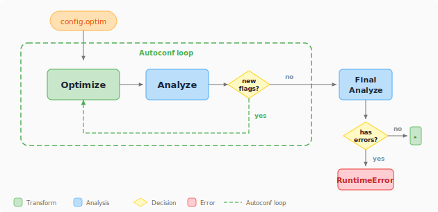

# Analyze and optimize

Not every ONNX graph runs efficiently on every execution provider. An operator that compiles cleanly on CPU may be unsupported on an NPU, and a correct graph may still leave performance on the table because adjacent operations were not fused. winml-cli separates the concern into two commands — `winml analyze` and `winml optimize` — that together form a graph-quality loop driven automatically by `winml build`.

## What analyze does

`winml analyze` performs static analysis on an ONNX graph to answer one question: **will this model run end-to-end on my target execution provider, and if not, what needs to change?**

Unlike profiling, static analysis does not require executing the full model on the target device. It inspects each operator (and recognized subgraph pattern) against a rule database of known EP capabilities, classifies every node, and emits actionable recommendations. The same analyzer also drives the autoconf feedback loop inside `winml build`, so understanding how it works is useful even when you never invoke `winml analyze` directly.

Specify a target EP with `--ep` (e.g., `--ep qnn` or `--ep openvino`) and a device with `--device` (CPU, GPU, or NPU). The default `--ep auto` infers from locally available EPs; pass `--ep all` to evaluate every rule-data-backed EP regardless of local availability. Results print to the console by default; add `--output results.json` to save the report as JSON for scripting or archiving.

### How operators are classified

For each operator (and matched subgraph pattern) the analyzer follows a two-step process:

1. **Rule-database lookup** — does the target EP claim to support this pattern?
2. **Local probe (fallback)** — if the pattern is absent from the rule database and `--run-unknown-op` is enabled, the analyzer builds a minimal ONNX graph for the op and runs it on the target EP locally to determine support (see [Local op execution](#local-op-execution) below).

The combined answer is recorded as a `SupportLevel`:

| Level         | Compile on target EP | Runs (possibly via CPU fallback) | CLI label          | Exit code contribution |
| ------------- | -------------------- | -------------------------------- | ------------------ | ---------------------- |
| `SUPPORTED`   | yes                  | yes                              | `Fully Supported`  | 0                      |
| `PARTIAL`     | no                   | yes                              | `Partial Support`  | 1 (warning)            |
| `UNSUPPORTED` | no                   | no                               | `Not Supported`    | 1 (error)              |
| `UNKNOWN`     | n/a                  | n/a                              | `Unknown Support`  | 1                      |

A `PARTIAL` classification means the operator cannot be dispatched to the requested EP but the ONNX Runtime can still execute the model by falling back to CPU. This is technically a working model, but the latency and power-efficiency goals of NPU deployment are not met. `UNSUPPORTED` means even the CPU fallback path fails, so the model will not run at all. `UNKNOWN` appears only when the analyzer lacks both rule-database data and the ability to test locally.

### Two key outputs: lint and autoconf

Every analysis produces a **lint** result; the default (full) mode additionally produces an **autoconf** result. Understanding these two outputs separately is the easiest way to understand what `winml analyze` is for and how to consume it.

**Lint** is the analyzer's verdict on the model as it stands today. It classifies every operator and recognized pattern against the target EP and rolls the classifications up into:

- `errors` — count of `UNSUPPORTED` patterns. **The model will not run.**
- `warnings` — count of `PARTIAL` patterns. The model runs, but these nodes fall back to CPU.
- `passed` — `True` iff `errors == 0 and warnings == 0`.

Lint always runs. It is deterministic and sufficient for a yes/no CI gate — the CLI's exit code is derived from it.

**Autoconf** is the analyzer's _suggestion_ for how to fix the current model. It lists the fusion flags which, if enabled in the optimize stage, would convert one or more `PARTIAL`/`UNSUPPORTED` patterns into `SUPPORTED` ones.

Autoconf is what powers the build pipeline's [re-optimization loop](#the-analyzeroptimizer-loop): when the analyzer says "`gelu_fusion` would resolve these warnings", the build re-runs optimize with that flag and re-analyzes — until no further suggestions remain or the iteration limit is hit. Autoconf is _advisory_; nothing else in the system flips fusion flags automatically.

### Analysis modes

`winml analyze` can run in two modes which differ only in whether autoconf is computed:

| Mode               | How to enable                                              | Output                                                                 | When to use                                     |
| ------------------ | ---------------------------------------------------------- | ---------------------------------------------------------------------- | ----------------------------------------------- |
| **Lint-only**      | `--no-information` (CLI) or `autoconf=False` (Python)      | Lint only. `optimization_config` is `None`.                            | CI gate; pass/fail only                         |
| **Full** (default) | `--information` (CLI, default) or `autoconf=True` (Python) | Lint **plus** autoconf and recommendations | Local debugging; build pipeline's autoconf loop |

The only difference between the two modes is whether autoconf and the human-readable recommendations are computed. Skipping them gives a faster, leaner run. The lint result is identical either way.

### Three classes of finding

Every analysis emits findings in three buckets. Each bucket maps to a different remediation pattern.

**Errors (`UNSUPPORTED` patterns)** block deployment. Either the operator does not exist on the target EP at all, or it does not handle the specific input shape/dtype the model uses. Typical remediations:

- Rewrite the model to use an equivalent pattern the EP does support.
- Lower the opset version of the offending op if the EP supports an older opset.
- Insert pre/post-processing to massage shapes into a supported configuration.

Each error pattern includes a recommendation that identifies the current pattern and the target pattern the EP does support, so the optimizer (or a manual rewrite) can apply the fix.

**Warnings (`PARTIAL` patterns)** mean the model will run, but the target EP cannot dispatch this pattern. Inference falls back to the CPU EP, breaking the deployment goal (e.g., NPU offload) without breaking correctness. Warnings are usually fusion opportunities — the analyzer recognized a sub-pattern that, if fused, would become a single EP-native op. The fix is to enable the relevant fusion flag in the optimize stage — this is exactly what the autoconf loop does automatically.

**Info (`Information` items)** are lower-priority insights: a hint that an alternative pattern exists, a QDQ-equivalent that could be used after quantization, or a description of why a node was classified as it was. Info entries never affect exit code.

### Local op execution

The static rule database does not cover every operator and every shape/dtype combination. When `--run-unknown-op` is enabled and the analyzer encounters a pattern not present in the database, it builds a tiny ONNX graph containing just that op (with the model's actual input metadata) and runs it on the target EP locally. The compile/run result becomes the classification. Without `--run-unknown-op` (the default), such patterns are classified as `UNKNOWN`.

Leave `--run-unknown-op` disabled when:

- The local machine does not have the target EP available (e.g., analyzing a QNN model from a non-Snapdragon machine).
- You want bit-for-bit reproducible analysis across machines. Local execution can produce different results depending on driver versions.

### Save-node: debugging unsupported subgraphs

When a pattern is unsupported and the recommendation does not immediately tell you what is wrong, use `--save-node` to dump the offending subgraph to disk as a self-contained, runnable `.onnx` file. You can then open it in [Netron](https://netron.app/), re-analyze it in isolation, or attach it to a bug report as a minimal reproducer. See the [analyze command reference](../commands/analyze.md) for usage examples.

### HTP metadata enhancement

When a model is exported with hierarchy-preserving tags (HTP), the export produces a sidecar `_htp_metadata.json` that maps each ONNX node back to its source module (e.g., `encoder.layer.0.attention.self.GELUActivation`). Passing this file via `--htp-metadata` lets the `PatternExtractor` use the module hierarchy to match subgraph patterns more accurately than operator-level heuristics alone.

HTP metadata is consumed at the pattern extraction stage — before any EP-specific runtime checking — so the enriched patterns benefit all target EPs equally (QNN, OpenVINO, VitisAI, etc.). Without HTP metadata, the analyzer falls back to attribute-based tag matching and then the general-purpose `PatternMatcher`; with it, the analyzer can correctly identify fused patterns (GELU, LayerNorm, Attention) that are difficult to detect from the raw operator graph. See the [analyze command reference](../commands/analyze.md) for usage examples.

### What runs internally

The analyzer is composed of five stages that run in order. You normally do not need to think about them, but they are worth knowing when reading recommendations or extending the analyzer:

| Stage               | Job                                                                                                                                                           |
| ------------------- | ------------------------------------------------------------------------------------------------------------------------------------------------------------- |
| `ONNXLoader`        | Load the ONNX file (or `ModelProto`), record metadata.                                                                                                        |
| `PatternExtractor`  | Walk the graph, match operator and subgraph patterns from the rule catalog. Optionally consume HTP metadata.                                                   |
| `RuntimeChecker`    | For each pattern, consult the rule database; if no rule applies, run the op locally (when allowed).                                                            |
| `InformationEngine` | Turn classifications into human-readable `Information` items; also runs model validators (constant folding, dynamic input, pattern matching, QDQ validation, shape inference). |
| `OutputAggregator`  | Assemble the final `AnalysisOutput` (the JSON you get from `--output`).                                                                                       |

The model validators run regardless of whether there are runtime check results — they are model-level sanity checks (e.g., is shape inference complete? are QDQ pairs well-formed?) and can surface issues even when every operator looks fine in isolation.

## What optimize does

`winml optimize` rewrites the ONNX graph by applying fusions and structural simplifications. Internally the optimizer runs four pipes in sequence:

| Pipe              | What it does                                                                 |
| ----------------- | ---------------------------------------------------------------------------- |
| **ORTGraphPipe**  | ORT C++ graph optimizer (level 2): fusions, eliminations, layout transforms  |
| **RewritePipe**   | JSON-driven pattern matcher that replaces subgraph patterns with equivalent alternatives |
| **ORTFusionPipe** | ORT Python transformer optimizer: attention, LayerNorm, and RMSNorm fusions  |
| **SurgeryPipe**   | Post-optimization model surgery (constant clamping, NaN guard removal)       |

Every optimization is a named **capability** toggled via `--enable-<name>` and `--disable-<name>` flags. Run `--list-capabilities` to see all registered optimizations and their defaults. The optimizer currently ships 57 static capabilities across 13 categories:

| Category     | Capabilities | Examples                                        |
| ------------ | :----------: | ----------------------------------------------- |
| GELU         | 5            | gelu-fusion, fast-gelu-fusion, quick-gelu-fusion |
| LayerNorm    | 6            | layer-norm-fusion, skip-layer-norm-fusion, fuse-rmsnorm |
| MatMul       | 6            | matmul-add-fusion, matmul-activation-fusion      |
| Conv         | 4            | conv-bn-fusion, conv-activation-fusion           |
| Layout       | 4            | nhwc-transformer, transpose-optimizer            |
| GEMM         | 3            | gemm-activation-fusion, gemm-transpose-fusion    |
| Elimination  | 3            | slice-elimination, expand-elimination            |
| Graph        | 3            | constant-folding, double-qdq-pairs-remover       |
| Activation   | 2            | bias-softmax-fusion, bias-dropout-fusion         |
| Attention    | 1            | attention-fusion                                 |
| Misc         | 4            | pad-fusion, gather-to-slice-fusion               |
| Rewrite      | 14           | attention-expandedattention, matmuladd-conv2d4d, layernormalization-singlelayernorm |
| Surgery      | 2            | clamp-constant-values, remove-isnan-in-attention-mask |

This granularity matters when a specific fusion breaks a downstream step or when you need an exact optimization profile for a given EP. Some capabilities declare dependencies (e.g., `bias-gelu-fusion` requires `gelu-fusion`); the optimizer resolves these automatically when you enable a flag.

**Pattern rewrites** are a complementary mechanism: instead of folding nodes, rewrites replace one subgraph pattern with a structurally equivalent alternative. Rules are defined in JSON files (`default.json` for general rewrites, `qnn.json` for QNN-specific rewrites). The optimizer currently ships 5 rewrite groups containing 12 individual rules — for example, four GELU source variants can each be rewritten to a single `Gelu` op, and a MatMul+Add pattern can be rewritten to a GEMM or to a Conv2D for Qualcomm NPU targets. Run `--list-rewrites` to discover available families and their flag names. Flags follow the form `--enable-<source-slug>-<target-slug>`.

Commit a specific combination of flags to a `--config` file for reproducible builds.

## The analyzer/optimizer loop

A single optimize pass may create fusion opportunities that were not present before, and a freshly fused graph may surface new operator compatibility issues. This is why `winml build` runs analyze and optimize in an alternating loop rather than once each.

The flow inside `winml build` (implemented in `run_optimize_analyze_loop`) is:

The initial optimize pass applies the flags from `config.optim`. The analyzer then inspects the result; if autoconf discovers fusion flags that were not yet enabled, the optimizer re-runs with those flags and the analyzer re-checks. This repeats up to `--max-optim-iterations` rounds (default: three). The loop exits early when autoconf suggests no further changes. After the loop, a final analysis validates the result — if unsupported patterns still exist, the build raises a `RuntimeError`.

Use `--no-analyze` to skip the loop and run a single optimization pass — useful for deterministic rebuilds from a fixed ONNX checkpoint where the graph is already known good.

## When to use which entry point

| You want to...                                | Use                                               |
| --------------------------------------------- | ------------------------------------------------- |
| Gate a CI pipeline on EP compatibility        | `winml analyze` (CLI) — exit code is the contract |
| Embed analysis in a build script or notebook  | `analyze_onnx(model, ep=...)` (flat Python API)   |
| Post-process the full result programmatically | `ONNXStaticAnalyzer().analyze(...)` (class API)   |
| Analyze an in-memory `ModelProto`             | `ONNXStaticAnalyzer().analyze_from_proto(...)`    |
| Optimize with full control over fusions       | `winml optimize` (CLI) with `--enable-` / `--disable-` flags |
| Reproducible build from a config file         | `winml build -c config.json` (pipeline wrapper)   |

The CLI and the flat Python API are sufficient for the vast majority of cases. The class-based API is only needed when you want to call `is_fully_supported(ep)`, `get_unsupported_operators(ep)`, or `get_optimization_opportunities(ep)` on the full result.

## See also

- [Compile and EPContext](compile-and-epcontext.md)
- [Primitives and pipeline](primitives-and-pipeline.md)
- [How winml-cli works](how-it-works.md) — where the analyzer sits in the build pipeline
- [EPs and devices](eps-and-devices.md) — background on EPs and operator support
- [analyze command](../commands/analyze.md)
- [optimize command](../commands/optimize.md)
