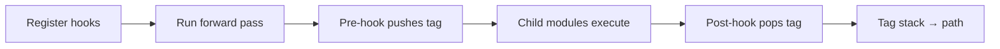

# Load and export

The first stage of the winml-cli pipeline is the most deterministic: bring a model into memory and convert it to ONNX. Everything that follows — optimization, quantization, compilation — operates on that ONNX artifact. A well-exported graph with accurate metadata travels cleanly through the rest of the pipeline without requiring patching or re-export.

Loading is an internal operation: the loader module resolves model provenance, selects the right HuggingFace model class, and prepares the weights for tracing. The `winml export` command is the surface users interact with directly.

## Loading a model

When you point winml-cli at a model identifier, the internal loader resolves it in one of two ways. If the identifier looks like a HuggingFace Hub path (e.g., `prajjwal1/bert-tiny`), the loader downloads the model weights and configuration to the standard HuggingFace cache at `~/.cache/huggingface`. Subsequent runs are served from that cache without re-downloading. If the identifier is a path to a local PyTorch checkpoint directory, the loader reads it directly without network access.

In both cases the loader auto-detects the task — image classification, text feature extraction, and so on — and selects a corresponding HuggingFace model class. The result is a PyTorch model object ready for tracing.

Before committing to a full export you can verify that the loader resolved everything correctly with `winml inspect`. It prints the detected task, the HuggingFace model class, the export configuration, and the WinML inference class — all without downloading weights. Add `--hierarchy` to reconstruct the PyTorch module tree from random-weight tracing.

Some community models host custom Python code in their repositories. The loader refuses to execute it by default. Pass `--trust-remote-code` to `winml config` when generating a build configuration for such a model.

## Exporting to ONNX

`winml export` converts the loaded model to ONNX. By default it uses PyTorch's TorchDynamo ONNX exporter (`torch.onnx.export(dynamo=True)`), which records rich per-node module metadata that is used to derive the `winml.hierarchy.*` node tags. Pass `--no-dynamo` to fall back to the legacy TorchScript exporter, which follows actual execution paths and tends to produce compact inference-oriented graphs. Both exporters default to static shapes; the QNN-relevant difference is opset and op decomposition: torch's dynamo op library targets a minimum opset of 18, so the dynamo path exports at opset 18, whereas the TorchScript path exports at the configured opset (17 by default) and lowers some ops differently (e.g. ResNet's head becomes `ReduceMean` + `Reshape` under dynamo but `GlobalAveragePool` + `Flatten` under TorchScript). Because the opset-17 TorchScript graph is what the QNN/NPU toolchain has been validated against, `--no-dynamo` remains the validated choice for QNN/NPU hand exports today.

By default the exporter runs an eight-step process that includes hierarchy tracing and tag injection. The result is an ONNX file enriched with structural metadata that powers downstream features such as per-module benchmarking, inspector views, and optimizer scoping.

### Hierarchy tagging in detail

During export the HTP (Hierarchy-preserving Tags Protocol) exporter attaches two pieces of information to every ONNX graph node via `node.metadata_props`:

| Key | Value | Example |
|-----|-------|---------|
| `winml.hierarchy.tag` | Full module path the node originated from | `/BertModel/BertEncoder/BertLayer.0/BertAttention` |
| `winml.hierarchy.depth` | Number of path segments (integer as string) | `4` |

#### How tags are built

The exporter registers PyTorch forward hooks on each module. When a module executes, a pre-hook pushes its class name onto a tag stack; the post-hook pops it. This produces hierarchical paths that mirror the PyTorch module tree:



Only modules that are actually executed during tracing receive tags — unused modules are excluded. For example, `prajjwal1/bert-tiny` has 48 registered modules but only 18 are reached during a forward pass.

#### Concrete example: BERT-tiny

Running `winml export -m prajjwal1/bert-tiny -o model.onnx -v` produces the following hierarchy tree (18 traced modules, 132 ONNX nodes, 100 % coverage):

```
BertModel (132 nodes)
├── BertEmbeddings: embeddings (7 nodes)
├── BertEncoder: encoder (106 nodes)
│   ├── BertLayer: encoder.layer.0 (53 nodes)
│   │   ├── BertAttention: encoder.layer.0.attention (39 nodes)
│   │   │   ├── BertSelfOutput: encoder.layer.0.attention.output (4 nodes)
│   │   │   └── BertSdpaSelfAttention: encoder.layer.0.attention.self (35 nodes)
│   │   ├── BertIntermediate: encoder.layer.0.intermediate (10 nodes)
│   │   │   └── GELUActivation: encoder.layer.0.intermediate.intermediate_act_fn (8 nodes)
│   │   └── BertOutput: encoder.layer.0.output (4 nodes)
│   └── BertLayer: encoder.layer.1 (53 nodes)
│       └── ... (same structure)
└── BertPooler: pooler (0 nodes)
```

Each ONNX node gets its tag from the module it belongs to. Here are a few examples from the actual exported model:

| ONNX node name | Assigned tag |
|---------------|--------------|
| `/embeddings/word_embeddings/Gather` | `/BertModel/BertEmbeddings` |
| `/encoder/layer.0/attention/self/query/MatMul` | `/BertModel/BertEncoder/BertLayer.0/BertAttention/BertSdpaSelfAttention` |
| `/encoder/layer.0/intermediate/intermediate_act_fn/Mul` | `/BertModel/BertEncoder/BertLayer.0/BertIntermediate/GELUActivation` |
| `/Unsqueeze` (no scope) | `/BertModel` (root fallback) |

#### Node-to-module mapping

After the ONNX graph is produced by `torch.onnx.export`, a 4-priority system assigns each ONNX node to the closest matching module:

1. **Direct match** (61 %) — the node's scope name maps exactly to a traced module.
2. **Parent match** (24 %) — walk up the scope hierarchy until a traced module is found.
3. **Operation fallback** (optional, off by default) — find the most similar scope by common prefix.
4. **Root fallback** (14 %) — unmatched nodes receive the model root tag (e.g. `/BertModel`).

This guarantees 100 % tag coverage: every node in the graph carries a non-empty tag.

### Graph-level metadata

Beyond per-node tags, the exporter also writes model-level metadata properties:

| Key | Content |
|-----|---------|
| `winml.io.inputs` | JSON array of `InputTensorSpec` — name, shape, dtype, and optional `value_range` |
| `winml.io.outputs` | JSON array of `OutputTensorSpec` — name, shape, dtype |

These I/O specs enable tools like `winml perf` to generate correct dummy inputs for benchmarking and `winml inspect` to display tensor shapes without loading the model into a runtime.

### Sidecar metadata file

Alongside the `.onnx` file, the exporter writes a `*_htp_metadata.json` sidecar containing:

- **`nodes`** — complete mapping of every ONNX node name → hierarchy tag
- **`modules`** — traced module information (class name, tag, execution order)
- **`statistics`** — export time, node counts, coverage percentage
- **`outputs`** — I/O tensor specifications

Use `--with-report` to additionally generate a human-readable markdown report (`*_htp_export_report.md`).

### Features that depend on tags

- **`winml inspect --hierarchy`** — traces the model with random weights and displays the resulting module tree in the terminal. This is a lightweight preview of what tags will look like after a full export.
- **`winml perf --module <ClassName>`** — isolates a submodule (e.g. `BertAttention`) and benchmarks it independently.

### Disabling tags

If you need a clean, standard-compliant ONNX without custom metadata — to hand off to a third-party tool, for example — pass `--no-hierarchy`. (The old `--clean-onnx` spelling remains as a deprecated hidden alias.) The graph behaviour is unchanged, but hierarchy-dependent features will not work against that file.

## Where it goes wrong

Most export failures fall into three categories.

**Task mismatch.** The loader auto-detects task from the model card and configuration, but some models are registered under multiple tasks or have ambiguous metadata. If the wrong task is selected the exporter generates incorrect dummy inputs and the trace fails or produces wrong output shapes. Override it explicitly with `--task`, for example `--task image-feature-extraction`.

**Shape issues.** Transformer models often have symbolic sequence-length dimensions; vision models may expect a fixed spatial resolution. If the default dummy inputs do not match what the model accepts, shape inference will fail or produce dynamic shapes that downstream tools cannot handle. Provide a `--shape-config` JSON file with explicit overrides, or use `--input-specs` to supply a fully specified input manifest.

**Custom modules.** Some models contain `torch.nn.Module` subclasses the tracer cannot automatically decompose. A `--torch-module` option (comma-separated class names) is intended to include them as distinct hierarchy nodes rather than inlining them — most often needed for custom normalization or attention implementations defined in the model repository. **Note:** the `--torch-module` flag is reserved for module-targeted export but is **not yet functional** in the current release — passing it logs a warning and the flag is ignored.

## See also

- [Graph and IR](graphs-and-ir.md)
- [inspect command](../commands/inspect.md)
- [export command](../commands/export.md)
