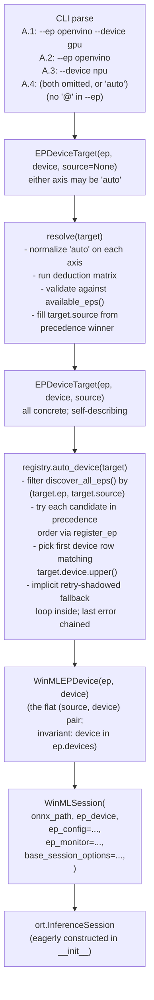
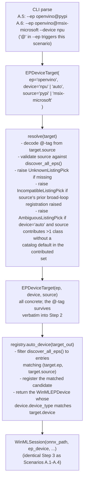
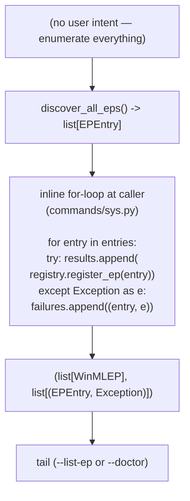
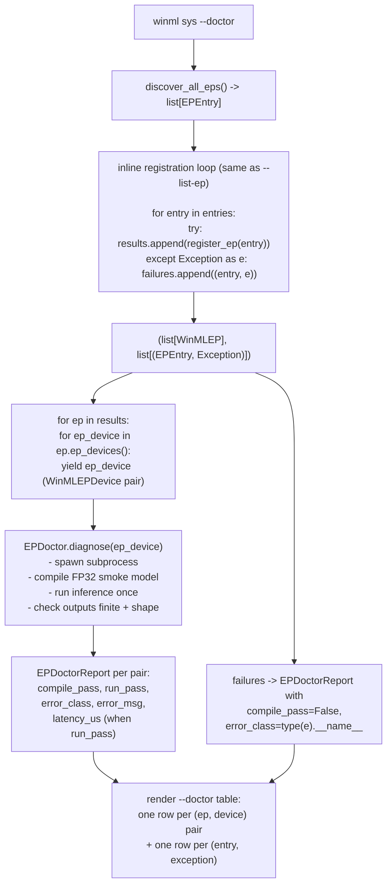

# Session Core Loops — Type Taxonomy, APIs, and Two Paths

**Version**: 2.3
**Date**: 2026-06-07
**Status**: Draft — v2.3 renames `WinMLEPRegistry.auto_ep` → `auto_device` (it returns a `WinMLEPDevice` pair, not a `WinMLEP`); drops the `_find_entry` tag-decode helper (its tag-decode + retry-shadowed logic is absorbed inside `auto_device`); collapses the `WinMLDevice` ABC + per-EP subclass set into a single concrete class with internal dispatch tables (see [`4_winml_device.md`](4_winml_device.md) v1.4); pins the `WinMLEPDevice` composition invariant (`.device` is one of `.ep.devices` — same object, not a copy). v2.2 dropped `WinMLSession.build` in favor of the direct `WinMLSession(onnx_path, ep_device, ...)` constructor (the existing `__init__` at `session/session.py:200` gains an optional `ep_monitor` kwarg); added the now-removed `_find_entry` tag-decode helper, the new exception classes (`UnknownListingPick`, `IncompatibleListingPick`, `AmbiguousListingPick`), full Path A walkthroughs split by scenario class (A.1-A.4 by-name vs A.5-A.6 by-listing-pick), the programmatic P.1 and persisted-config P.2 sub-scenarios, and a full-design `--doctor` walkthrough. v2.1 originally locked in the six-type taxonomy, the six-API public surface, the `WinMLEPRegistry.register_ep`-only registrar, and §9's class inventory.
**Module**: session
**Companion-To**:
- [`3_design_classes.md`](3_design_classes.md) — **canonical class reference** (read this first for the class taxonomy)
- [`1_req.md`](1_req.md) — user-facing requirements that this doc realizes
- [`3_design_ep.md`](3_design_ep.md) — Tier 1/2/3 model and registration internals
- [`4_winml_device.md`](4_winml_device.md) — `WinMLDevice` single concrete class + dispatch tables
- [`console_mockup.py`](console_mockup.py) — `winml sys --list-ep` render
**Depends-On**: [`../../ep-path-design.md`](../../ep-path-design.md), [`monitor/2_coreloop.md`](monitor/2_coreloop.md)

> **For the canonical class reference, see [`3_design_classes.md`](3_design_classes.md).** New readers should land there first to fix the six-class taxonomy and naming principles before reading this doc's path-level flows.

---

## Table of Contents

- [1. Purpose](#1-purpose)
- [2. Type Taxonomy](#2-type-taxonomy)
- [3. Core APIs](#3-core-apis)
  - [3.1 `WinMLEPRegistry` — lockdown](#31-winmlepregistry--lockdown)
  - [3.2 `_build_session_options` body after the refactor](#32-_build_session_options-body-after-the-refactor)
- [4. Path A — User Intent → Session](#4-path-a--user-intent--session)
  - [4.1 Scenarios A.1–A.4 — by-name walkthrough](#41-scenarios-a1a4--by-name-walkthrough)
  - [4.2 Scenarios A.5–A.6 — by-listing-pick walkthrough](#42-scenarios-a5a6--by-listing-pick-walkthrough)
  - [4.3 Failure modes per layer](#43-failure-modes-per-layer)
  - [4.4 Programmatic scenario P.1 — direct SDK construction](#44-programmatic-scenario-p1--direct-sdk-construction)
  - [4.5 Persisted-config scenario P.2 — JSON round-trip](#45-persisted-config-scenario-p2--json-round-trip)
- [5. Path B — Enumerate-All → Report](#5-path-b--enumerate-all--report)
  - [5.1 Walkthrough](#51-walkthrough)
  - [5.2 `--list-ep` inventory render](#52---list-ep-inventory-render)
  - [5.3 `--doctor` validation smoke-test](#53---doctor-validation-smoke-test)
  - [5.4 Failure modes per layer](#54-failure-modes-per-layer)
- [6. Stable Identifier for Scenario B](#6-stable-identifier-for-scenario-b)
- [7. CLI Surface Mapping](#7-cli-surface-mapping)
- [8. Open Questions](#8-open-questions)
- [9. Appendix — Class Inventory (2026-06-07)](#9-appendix--class-inventory-2026-06-07)

---

## 1. Purpose

This doc describes the **two core paths** through the session layer end-to-end. Today these paths are scattered across `resolve_device` in `session/ep_device.py`, `WinMLSession` in `session/session.py`, `commands/sys.py`, and `commands/perf.py`. No single document maps the full chain from "user typed `--ep openvino --device gpu`" to "an `InferenceSession` runs against the right `OrtEpDevice` handle." This is that map.

It is also the locked-in type and API contract for the session/EP module — the contents that previously lived in `5_type_taxonomy.md` are folded in here (§2 + §3) so that the type table, the API set, and the path-level flows all sit next to each other rather than chasing cross-doc breadcrumbs.

**In scope:**

- The six-class taxonomy and which class each layer produces/consumes.
- The minimal API surface (`discover_all_eps`, `EPSource.resolve()`, `resolve`, `registry.register_ep`, `wrap_ort_device`, `WinMLSession(...)`).
- Path A (one intent → one session) walked under both Scenario A (by-name) and Scenario B (by-listing-pick).
- Path B (enumerate-all → report) and its two render tails (`--list-ep`, planned `--doctor`).
- The Scenario B identifier syntax (`<ep>@<source-tag>`) and its derivation algorithm.
- The CLI surface mapping for every `winml <cmd> <flags>` that touches the session layer.
- A full appendix inventory of every existing class in the EP / session / discovery / sysinfo domain (§9) with the rename / fold / drop verdicts.

**Out of scope:**

- Tier 1/2/3 internals (catalog deduction, handle-binding mechanics, `provider_options` merge). Covered by [`3_design_ep.md`](3_design_ep.md). Plugin discovery (`EP_PATH`, `EPSource`) is in [`../../ep-path-design.md`](../../ep-path-design.md).
- `WinMLDevice` per-EP subclasses and `ep_metadata` schemas. Covered by [`4_winml_device.md`](4_winml_device.md).
- The monitor's per-op tracing loop. Covered by [`monitor/2_coreloop.md`](monitor/2_coreloop.md).
- Compile-specific session options (`SessionOptions.AddConfigEntry`, EP context flags). Covered by [`../compiler/3_design_spec.md`](../compiler/3_design_spec.md).

**Terminology mapping.** This doc uses "Path A" / "Path B" as the user-facing decomposition; [`3_design_ep.md`](3_design_ep.md) uses "Tier 1/2/3" as the internal decomposition. They are orthogonal axes — every Path consumes Tier 1 (discovery) and Tier 2 (registration); Path B optionally consumes Tier 3 (validation).

## 2. Type Taxonomy

Six data classes, one role each. The naming principle: **`WinML*`-prefixed classes are predefined or system-generated** — they cannot be crafted from CLI strings; they require a system API (the static catalog, an ORT registration, the device factory). **Non-prefixed classes are user-craftable** — they are constructible from strings or paths so tests, configs, and the CLI parser can build them directly.

| Class | Role | Created by | Prefix rule |
|---|---|---|---|
| `EPDeviceTarget(ep: str, device: str, source: str \| None = None)` | Pure intent. `"auto"` allowed on either axis. Optional `source` carries the Scenario B disambiguator (a tag string like `"pypi"`). Construction-time validation lives in `EPDeviceTarget.__post_init__`; see `3_design_classes.md` §3.1. | CLI parser, JSON config loader, tests, `resolve()` | **No prefix** — user-craftable |
| `EPDeviceSpec(ep, device, default_provider_options)` | Catalog row — what *could* exist for an EP, independent of installation state. Process-constant. | static `EP_DEVICE_SPECS` table in `ep_device.py` | **`WinML*`** — predefined |
| `EPEntry(ep_name, dll_path, source, status, version)` | Filesystem-discovery record. One per `(ep_name, on-disk-source)` pair. No DLL load. | `discover_all_eps()` walking each `EPSource.resolve()`; tests may construct directly | **No prefix** — user-craftable (for tests); produced by filesystem-only scan in production |
| `WinMLDevice` | Vendor-normalized adapter over `ort.OrtEpDevice` — single concrete class; dispatches by `ep_name` internally via module-level tables. See [`4_winml_device.md`](4_winml_device.md). | `wrap_ort_device(handle)` after a successful registration | **`WinML*`** — system-generated |
| `WinMLEP(source: EPEntry, devices: tuple[WinMLDevice, ...])` | Successful per-source registration aggregate. Invariant: `len(devices) ≥ 1`. | `WinMLEPRegistry.register_ep(entry)` | **`WinML*`** — system-generated |
| `WinMLEPDevice(ep: WinMLEP, device: WinMLDevice)` | Flat `(source, device)` pair — the project mirror of `ort.OrtEpDevice`. Invariant: `.device` is one of `.ep.devices` (same object, not a copy). | `WinMLEPRegistry.auto_device(target)` (Path A) and `WinMLEP.ep_devices()` (enumerator); the `WinMLSession(...)` constructor consumes it | **`WinML*`** — system-generated |

Role splits:

- **`EPDeviceTarget` is the user's pick** — the class the CLI parser, JSON config loader, and tests construct. Either axis may be the literal `"auto"`. The optional `source` field carries the Scenario B disambiguator when the user typed `--ep openvino@pypi`.
- **`EPDeviceSpec` is the catalog row** — what *could* exist for an EP. Lives as the `EP_DEVICE_SPECS` table in [`ep_device.py`](../../../src/winml/modelkit/session/ep_device.py).
- **`EPEntry` is the filesystem-discovery record** — produced by walking `EP_PATH` without loading any DLL. Carries the source tag (one of the closed seven listed in §6), the DLL path, the source's version string, and a `status` of `"primary"` or `"shadowed"` derived from precedence position.
- **`WinMLDevice` is the runtime adapter** — wraps one `OrtEpDevice` handle and exposes vendor-specific `ep_metadata` through a unified API. A single concrete class with internal dispatch tables keyed on `ep_name`; specified in [`4_winml_device.md`](4_winml_device.md).
- **`WinMLEP` is the successful per-source registration aggregate** — one EP DLL that loaded plus the tuple of `WinMLDevice` handles it contributed. The invariant `len(devices) ≥ 1` means a `WinMLEP` cannot represent a "failed registration" — failures stay separate (see §3).
- **`WinMLEPDevice` is the flat pair** — the project's typed mirror of `ort.OrtEpDevice`. Invariant: `.device` is always one of `.ep.devices` (same object identity, not a copy). Whereas a `WinMLEP` carries a tuple of devices that one DLL produced, `WinMLEPDevice` is the one-`(source, device)`-pair shape that the `WinMLSession(...)` constructor consumes downstream. The compound `WinMLEPRegistry.auto_device(target)` returns one pair directly (Path A); `WinMLEP.ep_devices()` flattens the aggregate into a tuple of pairs for the Path B enumerators.

Failures are represented as `(EPEntry, Exception)` pairs, not as a seventh class. `WinMLEP` is success-only by design; this keeps consumers ergonomic (no `if ep.devices: ...` null checks scattered across renderer code) and pushes the union into the failure-list shape at the broad-enumeration call site (§5).

**`WinMLEP` and `WinMLEPDevice` are reached via `register_ep` / `auto_device` / `ep_devices()`, never as top-level constructors in user code.** Tests may patch the registry to return synthetic instances; production callers never call `WinMLEP(...)` or `WinMLEPDevice(...)` directly.

## 3. Core APIs

Six public primitives. Each composes Path A (five steps) and Path B (an inline loop over the same registry method).

```python
# Tier 1 — filesystem-only discovery (top-level helper)
def discover_all_eps() -> list[EPEntry]:
    """Walk EP_PATH (PyPISource, NuGetSource, MSIXPackageSource,
    WinMLCatalogSource, DirectorySource) and return one EPEntry per
    (ep_name, on-disk source) pair, in precedence order. No DLL is
    loaded; the result depends only on filesystem state. Cheap;
    safe to call on every CLI invocation. Called by registry init,
    by --list-ep, by registry.auto_device (the tag-decode + retry-
    shadowed Path A entry, see §3.1), and by tests that mock the
    source set."""

# Tier 1 — single-source iterator (called inside discover_all_eps)
class EPSource(ABC):
    def resolve(self) -> Iterator[EPEntry]:
        """Yield one EPEntry per (ep_name, dll_path) the source contributes.
        Errors are logged and swallowed (yields nothing on failure)."""

# Intent resolution — pure deduction, fills in 'auto'
def resolve(target: EPDeviceTarget) -> EPDeviceTarget:
    """Resolve an EPDeviceTarget into one with no 'auto' values.

    Semantics inherited from the existing resolve_device() in
    ep_device.py — the deduction matrix (both / ep-only / device-only /
    neither) is preserved verbatim:
        ep+device given  -> validate; return
        ep given         -> default_device_for_ep(ep) fills device
        device given     -> default_ep_for_device(device) filters by
                            available_eps() (registration-aware) and
                            fills ep
        neither          -> auto_detect_device() picks strongest
                            hardware-and-EP-backed device, then falls
                            through to the device-only branch

    Additional behavior in this taxonomy:
        - When target.source is None, resolve fills it from the
          precedence-winner tag so the resolved target is self-describing.
        - Validates against available_eps() and the discovered EPEntry
          set; raises ValueError / UnknownListingPick / IncompatibleListingPick
          / AmbiguousListingPick on impossible targets.

    Cheap; consults the static catalog and the cached available_eps()
    name set. No DLL load. Called by every Path A entry point on the
    user's parsed EPDeviceTarget."""

# Per-device adapter (factory)
def wrap_ort_device(d: ort.OrtEpDevice) -> WinMLDevice:
    """Trivial wrapper over the WinMLDevice(d) constructor under the
    single-class design (v1.4). Vendor-specific properties dispatch
    on d.ep_name internally at property-access time via module-level
    tables; there is no per-EP subclass dispatch at construction time.
    EPs whose ep_name is absent from the dispatch tables surface with
    None / () for vendor-specific properties rather than crashing the
    renderer. Called by register_ep when wrapping each contributed
    OrtEpDevice handle. Cheap (no I/O); see 4_winml_device.md §6.

    Raises:
        (nothing) — never raises on construction."""

# Tier 2 — registration sink (TWO methods; atomic + compound)
class WinMLEPRegistry:
    def register_ep(self, entry: EPEntry) -> WinMLEP: ...
    def auto_device(self, target: EPDeviceTarget) -> WinMLEPDevice: ...
    # See §3.1 below for the full lockdown spec.

# Session entry point (Path A user-facing tail) — direct constructor
class WinMLSession:
    def __init__(
        self,
        onnx_path: str | Path,
        ep_device: WinMLEPDevice,
        *,
        ep_config: EPConfig | None = None,
        ep_monitor: WinMLEPMonitor | None = None,
        base_session_options: ort.SessionOptions | None = None,
    ) -> None:
        """Path A user entry. The direct constructor (no .build()
        classmethod). Runs the three-layer provider_options merge
        (catalog default -> user config -> monitor overrides) and
        calls so.add_provider_for_devices([ep_device.device._ort],
        options) on a fresh ort.SessionOptions, then constructs
        ort.InferenceSession eagerly (the current shape at
        session/session.py:200).

        ep_monitor is optional (default None) — existing call sites
        (commands/perf.py, commands/compile.py, models/auto.py) keep
        working unchanged; new monitor-aware sites pass ep_monitor=
        monitor. On compile-time error (unsupported op, missing
        driver) ORT raises RuntimeException; the constructor surfaces
        it verbatim. The caller decides whether to fall back — the
        constructor does not.

        Subclass extension: WinMLQairtSession (session/qairt/
        qairt_session.py:44) extends __init__ to default ep_device
        to resolve('qnn', 'npu') when None; the new ep_monitor kwarg
        propagates via **kwargs in subclasses that don't name it
        explicitly."""
```

**Current state (queued for the `ep_path.py` casing-sweep PR).** The signatures above describe the locked-in target state; today's `src/` differs in two related places that move together with the rename:

- `EPSource.resolve()` returns `Iterator[tuple[str, Path]]` today (`ep_path.py:215`); the locked-in shape is `Iterator[EPEntry]`. The five subclasses (`PyPISource`, `NuGetSource`, `MSIXPackageSource`, `WinMLCatalogSource`, `DirectorySource`) all migrate in the same PR — each one's `resolve()` body becomes the `EPEntry` construction it currently delegates back up to `discover_all_eps`.
- `discover_all_eps()` returns `dict[str, list[ResolvedEp]]` today (`ep_path.py:1198`); the locked-in shape is `list[EPEntry]`. The two consumers — `ep_registry.py:76` (the current `_load_ep_dll` candidate-fallback loop) and `commands/sys.py:566` (the `--list-ep` renderer) — migrate in the same PR.

Both changes are queued for the casing-sweep PR alongside `EpSource → EPSource`, `ResolvedEp → EPEntry`, and the rest of §9 inventory's `Ep → EP` renames.

**No `list_all`, no `available_eps`, no `available_ep_devices` on the registry public surface.** Path B's broad enumeration is an inline 6-line loop at the caller side (see §5.1).

**Path A composition (three steps + the constructor call; same shape for Scenario A and B):**

```python
target_in    = parse_cli_args()                  # EPDeviceTarget; may have "auto"
target       = resolve(target_in)                # EPDeviceTarget; all concrete; source-tag filled in
ep_device    = registry.auto_device(target)      # WinMLEPDevice; matched (source, device) pair with shadowed-fallback
session      = WinMLSession(onnx_path, ep_device,
                            ep_config=..., ep_monitor=..., base_session_options=...)
```

The first three lines are universal: Scenario A's `target_in` has `"auto"` values for `resolve` to fill in; Scenario B's `target_in` carries an explicit `source` and concrete `ep` + `device`, so `resolve` is mostly a validation pass. `auto_device` then takes the resolved target, walks `discover_all_eps()` filtered by `target.ep` (and optionally `target.source`) in precedence order, calls `register_ep` on each candidate, and returns the first `WinMLEPDevice` whose device class matches `target.device.upper()`. The retry-shadowed fallback that previously lived as caller-side code now lives inside `auto_device`. The session construction call signature is the same on both branches; `ep_monitor=None` is the default for non-monitor call sites.

See §3.1 below for the `auto_device` lockdown spec (the previous `_find_entry` tag-decode helper is dropped — its responsibilities are absorbed inline).

### 3.1 `WinMLEPRegistry` — lockdown

This subsection locks the registry's public surface to **two** methods — one atomic (`register_ep`) and one compound (`auto_device`). Every prior public surface — `list_all`, `available_eps`, `available_ep_devices` — is dropped from the class.

```python
class WinMLEPRegistry:
    def register_ep(self, entry: EPEntry) -> WinMLEP: ...
    def auto_device(self, target: EPDeviceTarget) -> WinMLEPDevice: ...
```

**State held by the singleton:**

```python
class WinMLEPRegistry:
    _instance: ClassVar[WinMLEPRegistry | None] = None
    _registered: dict[Path, WinMLEP]   # idempotency cache, keyed by entry.dll_path
```

The singleton holds one mutable field: `_registered`, a `dict[Path, WinMLEP]` that records which DLL paths have already been loaded and what `WinMLEP` came out. The dict is keyed by `entry.dll_path` (the canonical absolute path) so re-registering the same on-disk DLL is a true no-op that returns the same `WinMLEP`. No discovery cache, no source-list cache, no failure-list cache — those concerns are owned by callers.

**Singleton pattern:**

```python
@classmethod
def instance(cls) -> WinMLEPRegistry:
    """Return the process-wide singleton, constructing on first call."""
    if cls._instance is None:
        cls._instance = cls.__new__(cls)
        cls._instance._registered = {}
    return cls._instance
```

Callers obtain the instance via `WinMLEPRegistry.instance()`. There is no module-level `get_registry()` helper — the classmethod is the single entry point. The constructor is private by convention (tests that need a fresh instance reset `WinMLEPRegistry._instance = None` and re-call `instance()`).

**Public methods (atomic + compound):**

```python
def register_ep(self, entry: EPEntry) -> WinMLEP:
    """Atomically register the EPEntry's DLL with ORT and return a
    success-only WinMLEP aggregate.

    Steps:
      1. If entry.dll_path is in self._registered, return the cached
         WinMLEP unchanged (idempotency).
      2. Call ort.register_execution_provider_library(entry.ep_name,
         str(entry.dll_path)). Already-loaded check against
         ort.get_ep_devices() is the defensive fast path for
         third-party callers that registered the same DLL outside
         this registry.
      3. Re-read ort.get_ep_devices() and collect every handle whose
         ep_name == entry.ep_name. Wrap each via wrap_ort_device(...)
         into a WinMLDevice instance.
      4. Build WinMLEP(source=entry, devices=tuple(wrapped)), assert
         len(devices) >= 1, cache by entry.dll_path, and return.

    Raises:
        WinMLEPRegistrationFailed: ORT's register_execution_provider_library
            raised, or the loaded DLL contributed zero devices for
            this entry.ep_name (empty device set is a registration
            failure under the success-only invariant).

    Idempotent at entry.dll_path granularity: re-registering the same
    DLL is a no-op that returns the same WinMLEP object identity-wise."""


def auto_device(self, target: EPDeviceTarget) -> WinMLEPDevice:
    """Compound Path A entry: resolve (filter + retry-shadowed) the
    discovered entries for target.ep down to one (source, device) pair
    and return it directly.

    Rejects unresolved targets:
        Raises ValueError if target.ep == "auto" or
        target.device == "auto". The caller must call resolve(target)
        first; auto_device is the Path A tail, not the resolver.

    Steps:
      1. Walk discover_all_eps() filtered to entries where
         entry.ep_name == expand_ep_name(target.ep). If target.source
         is set, additionally filter to entries whose
         derive_source_tag(entry, peers) == target.source.
      2. For each remaining candidate in EP_PATH precedence order,
         try register_ep(candidate). On WinMLEPRegistrationFailed,
         record the exception and continue to the next candidate.
      3. For each successfully-registered WinMLEP, flatten via
         .ep_devices() and pick the first WinMLEPDevice whose
         device.device_type == target.device.upper(). Return it.
      4. If no candidate produces a matching pair, raise
         WinMLEPRegistrationFailed with the LAST recorded exception
         chained as __cause__.

    Invariant on returned pair:
        pair.device in pair.ep.devices  (same object identity)

    The retry-shadowed fallback that previously lived as caller-side
    code is absorbed here. The atomic register_ep stays narrow; the
    compound entry point owns the per-EP enumeration + fallback logic
    + device-class match.

    Raises:
        ValueError: target carries unresolved 'auto' on either axis.
        WinMLEPRegistrationFailed: all filtered candidates' registrations
            raised, OR every successful registration's device tuple
            contained no row matching target.device. The last underlying
            exception is chained as __cause__.
        UnknownListingPick: target.source is set but no discovered
            EPEntry's tag matches it (Scenario B miss; the helper is
            still raised here even though the dedicated tag-decode
            helper no longer exists as a standalone function).
        AmbiguousListingPick: (defensive) more than one entry matched
            target.source — tag-derivation algorithm bug signal."""
```

**Private helpers (kept internal):**

| Helper | Purpose |
|---|---|
| `_load_ep_dll(self, entry: EPEntry) -> None` | The actual `ort.register_execution_provider_library` call, with the `ort.get_ep_devices()` fast-path guard. Raises `WinMLEPRegistrationFailed` on ORT exception. |
| `_pick_handle(self, ep_name: str, devices: list[ort.OrtEpDevice]) -> list[ort.OrtEpDevice]` | Filters ORT's enumeration to handles whose `ep_name == ep_name`, deduplicates by `(vendor_id, device_id)`. No device-class filter; that is caller's concern via `ep.ep_devices()`. |

**Idempotency contract.** Re-registering the same `entry.dll_path` returns the *same* `WinMLEP` instance — object identity is preserved. Tests, repeated CLI calls within one process, and the Path B inline loop all rely on this. Two `EPEntry` rows that resolve to the same absolute DLL path (e.g., one constructed from a tag, one constructed by `discover_all_eps()`) hit the same cache slot.

**What `register_ep` does NOT do:**

- It does **not** discover. Discovery is `discover_all_eps()`'s job; the registry takes a pre-built `EPEntry` as input.
- It does **not** filter devices to one device class. The returned `WinMLEP.devices` tuple contains every class the DLL contributed. Filtering to a single `(source, device)` pair is the caller's concern — done via `WinMLEP.ep_devices()` followed by a list-comprehension on `device.device_type`.
- It does **not** decode tag strings. That work is owned by `auto_device` (it does its own tag-filter on `discover_all_eps()`).
- It does **not** expose broad listing. Callers that need every registration (`--list-ep`, `--doctor`) write an inline loop over `discover_all_eps()`; the loop is six lines (see §5.1).
- It does **not** raise `DeviceNotFound`. A loaded DLL contributing zero devices is a `WinMLEPRegistrationFailed` (invariant violation); a loaded DLL contributing devices but none matching the user's `--device` class is a caller-side empty-filter outcome — for Path A that filter is inside `auto_device`, for Path B it is in the renderer.
- It does **not** retry against shadowed candidates. The single-source contract (one `EPEntry` in, one `WinMLEP` out, or raise) means `register_ep` is atomic. Primary-failed-try-shadowed lives inside `auto_device` (Path A's compound entry point); Path B (`--list-ep`) registers each `EPEntry` independently and captures failures as data — no fallback at all (see §5.1).

**What migrates out of the current `register_ep` body.** The locked-in shape above is intentionally narrower than today's `ep_registry.py:76` `register_ep`. Three concerns migrate out:

- **Candidate fallback.** Today, `register_ep` accepts an `ep_name` plus a list of candidate DLL paths and tries them in order (`_load_ep_dll` walks `_ep_paths[ep_name]` until one succeeds). The locked-in `register_ep` takes a single pre-resolved `EPEntry` and is purely atomic; the "primary failed, try shadowed" loop moves to `auto_device` (compound Path A entry). Path B's caller-side broad-loop registers each `EPEntry` independently with no fallback at all.
- **Bundled-EP branch.** Today's `register_ep` has a branch for "bundled with ORT — skip `register_execution_provider_library`." Under the locked-in shape, bundled EPs are surfaced as synthetic `EPEntry(source_kind="bundled", dll_path=None)` records produced by `discover_all_eps()`. `register_ep` treats them as a no-op on the ORT load step and proceeds straight to the `get_ep_devices()` re-read — the conditional moves into the entry's `source_kind` test rather than splitting the registry's contract.
- **Device-class filter.** Today, `register_ep` accepts a target `device` class and returns a single matching `OrtEpDevice`. Under the locked-in shape, the atomic `register_ep` returns the full per-DLL device tuple (`WinMLEP.devices`); the device-class filter lives in `auto_device` (Path A's compound entry) or in the Path B renderer. `register_ep` itself stays cardinality-agnostic.

These three migrations are what makes the atomic `register_ep` narrow enough to be "one atomic op" rather than "the everything-handler" it is today; `auto_device` is then a thin compound built over `register_ep` + `discover_all_eps()` that handles tag-decode, retry-shadowed, and device-class match in one user-facing call.

**Why split into atomic + compound.** There is exactly one atomic operation the registry performs — load one DLL, wrap its handles, build the aggregate. That is `register_ep`. The compound path (resolve a target → filter discovered entries → try them in precedence order → pick the matching device class) is the most-used Path A entry; it ships as `auto_device` so the call site is a single line instead of a five-step inline composition. Cardinality (one entry vs many entries) stays a caller-side concern — `auto_device` walks one filtered precedence list, Path B's `--list-ep` walks all entries; neither tries to be the other.

The tag-decode logic that earlier drafts factored into a private `_find_entry(target) -> EPEntry` helper now lives directly inside `auto_device` — no separate helper. The decode rule (walk `discover_all_eps()`, filter by `(target.ep, target.source)`, raise `UnknownListingPick` / `AmbiguousListingPick` defensively) survives unchanged; only the indirection through a named helper is dropped. `IncompatibleListingPick` is still raised by `resolve` (which has access to the prior broad-loop failure list and can chain the original exception as `__cause__`); `auto_device` does not re-raise it.

### 3.2 `_build_session_options` body after the refactor

`_build_session_options` (`session/session.py:170`) is the helper that the `WinMLSession.__init__` body calls to build the `ort.SessionOptions` it passes to `ort.InferenceSession`. The locked-in shape narrows it significantly:

```python
def _build_session_options(
    ep_device: WinMLEPDevice,
    ep_config: EPConfig | None,
    ep_monitor: WinMLEPMonitor | None,
    base_session_options: ort.SessionOptions | None,
) -> ort.SessionOptions:
    so = base_session_options if base_session_options is not None else ort.SessionOptions()
    if ep_monitor is not None:
        for key, value in ep_monitor.get_session_options().items():
            so.add_session_config_entry(key, value)
    options = _build_provider_options(ep_device, ep_config, ep_monitor)
    so.add_provider_for_devices([ep_device.device._ort], options)
    return so
```

The current body at `session/session.py:191` calls `WinMLEPRegistry.get_instance().register_ep(ep_device)` to *re-derive* the `OrtEpDevice` handle from the intent-meaning `WinMLEPDevice`. Under the locked-in taxonomy, the caller has already done the registration and pair pick (Steps 3-4 of the Path A composition), so `_build_session_options` receives the new-meaning `WinMLEPDevice` pair and reaches the handle directly via `ep_device.device._ort`. **No `register_ep` call inside the helper.** The session-options helper becomes a thin wrapper over `add_provider_for_devices` plus the monitor's session-config entries.

## 4. Path A — User Intent → Session

Path A is the foundational walk: one user, one intent, one session. Every programmatic `WinMLSession(onnx_path, ep_device, ...)` construction, every `winml perf`, every `winml compile`, and every direct SDK call lands here.

Path A is **one path with two scenarios**, not two sub-paths. The three-step composition above (resolve → `auto_device` → constructor) is identical for Scenario A (by-name) and Scenario B (by-listing-pick) — the difference is in the *input* to `resolve` (does `target.source` come from the user or does `resolve` fill it in?) and in the *strictness* of `resolve`'s validation (Scenario B rejects mismatches that Scenario A would silently deduce around).

The §3 composition snippet describes the steps; this section walks them in detail and shows one Mermaid flowchart per scenario class:

- **§4.1** — Scenarios A.1–A.4: by-name (no `@`-tag). Covers both-explicit, ep-only, device-only, and both-omitted CLI forms.
- **§4.2** — Scenarios A.5–A.6: by-listing-pick (`@`-tag present). Covers `--ep <name>@<tag>` with optional `--device <class>`.
- **§4.3** — Failure modes per layer (one combined table).
- **§4.4** — Programmatic scenario P.1: direct SDK `WinMLSession(...)` construction from Python.
- **§4.5** — Persisted-config scenario P.2: `compiler/configs.py:285` JSON round-trip.

### 4.1 Scenarios A.1–A.4 — by-name walkthrough

The user typed `--ep <name|auto>` and/or `--device <class|auto>` with no `@<source-tag>`. The CLI parser produces an `EPDeviceTarget` with `source=None` and may have `"auto"` on either axis. The four sub-scenarios are:

- **A.1** — `--ep <name> --device <class>` (both explicit). `resolve` validates only.
- **A.2** — `--ep <name>` only. `resolve` fills `device` from `default_device_for_ep(ep)`.
- **A.3** — `--device <class>` only. `resolve` fills `ep` from `default_ep_for_device(device)` filtered by `available_eps()`.
- **A.4** — both omitted (or both `"auto"`). `resolve` runs `auto_detect_device()`, then falls through to the device-only branch.

All four follow the same three-step flow:



**Step 1 — `resolve(target)`.** Pure deduction. Walks the matrix inherited from `resolve_device` (see [`ep_device.py`](../../../src/winml/modelkit/session/ep_device.py) lines 369-446):

| `ep` given | `device` given | Behavior |
|---|---|---|
| yes | yes | Validate both; return |
| yes | no | `default_device_for_ep(ep)` from catalog |
| no | yes | `default_ep_for_device(device)` filtered by `available_eps()` (registration-aware — see [`3_design_ep.md`](3_design_ep.md) §6.4) |
| no | no | `auto_detect_device()` walks the hardware-priority list, intersects with `available_eps()`, falls through to the device-only branch |

The `"auto"` sentinel on either axis is normalized to `None` up-front. The auto-detect case is not a separate path — it is part of `resolve`'s deduction. Because `available_eps()` is cheap, lru-cached, and name-only, the entire deduction phase stays sub-millisecond.

After the matrix runs, `resolve` fills in `target.source` from the precedence-winner tag (the source tag of the first matching `EPEntry` for `target.ep`, in `EP_PATH` order). The resolved target is **self-describing**: a downstream caller can pass it to `auto_device` and land on the same `EPEntry` without re-running the precedence pick.

Invariant: `resolve` either returns an `EPDeviceTarget` with no `"auto"` values whose `(ep, device)` is in `EP_DEVICE_SPECS` and whose `source` matches a discovered `EPEntry`'s tag, or it raises `ValueError`.

**Step 2 — `registry.auto_device(target)`.** Compound Path A entry (§3.1). Filters `discover_all_eps()` by `(target.ep, target.source)`, tries each candidate in precedence order via `register_ep` (with the idempotency cache), and returns the first `WinMLEPDevice` whose `device.device_type == target.device.upper()`. The retry-shadowed fallback runs inline: if `register_ep` raises on the precedence-winner, `auto_device` records the exception and continues to the next candidate; only if all candidates fail does it raise `WinMLEPRegistrationFailed` with the last error chained. Multi-instance disambiguation (two GPUs of the same vendor+device-id) is the registry's concern — see [`3_design_ep.md`](3_design_ep.md) §11 — not the call site's.

Invariant on the returned pair: `pair.device in pair.ep.devices` (same object identity, not a copy).

**Step 3 — `WinMLSession(onnx_path, ep_device, …)`.** The constructor takes the chosen `WinMLEPDevice` pair directly. Internally it runs the three-layer `provider_options` merge (catalog default → user config → monitor overrides; see [`3_design_ep.md`](3_design_ep.md) §8.1), calls `so.add_provider_for_devices([ep_device.device._ort], options)` on a fresh `ort.SessionOptions`, and constructs `ort.InferenceSession` eagerly (the current `__init__` shape at `session/session.py:200`). `ep_monitor` defaults to `None`; non-monitor call sites omit it entirely. On compile-time error (unsupported op, missing driver) ORT raises `RuntimeException`; the constructor surfaces it verbatim. The caller decides whether to fall back — the constructor does not.

### 4.2 Scenarios A.5–A.6 — by-listing-pick walkthrough

The user previously ran `winml sys --list-ep`, saw one or more rows under an EP heading, and types one back as `--ep <name>@<source-tag>[ --device <class>]`. The CLI parser produces an `EPDeviceTarget` with a non-None `source` and concrete `ep`. `device` may still be `"auto"`/omitted (then defaulted from the catalog) or the user-supplied class.

- **A.5** — `--ep <name>@<tag>` only. `resolve` validates the tag; `device` deduced via `default_device_for_ep` *only* if the contributed device set contains that class — otherwise `AmbiguousListingPick`.
- **A.6** — `--ep <name>@<tag> --device <class>`. Both axes explicit; `resolve` validates the tag and the contributed device-class set.

The flow is the same three steps as A.1-A.4 — `resolve` → `registry.auto_device(target)` → `WinMLSession(...)` — with two differences:

1. **`resolve` validates rather than deduces `source`.** Because `target.source` is already set, `resolve` looks up the matching `EPEntry` from `discover_all_eps()`'s output and raises `UnknownListingPick(ep, source_tag)` if no row matches. If the matched entry's broad-loop registration (the inline Path B loop output) raised an exception, `resolve` raises `IncompatibleListingPick` with the carried exception chained as `__cause__`. The user explicitly named a broken row; Path A refuses to fall back to a different one.

2. **Ambiguous-device handling is stricter.** If the user did not supply `--device` and the matched entry contributed more than one device class, `resolve` raises `AmbiguousListingPick(ep, source_tag, [classes])` — the user must either re-run with `--device <class>` or accept the EP's catalog-default device. The default-device-from-catalog fallback fires *only* when `default_device_for_ep` returns a class that is present in the entry's contributed devices; otherwise the ambiguity is loud.

Step 2 (`auto_device`) and Step 3 (construct) are identical to Scenarios A.1-A.4. The only difference visible at register-time is that `target.source` is the user-named tag, not the precedence winner — so `auto_device`'s internal filter narrows to exactly that one `EPEntry` even when a different one would have won precedence, and the inner `register_ep` loads that DLL. The retry-shadowed loop inside `auto_device` is a no-op in Scenario B because the source-tag filter usually leaves only one candidate.



The Scenario B contract is intentionally stricter than Scenario A's: A silently deduces; B refuses to silently substitute. See [`1_req.md`](1_req.md) §2 R2 for the user-facing statement of this contract.

### 4.3 Failure modes per layer

| Layer | Scenario | Failure | Raised as | Caller can... |
|---|---|---|---|---|
| `resolve` | A.1-A.4 | Unknown EP short-name (`--ep foo`) | `ValueError` | Fix input |
| `resolve` | A.1-A.4 | `--device` only, no installed EP claims that class | `ValueError("No registered EP for device …")` | Install plugin, set `WINMLCLI_EP_PATH`, or pass `--ep` |
| `resolve` | A.1-A.4 | Both given; resolved EP not in `available_eps()` | `ValueError("EP X not registered on this host. Hint: install the plugin or set WINMLCLI_EP_PATH.")` | Install plugin, set env var |
| `resolve` | A.4 | `auto_detect_device()` finds no plugin EP backing any hardware | falls through to bundled CPU | None needed; CPU always works |
| `resolve` | A.5-A.6 | Source tag does not match any discovered `EPEntry` for the EP | `UnknownListingPick(ep, source_tag)` | Re-run `winml sys --list-ep` to see valid tags |
| `resolve` | A.5-A.6 | Source's broad-loop registration raised | `IncompatibleListingPick` (cause: original `WinMLEPRegistrationFailed`) | Pick a different row |
| `resolve` | A.5 | `device="auto"` and entry contributes multiple classes with no clean catalog default | `AmbiguousListingPick(ep, source_tag, [classes])` | Add `--device <class>` |
| `auto_device` | any | Tag → `EPEntry` lookup fails (shouldn't reach here in A.1-A.4; race in A.5-A.6) | `UnknownListingPick` | Re-run discovery |
| `auto_device` | any | Multiple entries match a tag (defensive — algorithm bug) | `AmbiguousListingPick` | File bug against tag derivation |
| `auto_device` (inner `register_ep`) | any | DLL fails to register (load error, ABI mismatch, missing dep) | `WinMLEPRegistrationFailed` (last error chained after all candidates exhausted) | Inspect logs for the underlying native error |
| `auto_device` (inner `register_ep`) | any | DLL loaded but contributed zero devices total | `WinMLEPRegistrationFailed` (invariant `len(devices) >= 1`) | Pick a different EP, verify hardware |
| `auto_device` (device-class match) | any | No `WinMLEPDevice` in any successful candidate's flat tuple matches the requested device class | `WinMLEPRegistrationFailed` (last error chained — see §3.1) | Pick a different `--device`; verify hardware |
| `WinMLSession(...)` | any | Compile-time error (unsupported op for this EP+device) | ORT raises `RuntimeException` | Use different EP or fall back to CPU |
| `session.run` | any | Runtime crash (driver issue, OOM, native SEGV) | ORT raises or process crashes | Out of scope for Path A; use `winml sys --doctor` to pre-validate |

### 4.4 Programmatic scenario P.1 — direct SDK construction

The Python SDK call into `WinMLSession(onnx_path, ep_device, ...)` is Path A from a non-CLI entry point. There is no `argparse` step — the caller builds the `EPDeviceTarget` directly, walks the three steps, and invokes the constructor. The shape is identical to the CLI walks above; only the entry point differs.

```python
from winml.modelkit.session import (
    EPDeviceTarget, resolve,
    WinMLEPRegistry, WinMLSession,
)

# Step 0 — user code constructs the intent directly.
target = EPDeviceTarget(ep="openvino", device="npu", source=None)   # Scenario A shape
# (or: EPDeviceTarget(ep="openvino", device="npu", source="pypi")   — Scenario B shape)

# Step 1 — resolve (fills 'auto', validates, fills source from precedence winner).
resolved = resolve(target)

# Step 2 — compound: filter discovered entries by (ep, source), register the
# precedence-winner (with retry-shadowed fallback), pick the matching device
# row, and return the WinMLEPDevice pair.
ep_device = WinMLEPRegistry.instance().auto_device(resolved)

# Step 3 — direct constructor.
session = WinMLSession(
    onnx_path="model.onnx",
    ep_device=ep_device,
    ep_config=None,
    ep_monitor=None,                    # optional; omit for non-monitor sites
)
```

Existing call sites that already construct `WinMLSession(onnx_path, ep_device)` without a monitor keep working unchanged (`ep_monitor=None` is the default). Existing call sites in `commands/perf.py`, `commands/compile.py`, and `models/auto.py` fall in this bucket — they construct the `WinMLEPDevice` pair (via today's `resolve_device(ep, device)`, post-refactor `resolve` + `auto_device`) and pass it to the constructor.

Tests bypass `auto_device` entirely by patching the registry to return synthetic `WinMLEP` / `WinMLEPDevice` instances — see [`3_design_classes.md`](3_design_classes.md) §3 for the test patterns.

### 4.5 Persisted-config scenario P.2 — JSON round-trip

`WinMLCompileConfig` (`compiler/configs.py:285`) persists the user's intent across compile runs. The JSON shape:

```json
{
  "ep_device": {
    "ep": "openvino",
    "device": "npu",
    "source": "pypi"
  },
  "validate": true,
  ...
}
```

The `source` field is **optional**. Two cases at load:

- **New JSON (with `source`)** — `EPDeviceTarget(ep="openvino", device="npu", source="pypi")` is rehydrated as-is. The load-time `resolve(target)` validates the tag against the current `discover_all_eps()` output; if `source="pypi"` is no longer present (the user uninstalled the wheel between saves), `resolve` raises `UnknownListingPick` — the user sees the failure rather than silently binding to a different source.
- **Old JSON (no `source`)** — `EPDeviceTarget(ep="openvino", device="npu", source=None)`. The load-time `resolve(target)` runs the Scenario A path: the deduction matrix is a no-op (both axes already concrete), and `resolve` fills `target.source` from the **current** precedence winner. **No version pinning, no silent failure.** If `openvino@pypi` was the winner when the config was saved and `openvino@msix-microsoft` is the winner now, the reloaded session binds to `msix-microsoft` — the persisted config did not pin the source, so the current host's precedence wins.

This behavior is user-visible — see [`1_req.md`](1_req.md) §3 C1 for the stability statement. Scripts that need cross-environment stability must save new-format JSON (include `source`) and must be prepared to handle `UnknownListingPick` when re-loading on a different host. There is no `version` field on the persisted config and no automatic version compatibility shim; the load path is `resolve → auto_device → constructor` exactly as in P.1, with the JSON acting as the input substitute for `parse_cli_args()`.

The `register_ep` block intentionally collapses the prior "not discovered" / "all candidates failed" / "ambiguous" cases into a single `WinMLEPRegistrationFailed`. "Not discovered" is unreachable here (the caller passed in a real `EPEntry`); "all candidates failed" is the success-or-raise semantics; "no matching device" is a caller-side filter outcome on `ep.ep_devices()`, not a registry concern; "ambiguous" is logged as a registry-bug signal but not a public error class.

## 5. Path B — Enumerate-All → Report

Path B is the enumeration walk: no user-supplied intent, no single target. The caller wants a full inventory of "every `(ep, source)` combination this machine can serve" — for either render (`--list-ep`) or validation (`--doctor`). Path B does not introduce new registry methods; it loops the same `register_ep` at higher cardinality and ends in a different tail.

### 5.1 Walkthrough



**The caller-side loop:**

```python
results, failures = [], []
for entry in discover_all_eps():
    try:
        results.append(registry.register_ep(entry))
    except Exception as e:
        failures.append((entry, e))
```

This is the **only** place that `register_ep` is called in a fan-out pattern. Path A's `register_ep` is one-call-one-`WinMLEP`; Path B's enumeration is the explicit six-line loop that captures failures as data so the renderer can show `[incompatible]` rows inline.

There is no `registry.list_all()`. The registry stays atomic-and-idempotent (§3.1); the cardinality lives where the cardinality decision is made — at the CLI command. Both `--list-ep` and `--doctor` write the same six-line loop; their downstream renderer logic diverges, the enumeration loop does not.

The `register_ep` idempotency cache (keyed by `entry.dll_path`) means that if a process already ran the inline loop once and then runs a Path A invocation against the same DLL, the second call is a fast O(1) cache hit — the DLL was loaded by the earlier walk.

### 5.2 `--list-ep` inventory render

Consumer: [`commands/sys.py`](../../../src/winml/modelkit/commands/sys.py). The render takes the loop's `(results, failures)` output and produces one numbered entry per `(ep_name, source)` pair, grouped under an EP heading.

Status derivation (render-time only; no `status` field exists on `WinMLEP`, though `EPEntry.status` carries the discovery-time `"primary"` / `"shadowed"` value):

```
For each ep_name appearing in results or failures:
  primary_seen = False
  for entry in EP_PATH precedence order:
    if entry -> WinMLEP in results:
      status = "primary" if not primary_seen else "shadowed"
      primary_seen = True
    elif (entry, exception) in failures:
      status = "incompatible"
```

In plain English:

- **Primary** — first source under this EP name that produced a `WinMLEP`.
- **Shadowed** — subsequent source under the same EP name that also produced a `WinMLEP`. Available for Scenario B (`--ep <name>@<that-source-tag>`) but not what Scenario A's deduction picks.
- **Incompatible** — the EP DLL was discovered but failed to register, or registered but contributed zero devices.

The locked-in semantic is the "Intel NPU/GPU/CPU lie" fix from [`3_design_ep.md`](3_design_ep.md) §6.5: `--list-ep` does not show static `EP_DEVICE_SPECS` declarations of devices that aren't actually present. A row appears only when grounded by either a `WinMLEP.devices` entry (real handle) or an `EPEntry` (real on-disk DLL), never by a catalog claim alone.

The render-time DTOs (`EntryRow`, `DeviceRow`, `EpBlock`) live in [`console_mockup.py`](console_mockup.py). The mockup consumes a list of `WinMLEP` for the success groups and a list of `(EPEntry, Exception)` for the incompatible entries.

### 5.3 `--doctor` validation smoke-test

Consumer: [`commands/sys.py`](../../../src/winml/modelkit/commands/sys.py) (PROPOSED — `ep_doctor.py` does not exist yet; the `EPDoctor.diagnose(ep_device: WinMLEPDevice) -> EPDoctorReport` signature below is a PROPOSED API specified for this design and implemented under the queued doctor PR). Builds on `--list-ep`'s data: starts from the same `(results, failures)` output, iterates the flat `WinMLEPDevice` pairs (one smoke test per pair), and records a per-pair `EPDoctorReport`. The `failures` list skips Tier 3 entirely — there is no handle to bind, so `compile_pass=False` is recorded with the carried exception class.



The pair iteration is intentionally flat — one smoke test per `(source, device)` combination — because that is the cardinality at which native crashes happen. A SEGV in `OpenVINOExecutionProvider`'s NPU compile path must not poison the report on its GPU pair, even when both come from the same `WinMLEP`. The subprocess-per-pair isolation enforces this.

```python
# Pseudocode for the iteration (commands/sys.py side):
results, failures = [], []
for entry in discover_all_eps():
    try:
        results.append(WinMLEPRegistry.instance().register_ep(entry))
    except Exception as e:
        failures.append((entry, e))

reports: dict[tuple[str, str], EPDoctorReport] = {}

# Successful registrations -> one report per WinMLEPDevice flat pair.
for ep in results:
    for ep_device in ep.ep_devices():
        key = (ep.source.ep_name, ep_device.device.device_type)
        reports[key] = EPDoctor.diagnose(ep_device)        # subprocess-isolated

# Failed registrations -> synthetic report; no handle to bind.
for entry, exc in failures:
    key = (entry.ep_name, "<unbound>")
    reports[key] = EPDoctorReport(
        compile_pass=False,
        run_pass=False,
        error_class=type(exc).__name__,
        error_msg=str(exc),
        latency_us=None,
    )

render_doctor_table(reports)
```

The subprocess runs the FP32 smoke model end-to-end (see [`3_design_ep.md`](3_design_ep.md) §7.4):

1. **Compile** — `ort.InferenceSession(model, sess_options=so)` with the doctor's `WinMLEPDevice` bound via `add_provider_for_devices([ep_device.device._ort], options)`.
2. **Run** — `session.run(...)` once on a deterministic FP32 input over the `Add + Mul + MatMul + Relu` graph.
3. **Check** — verify each output is finite (no NaN/Inf) and has the expected shape.

Returns `EPDoctorReport` per pair with `compile_pass`, `run_pass`, `error_class`, `error_msg`, and (on `run_pass=True`) `latency_us`. The subprocess wrapper catches `BrokenProcessPool` so a plugin that SEGVs mid-inference is rendered as `[crashed: native]` instead of bringing down the doctor itself.

**Failure modes per layer (Tier 3-specific; the registration layer's failures are the same as §5.4 below).**

| Layer | Failure | Outcome | Renders as |
|---|---|---|---|
| pair flatten | (no failure — pure iteration) | — | — |
| `EPDoctor.diagnose` subprocess spawn | `OSError` (executable missing, no fork support) | per-pair `error_class="OSError"` | `[doctor: cannot spawn]` |
| `EPDoctor.diagnose` compile step | `RuntimeException` from `InferenceSession` constructor | per-pair `compile_pass=False` | `[compile failed]` |
| `EPDoctor.diagnose` run step | `RuntimeException` from `session.run` | per-pair `compile_pass=True, run_pass=False` | `[run failed]` |
| `EPDoctor.diagnose` subprocess crash | `BrokenProcessPool` (SEGV, `exit(127)`) | per-pair `error_class="BrokenProcessPool"` | `[crashed: native]` |
| `EPDoctor.diagnose` per-pair timeout | wrapper kills subprocess | per-pair `error_class="Timeout"` | `[timeout]` |
| `EPDoctor.diagnose` output validity | NaN/Inf in output, or shape mismatch | per-pair `compile_pass=True, run_pass=False` | `[run failed: output invalid]` |

The contrast with `--list-ep` (§5.2): `--list-ep` reports what registered; `--doctor` reports what *works end-to-end*. A pair can appear under `primary` in `--list-ep` and still come back as `[compile failed]` in `--doctor` — that is the entire point of having Tier 3. Conversely, `[incompatible]` rows in `--list-ep` cannot promote in `--doctor`; they skip the subprocess and synthesize a `compile_pass=False` report from the registration-time exception.

### 5.4 Failure modes per layer

| Layer | Failure | Raised as | Caller can... |
|---|---|---|---|
| `discover_all_eps` | Any single `EPSource.resolve()` raises | swallowed; yields empty result for that source | Inspect the source's own diagnostics; the walk does not abort |
| inline loop | DLL fails to register | captured as `(EPEntry, WinMLEPRegistrationFailed)` row; loop continues | `--list-ep` renders `[incompatible]`; `--doctor` records `compile_pass=False` |
| inline loop | EP registered but contributed zero devices on this hardware | captured as `(EPEntry, WinMLEPRegistrationFailed)` row (invariant violation collapses to the same class); loop continues | Drop from render or show as `[incompatible]` with hardware-vendor hint |
| `EPDoctor.diagnose` | Subprocess SEGV / `exit(127)` | `BrokenProcessPool`; wrapper catches → `error_class="BrokenProcessPool"` | Render `[crashed: native]`; remaining pairs continue |
| `EPDoctor.diagnose` | Compile fail (graph rejected by EP) | `compile_pass=False` + `error_class` + `error_msg` | Render `[compile failed]` |
| `EPDoctor.diagnose` | Run fail (compile OK, then exception during `session.run`) | `run_pass=False` + `error_class` + `error_msg` | Render `[run failed]` |
| `EPDoctor.diagnose` | Per-pair timeout exceeded | wrapper kills subprocess → `error_class="Timeout"` | Render `[timeout]`; pair contributes no latency |

The contrast with §4.3 is structural: Path A raises *to the caller* (one intent → one outcome → caller decides); Path B captures failures *as data* (every source gets a row, including the failed ones). That asymmetry is what makes Path B a reporting walk rather than a session-construction walk.

## 6. Stable Identifier for Scenario B

### 6.1 CLI syntax

The identifier appears in `--list-ep` rows and is re-typed by the user on a subsequent command:

```
--ep <ep-short-name>                              # default source, default device  (Scenario A)
--ep <ep-short-name>@<source-tag>                 # specific source, default device  (Scenario B)
--ep <ep-short-name>@<source-tag> --device <class># specific source AND device       (Scenario B)
```

The presence of `@` in `--ep` is the lexical dispatch — Scenario B if present, Scenario A otherwise. Mixing `--ep ...@...` with a Scenario-A-style `--device auto` is allowed: `auto` means "let the catalog default fill in"; the Scenario B path just raises `AmbiguousListingPick` if the source contributes more than one class without a clean default. Mixing it with a concrete `--device <class>` is the standard Scenario B form.

### 6.2 Source-tag derivation

Tags are derived deterministically from intrinsic source properties only — they do not depend on render order, lexical sort, or `EP_PATH` ordering beyond what's required to enumerate peers. The closed set of seven base tags:

```python
BASE_TAG = {
    "bundled":        "bundled",         # CPU / DML / Azure built into ORT
    "pypi":           "pypi",            # PyPISource — venv-installed wheels
    "nuget":          "nuget",           # NuGetSource — NuGet packages
    "msix-microsoft": "msix-microsoft",  # MSIXPackageSource, family prefix MicrosoftCorporationII.WinML.*
    "msix-workload":  "msix-workload",   # MSIXPackageSource, family prefix WindowsWorkload.EP.*
    "winml-catalog":  "winml-catalog",   # WinMLCatalogSource — Microsoft.Windows.AI.MachineLearning.ExecutionProviderCatalog
    "directory":      "directory",       # DirectorySource — WINMLCLI_EP_PATH glob hits
}

def derive_source_tag(entry: EPEntry, peers: list[EPEntry]) -> str:
    """Shortest unique tag among peers (entries for the same ep_name).

    Disambiguator priority (applied only when the base tag collides
    with another peer):
      1. version       (when peers have distinct version strings)
      2. parent-dir    (basename of dll_path.parent — primarily for
                        DirectorySource peers)
      3. 8-char hash   (sha256(dll_path)[:8] — last-resort fallback)
    """
```

**Naming rationale.** `winml-catalog` is the WinML EP Catalog mechanism documented by Microsoft (`Microsoft.Windows.AI.MachineLearning.ExecutionProviderCatalog` + `EnsureReadyAsync`/`FindAllProviders`, available in Windows App SDK 1.8.1+ and the standalone `Microsoft.Windows.AI.MachineLearning` package, on Windows 11 24H2+). The previously-proposed `msix-catalog` tag was renamed to `msix-microsoft` because "catalog" is Microsoft's term for the WinML EP Catalog API; we cede the word to its owner. The two `msix-*` tags are named after the *publisher namespace* of the matched MSIX family — Microsoft's official publisher (`MicrosoftCorporationII.WinML.*`) vs the Windows Workload publisher (`WindowsWorkload.EP.*`) — which is how `MSIXPackageSource` already distinguishes them via `family_name_prefix`.

Examples (for an OpenVINO group):

| Peers | Tag for each |
|---|---|
| `(pypi)`, `(msix-microsoft)` | `openvino@pypi`, `openvino@msix-microsoft` — base tags suffice |
| `(pypi)`, `(winml-catalog)` | `openvino@pypi`, `openvino@winml-catalog` — base tags suffice |
| `(pypi v1.4.1)`, `(pypi v1.5.0)` | `openvino@pypi-1.4.1`, `openvino@pypi-1.5.0` — version disambiguator |
| `(directory C:\src\ov-dev\)`, `(directory C:\src\ov-rel\)` | `openvino@directory-ov-dev`, `openvino@directory-ov-rel` — parent-dir disambiguator |
| `(pypi)`, `(directory C:\repro-bug\)` | `openvino@pypi`, `openvino@directory-repro-bug` — heterogeneous base tags, no extra disambiguator needed |

### 6.3 `--list-ep` displays the tag

Each numbered entry shows the tag as the bracketed identifier:

```
#1 primary       [openvino@pypi]
#2 shadowed      [openvino@msix-microsoft]
#3 shadowed      [openvino@winml-catalog]
#4 incompatible  [openvino@msix-workload]
```

The user re-types the bracketed contents (without brackets) as `--ep openvino@msix-microsoft`.

### 6.4 Stability caveat

Identifiers are stable within a stable environment session, NOT across user environment changes. See [`1_req.md`](1_req.md) §3 C1 for the full statement. The most acute case: when peers exist that require the parent-dir disambiguator, adding a new `WINMLCLI_EP_PATH` entry can shift the parent-dir basename a row resolves to (because what was previously a unique base tag becomes a colliding one). Scripts that pin `--ep openvino@directory-ov-dev` and then have a sibling directory installed may either continue to work or start raising `UnknownListingPick` — there is no silent substitution.

The structural follow-up to this caveat (option B: a globally stable identifier independent of disambiguator order) is logged in §8.

## 7. CLI Surface Mapping

Every CLI surface that touches the session layer walks either Path A or Path B. The mapping below is exhaustive for the current command set.

| Command | Path | Scenario | APIs called | Notes |
|---|---|---|---|---|
| `winml sys --list-ep` | B | — | `discover_all_eps()` + inline loop over `register_ep` | Inventory render; status derived per §5.2 |
| `winml sys --doctor` | B | — | `discover_all_eps()` + inline loop over `register_ep` → `EPDoctor.diagnose` per `WinMLEPDevice` pair | Subprocess per pair; design only, see §5.3 and [`3_design_ep.md`](3_design_ep.md) §7.8 |
| `winml perf --ep <name> --device <class>` | A | A.1 (by-name) | `resolve` → `registry.auto_device` → `WinMLSession(...)` | Both axes explicit |
| `winml perf --ep <name>` | A | A.2 (by-name) | `resolve` → `registry.auto_device` → `WinMLSession(...)` | Device defaulted via catalog |
| `winml perf --device <class>` | A | A.3 (by-name) | `resolve` → `registry.auto_device` → `WinMLSession(...)` | EP defaulted via `default_ep_for_device` (registration-aware) |
| `winml perf` | A | A.4 (by-name) | `resolve` → `registry.auto_device` → `WinMLSession(...)` | Auto-detect strongest hardware-and-EP-backed device |
| `winml perf --ep <name>@<tag>` | A | A.5 (by-listing-pick) | `resolve` → `registry.auto_device` → `WinMLSession(...)` | `@` triggers Scenario B; `resolve` is mostly validation |
| `winml perf --ep <name>@<tag> --device <class>` | A | A.6 (by-listing-pick) | `resolve` → `registry.auto_device` → `WinMLSession(...)` | `@` + explicit device class |
| `winml compile …` | A | A.1-A.6 | same as `winml perf` shapes | Constructor tail diverges (compile-mode flags); see [`../compiler/3_design_spec.md`](../compiler/3_design_spec.md) |
| `WinMLSession(...)` programmatic (P.1) | A | A.1-A.6 | same as `winml perf` shapes | Programmatic callers build an `EPDeviceTarget`, walk the five steps, and end at `WinMLSession(onnx_path, ep_device, …)` — see §4.4 |
| Persisted-config reload (P.2) | A | A.1-A.6 | JSON `→` `EPDeviceTarget.from_dict` → same steps | Old JSON without `source` reloads as `source=None` and re-resolves to current host's precedence winner — see §4.5 |

The Path A vs Path B split is **cardinality of intent**: one target (perf, compile, programmatic) versus all targets (inventory, validation). The Scenario A vs Scenario B split is **shape of intent within Path A**: name-and-device strings (deduction-eligible) versus a fully-qualified listing pick (deduction-skipping). Path B never has scenarios because it has no user intent.

## 8. Open Questions

Items below surfaced during the design discussion but are out of scope for this refactor. Each is a concrete question with a deferred decision; resolving any of them is a separate PR.

- **`Ep` → `EP` casing sweep + `EpEntry` nesting in `src/`.** The locked-in classes here use `EP` uppercase per the canonical acronym table ([`docs/naming-convention.md`](../../naming-convention.md) §1). Current `src/winml/modelkit/ep_path.py` still has `EpCatalog`, `EpSource`, `PyPiSource`, `MsixPackageSource`, `ResolvedEp` — all queued for a one-shot rename PR (see §9 inventory). The same PR nests the old `EpEntry` (EP-metadata catalog row) into `EPCatalog` as `EPCatalog.Row` so the top-level `EPEntry` name belongs to the new discovery record (renamed from `ResolvedEp`). Test imports and downstream consumers update in the same PR.

- **`EPSource.resolve() -> Iterator[EPEntry]` refactor.** The current signature is `Iterator[tuple[str, Path]]` — i.e., the caller receives raw `(ep_name, dll_path)` pairs and `discover_all_eps()` constructs the `ResolvedEp` (→ `EPEntry`) records itself. The locked-in `EPSource.resolve() -> Iterator[EPEntry]` shape moves the record construction into each source, so `discover_all_eps()` becomes a simple flatten. The refactor is queued for the same PR as the casing sweep.

- **`WinMLEPDevice` flat-pair construction ergonomics.** `WinMLEPDevice(ep: WinMLEP, device: WinMLDevice)` requires both halves and is system-generated. The convenience accessor `WinMLEP.ep_devices() -> tuple[WinMLEPDevice, ...]` is mandatory; whether to also expose `WinMLEPDevice.__getitem__` patterns (e.g., subscript by `device_type` string) is open. Recommendation: ship without, add if call-sites demand it.

- **Source-tag derivation needs a follow-up PR.** §6.2 specifies the algorithm (shortest unique tag among peers; version → parent-dir → 8-char hash disambiguator order); the implementation lives in the discovery layer as a `derive_source_tag(entry, peers)` helper and a corresponding parse-from-CLI helper. Neither helper exists today. The PR adding them should also wire the `--list-ep` render to display tags (rather than the current ad-hoc "Source: PyPI / onnxruntime-ep-openvino" label) and add the `@`-split branch to the `--ep` flag parser.

- **`source_kind` derivation still relies on prefix inspection inside `MSIXPackageSource`.** The closed set in §6.2 covers all five `EPSource` subclasses (`PyPISource` → `pypi`, `NuGetSource` → `nuget`, `DirectorySource` → `directory`, `WinMLCatalogSource` → `winml-catalog`, `MSIXPackageSource` → `msix-microsoft` or `msix-workload`). The remaining smell is that `MSIXPackageSource` produces two tags depending on `family_name_prefix.startswith(...)` rather than being typed-split into `MSIXMicrosoftSource` and `MSIXWorkloadSource`. Either approach yields the same closed set of seven tags downstream.

- **Stable identifier — option B (globally stable across environment changes).** Option A ships in v1 because the caveat in [`1_req.md`](1_req.md) §3 C1 is acceptable for the workflows we know of. Option B (a content-based hash that survives `WINMLCLI_EP_PATH` mutations and MSIX install state changes) is not ruled out, but defining it requires nailing down "what makes two `EPEntry` records 'the same source' across environment changes" — likely the DLL path itself, but that breaks when the same MSIX package is re-installed at a new versioned path. Deferred.

- **Multi-instance hardware disambiguation.** If a machine has two NVIDIA GPUs, `register_ep(EPEntry-for-NvTensorRtRtx)` returns *one* `WinMLEP` whose `.devices` tuple contains one row after `(vendor_id, device_id)` dedup. There is no instance index on `EPDeviceTarget` today — by design, since the target is meant to be a pure machine-portable intent. If we ever need to bind a session to "the second NVIDIA GPU specifically," we will need to add `instance_index: int = 0` to `EPDeviceTarget` and surface a per-instance selector in the CLI. Deferred until we have real demand.

- **Inline-loop caching across CLI invocations.** Each CLI call currently re-runs the expensive enumeration. The `register_ep` idempotency cache covers *within-process* repeated calls but not *across-process* invocations. For interactive workflows (running `winml sys --list-ep` followed by `winml perf`), a process-life cache would amortize the cost; a cross-process cache would require a file-backed store with invalidation rules tied to plugin discovery state (e.g., invalidate when `WINMLCLI_EP_PATH` changes or any candidate DLL's mtime changes). Tradeoff is unclear until we have user telemetry on interactive vs scripted usage patterns.

- **EPDoctor subprocess details.** Serialization format (JSON vs pickle), default per-pair timeout, error-classification taxonomy (worker crash vs model failure vs hardware unavailable vs precision mismatch), and smoke-model construction (runtime `onnx.helper` vs static `.onnx` checked into `assets/`). The current design ([`3_design_ep.md`](3_design_ep.md) §7) locks in the subprocess-isolation invariant and the FP32 smoke shape but defers these concrete choices to the implementation PR.

- **`OpenVINOExecutionProvider.AUTO` cataloging.** The OpenVINO plugin DLL exposes both `OpenVINOExecutionProvider` and `OpenVINOExecutionProvider.AUTO` as distinct `ep_name`s in `ort.get_ep_devices()` ([`3_design_ep.md`](3_design_ep.md) §10.7). `EP_DEVICE_SPECS` catalogs only the canonical name; the `.AUTO` variant is invisible to both `resolve` and the inline loop. Whether to add `.AUTO` rows depends on whether session-bound `.AUTO` differs from canonical at compile or runtime — pending an empirical test.

- **Shadowed candidate visibility in `--list-ep`.** Today's render shows source attribution for each shadowed candidate but only the precedence-winner is what Scenario A picks. Should `--list-ep --verbose` show whether each shadowed candidate has at least one healthy device class? Deferred until shadow-resolution debugging has concrete demand.

## 9. Appendix — Class Inventory (2026-06-07)

This appendix enumerates every existing class in the EP / session / discovery / sysinfo domain, flags casing violations against the canonical acronym table ([`docs/naming-convention.md`](../../naming-convention.md) §1), and records a verdict (`KEEP` / `RENAME-AND-KEEP` / `DROP` / `FOLD-INTO-OTHER`). The corrected names below are what `src/` should look like after the queued rename PR; this appendix is the canonical reference for that PR's diff.

### 9.1 Intent layer

| Current name | File:line | Casing | Corrected name | Role | Scenario | Lifecycle | Verdict |
|---|---|---|---|---|---|---|---|
| `WinMLEPDevice` | `session/ep_device.py:54` | OK | `EPDeviceTarget` | **Currently** = pure intent `(ep, device)`; **being redefined** as the flat `(WinMLEP, WinMLDevice)` pair. The intent role moves to a new class `EPDeviceTarget`. | CLI parse, JSON config rehydrate. | Constructed at CLI parse; consumed by `resolve` and dropped after `find_entry`. | **RENAME-AND-KEEP (semantic split)**: split into `EPDeviceTarget` (intent, no prefix) + new `WinMLEPDevice` (system-generated flat pair). The current single-class meaning is dropped. |

### 9.2 Catalog layer

| Current name | File:line | Casing | Corrected name | Role | Scenario | Lifecycle | Verdict |
|---|---|---|---|---|---|---|---|
| `EPDeviceSpec` | `session/ep_device.py:136` | OK | `EPDeviceSpec` | Catalog row — `(ep, device, default_provider_options)`. Process-constant. | Used by `lookup_device_spec`, `default_device_for_ep`, `default_ep_for_device`, `eps_for_device` — every `resolve()` deduction step consults it. | Module-level constant; never instantiated by callers. | **KEEP** |
| `EpEntry` | `ep_path.py:64` | `Ep` → `EP` | `EPCatalog.Row` (**nested inside `EPCatalog`**) | Per-EP metadata: `name`, `dll_name`, `vendor_requirements`. Used only by `EPCatalog` internals — `grep EpEntry src/` returns hits in `ep_path.py` only. | Static row inside `EPCatalog._ENTRIES`. | Module-level constant; never instantiated by callers. | **RENAME-AND-NEST** as `EPCatalog.Row`. Frees the top-level `EPEntry` name for the §2 discovery record without introducing the synthetic `EPCatalogRow`. External callers reference `EPCatalog.Row` only when type-annotating — which is rare since lookups return scalar fields, not rows. |
| `EpCatalog` | `ep_path.py:76` | `Ep` → `EP` | `EPCatalog` | Single source of truth for EP metadata (name, DLL filename, vendor requirements). All methods are classmethods; used as a namespace. | Consulted by `MSIXPackageSource.list_installed` (dll → ep name), `discover_eps` (vendor compatibility), `_parse_winmlcli_ep_path` (DLL pattern table). | Process-wide; instantiation rejected by convention. | **RENAME-AND-KEEP** |

### 9.3 Discovery layer (`ep_path.py`)

| Current name | File:line | Casing | Corrected name | Role | Scenario | Lifecycle | Verdict |
|---|---|---|---|---|---|---|---|
| `EpSource` (ABC) | `ep_path.py:215` | `Ep` → `EP` | `EPSource` | Abstract base for `(ep_name, dll_path)` providers. `resolve()` will change shape to `Iterator[EPEntry]` (see §8 open question). | Each subclass exposes one origin (PyPI, NuGet, MSIX, Catalog, Directory). | Module-level. | **RENAME-AND-KEEP** |
| `PyPiSource` | `ep_path.py:250` | `PyPi` → `PyPI` | `PyPISource` | pip-installed plugin EP wheels. | Default `EP_PATH` row. | Constructed in `_default_ep_sources()`. | **RENAME-AND-KEEP** |
| `NuGetSource` | `ep_path.py:307` | OK (NuGet is title-case product name, not an acronym) | `NuGetSource` | NuGet-cached plugin EP packages. | Default `EP_PATH` row. | Constructed in `_default_ep_sources()`. | **KEEP** |
| `DirectorySource` | `ep_path.py:447` | OK | `DirectorySource` | Filesystem directory drop (vendor installer, dev build, `WINMLCLI_EP_PATH` glob). | Default `EP_PATH` row; also dynamically created by `_parse_winmlcli_ep_path()`. | Constructed in `_default_ep_sources()` and at env-var-parse time. | **KEEP** |
| `WinMLCatalogSource` | `ep_path.py:528` | OK | `WinMLCatalogSource` | WinAppSDK `ExecutionProviderCatalog` (MSIX-delivered EPs). | Default `EP_PATH` row. | Constructed in `_default_ep_sources()`. | **KEEP** |
| `MsixPackageSource` | `ep_path.py:766` | `Msix` → `MSIX` | `MSIXPackageSource` | WinRT `PackageManager` MSIX EP discovery by family-name prefix. Produces both `msix-microsoft` and `msix-workload` tags depending on `family_name_prefix`. | Dynamic — `list_installed()` enumerates installed packages and produces fully-pinned sources at runtime. | Per-installed-package at discovery time. | **RENAME-AND-KEEP** (consider future split into `MSIXMicrosoftSource` / `MSIXWorkloadSource` per §8 open question). |
| `ResolvedEp` | `ep_path.py:1189` | `Ep` → `EP`; also a rename | `EPEntry` | One `(ep_name, dll_path, source, status, version)` filesystem-discovery hit. Returned by `discover_all_eps()`. The locked-in §2 type. | Output of every `EPSource.resolve()` after the signature refactor; primary input to `register_ep`. | Per-discovery-walk. | **RENAME-AND-KEEP** to `EPEntry`. The name is freed because the prior `EpEntry` (EP-metadata catalog row) is nested into `EPCatalog` as `EPCatalog.Row` per §9.2 — no top-level collision. |

### 9.4 Registration layer

| Current name | File:line | Casing | Corrected name | Role | Scenario | Lifecycle | Verdict |
|---|---|---|---|---|---|---|---|
| `WinMLEPRegistry` | `session/ep_registry.py:37` | OK | `WinMLEPRegistry` | Process-singleton registrar. Public surface narrowed to **two methods**: atomic `register_ep(entry: EPEntry) -> WinMLEP` + compound `auto_device(target: EPDeviceTarget) -> WinMLEPDevice`. State: `_registered: dict[Path, WinMLEP]`. See §3.1 for lockdown. | All Path A and Path B registration goes through this. | Singleton; one instance per process. | **KEEP** (with public-surface narrowing per §3.1: drop `list_all`, `available_eps`, `available_ep_devices`, `get_instance` → `instance`). |
| `WinMLEPNotDiscovered` | `session/ep_device.py:30` | OK | `WinMLEPNotDiscovered` | Exception. Raised by `resolve()` when an `--ep <name>` doesn't match any discovered `EPEntry`. | Path A `resolve()` fast-fail. | Raised. | **KEEP** (already aligned with the success-or-raise contract; `register_ep` no longer raises this because it takes a pre-built entry). |
| `WinMLEPRegistrationFailed` | `session/ep_device.py:34` | OK | `WinMLEPRegistrationFailed` | Exception. Raised by `register_ep` when ORT's load fails or zero devices come back. | Single registration sink. | Raised. | **KEEP** |
| `DeviceNotFound` | `session/ep_device.py:38` | OK | `DeviceNotFound` | Exception. Was raised when a registered EP yielded no row for the requested device class. | Previously inside `register_ep`; new design pushes the device-class filter to caller-side, so this exception is **no longer raised by `register_ep`**. May survive as a caller-side helper for pair-pick failure. | Raised. | **KEEP** (demoted to caller-side helper; not part of `register_ep` contract). |
| `AmbiguousMatch` | `session/ep_device.py:42` | OK | `AmbiguousMatch` | Exception. Multiple `(vendor_id, device_id)`-distinct handles survive dedup. Registry-bug signal. | Inside `register_ep` (logged not raised in v2 design — registry-bug signal). | Logged. | **KEEP** (logged, not part of public-raise contract). |
| `WinMLEPMonitorMismatch` | `session/ep_device.py:46` | OK | `WinMLEPMonitorMismatch` | Exception. Raised when `WinMLSession.perf()` gets a monitor for a different EP. | Monitor lifecycle. | Raised. | **KEEP** |
| `UnknownListingPick` | (new — will live in `session/ep_device.py`) | OK | `UnknownListingPick` | Exception. Raised by `resolve` (Scenario B) and `auto_device` (defensive, when the resolved target's tag does not match any discovered `EPEntry`) — covers the `--ep <name>@<tag>` arg or persisted-config `source` cases. Carries `ep` and `source_tag` in `args`. | Scenario B `resolve` (Step 1) and `auto_device` (Step 2); P.2 reload of a persisted `source` that no longer exists. | Raised. | **NEW** — locked in §3-§4. |
| `IncompatibleListingPick` | (new — will live in `session/ep_device.py`) | OK | `IncompatibleListingPick` | Exception. Raised by `resolve` (Scenario B) when the matched `EPEntry`'s broad-loop registration raised. Carries the original `WinMLEPRegistrationFailed` as `__cause__`. The user explicitly named a broken row; Path A refuses to fall back. | Scenario B Step 1 (`resolve`), only when `resolve` has access to the broad-loop failure list. | Raised. | **NEW** — locked in §4.2. |
| `AmbiguousListingPick` | (new — will live in `session/ep_device.py`) | OK | `AmbiguousListingPick` | Exception. Raised by `resolve` (Scenario B Step 1) when `device="auto"` is passed alongside an `@<tag>` whose matched entry contributes more than one device class with no clean catalog-default fallback. Also raised defensively by `auto_device` if more than one entry matches a tag (tag-algorithm bug signal). Carries `ep`, `source_tag`, and the candidate-classes list. | Scenario B Step 1 (`resolve`) and Step 2 (`auto_device`, defensive). | Raised. | **NEW** — locked in §4.2. |

### 9.5 Session layer

| Current name | File:line | Casing | Corrected name | Role | Scenario | Lifecycle | Verdict |
|---|---|---|---|---|---|---|---|
| `WinMLSession` | `session/session.py:197` | OK | `WinMLSession` | ONNX Runtime session bound to one `(EP, device)` target. The existing `__init__` at `session/session.py:200` is the Path A user entry; it gains a new optional `ep_monitor: WinMLEPMonitor \| None = None` kwarg (default `None` — existing call sites work unchanged). NO `build()` classmethod is added; the direct constructor is the entry point. | Programmatic, `winml perf`, `winml compile`. | Per-session. | **KEEP unchanged + add optional `ep_monitor` kwarg.** Signature shift: `ep_device` parameter takes the new-meaning `WinMLEPDevice` flat-pair instead of the old intent-meaning `WinMLEPDevice`. |
| `WinMLSessionError`, `CompilationError`, `DeviceNotAvailableError`, `InferenceError`, `NotCompiledError` | `session/session.py:129–166` | OK | (unchanged) | Session exception family. | Session lifecycle. | Raised. | **KEEP** |
| `SessionState` | `session/session.py:64` | OK | `SessionState` | Enum: `INITIALIZED` / `COMPILED` / `INFERRING` / `ERROR`. | Session lifecycle. | Per-session. | **KEEP** |
| `PerfContext` | `session/session.py:73` | OK | `PerfContext` | Frozen dataclass yielded by `WinMLSession.perf()`: `(stats, monitor)`. | Perf-window context. | Per perf() entry. | **KEEP** |
| `WinMLQairtSession` | `session/qairt/qairt_session.py:44` | OK | `WinMLQairtSession` | QAIRT-specific WinMLSession subclass (CSV trace). | QNN tooling. | Per-session. | **KEEP** |
| `PerfStats` | `session/stats.py` | OK | `PerfStats` | Latency-stats accumulator. | Perf window. | Per perf() entry. | **KEEP** |
| `_build_session_options` | `session/session.py:170` | OK (private) | `_build_session_options` | Module-private helper called from `WinMLSession.__init__`. Post-refactor body (see §3.2) is just the monitor session-config entries + `add_provider_for_devices([ep_device.device._ort], options)` — NO `register_ep` call inside (caller has already invoked `auto_device` or pre-resolved the pair). | Used in `WinMLSession.__init__` only. | Per session construction. | **KEEP** (body narrowed per §3.2). |

### 9.6 Sysinfo classes participating in the EP/device flow

| Current name | File:line | Casing | Corrected name | Role | Scenario | Lifecycle | Verdict |
|---|---|---|---|---|---|---|---|
| `CPU` / `GPU` / `NPU` / `RAM` | `sysinfo/hardware.py:75, 142, 208, 260` | OK | (unchanged) | Hardware enumeration via WMI. `GPU.get_all()` / `NPU.get_all()` are consulted by `_get_detected_vendors()` for `EPCatalog.is_compatible()` and by `auto_detect_device()` for Path A's neither-axis branch. | Tier 1 vendor compatibility; Path A auto-detect. | WMI query-cached per `get_all()` call. | **KEEP** |
| `EPPackage` | `sysinfo/software.py:225` | OK | `EPPackage` | Discovered AppX/MSIX EP package descriptor. **Predates** the unified `EP_PATH` discovery layer. Not consumed by the new `discover_all_eps` flow — `MSIXPackageSource.list_installed()` is the canonical replacement. | `winml sys --packages` legacy listing (status unclear; verify with `commands/sys.py`). | Per-call enumeration. | **OPEN QUESTION**: likely **FOLD-INTO-OTHER** (`MSIXPackageSource.list_installed()` covers the same ground with the right type). If `commands/sys.py` still consumes it, deprecate after the unified discovery layer ships. |
| `PythonRuntime` | `sysinfo/software.py:83` | OK | `PythonRuntime` | Reports `runtime_arch` (`amd64` / `arm64ec`). Consumed by `PyPISource.resolve()` and `NuGetSource.resolve()` for `{arch}` template substitution. | Tier 1 discovery `{arch}` rendering. | Module-level cached `.get()`. | **KEEP** |
| `OS`, `PipPackage` | `sysinfo/software.py:15, 163` | OK | (unchanged) | General system info; not part of EP/device flow. | `winml sys` overall report. | Per query. | **KEEP** (out of scope for this taxonomy). |
| `CimInstance`, `PnpDevice`, `AppxPackage` | `sysinfo/helper.py:34, 84, 174` | OK | (unchanged) | WMI / Appx low-level helpers. | Internal to sysinfo. | Per call. | **KEEP** (internal). |
| `AdapterInfo` | `sysinfo/pdh_adapters.py:78` | OK | (unchanged) | PDH adapter listing for GPU monitor. | Monitor consumption. | Per call. | **KEEP** (monitor-side, not Path A/B). |
| `SysInfo` | `sysinfo/sysinfo.py:9` | OK | (unchanged) | Top-level facade. | `winml sys`. | Per command. | **KEEP** |

### 9.7 Retired / planned-new

| Name | File | Status |
|---|---|---|
| `available_eps()` | `session/ep_registry.py:239` | **KEEP as module-level helper** (consumed by `resolve()`); not on `WinMLEPRegistry`'s public surface. |
| `available_ep_devices()` | `session/ep_registry.py:272` | **DROP** — superseded by Path B inline loop over `register_ep`. |
| `ensure_initialized()` | `session/ep_registry.py:312` | **DROP** (or refactor into a top-level `warmup()` helper). Pre-loading EPs is a CLI-side concern, not a registry method. |
| `discover_eps()` | `ep_path.py:1203` | **KEEP** (winner-per-EP convenience; built on top of `discover_all_eps()`). |
| `WinMLEP` | (new) | **NEW** — locked in §2. Constructed only by `WinMLEPRegistry.register_ep`. |
| `WinMLDevice` (single concrete class + module-level dispatch tables) | (new) `session/winml_device.py` | **NEW** — full spec in [`4_winml_device.md`](4_winml_device.md). No ABC, no per-EP subclasses; per-EP `ep_metadata` schemas live in dispatch tables keyed on `ep_name`. |
| `WinMLEPDevice` (NEW MEANING) | (new — same name reassigned) `session/ep_device.py` | **NEW** — flat `(WinMLEP, WinMLDevice)` pair. Invariant: `.device in .ep.devices` (same object). Constructed only by `WinMLEPRegistry.auto_device()` and by tests; never by direct user code. The old intent meaning moves to `EPDeviceTarget`. |
| `EPDeviceTarget` | (new) `session/ep_target.py` (proposed) | **NEW** — pure intent. Replaces the old `WinMLEPDevice` intent meaning. |
| `WinMLEPRegistry.auto_device` | (new method on existing class) | **NEW** — compound Path A entry: `EPDeviceTarget → WinMLEPDevice` with tag-decode filter + retry-shadowed fallback inside. Returns a pair; rejects `target.ep == "auto"` or `target.device == "auto"`. See §3.1. |
| `_find_entry()` | (dropped from design) | **DROPPED** — earlier drafts (v2.2) factored the tag-decode helper out; v2.3 absorbs it into `auto_device`. Tests that previously bypassed `_find_entry` to feed `register_ep` directly continue to do so (the atomic `register_ep` is still on the public surface). |
| `UnknownListingPick`, `IncompatibleListingPick`, `AmbiguousListingPick` | (new) `session/ep_device.py` | **NEW** — Scenario B exception trio raised by `resolve` (Step 1) and `auto_device` (Step 2, defensive). See §9.4 for full role/scenario/lifecycle. |

### 9.8 Out-of-domain class flagged for documentation only

| Current name | File:line | Casing | Note |
|---|---|---|---|
| `EpSwitchRequest` | `serve/schema.py:23` | `Ep` → `EP` | Pydantic request model for the (in-development) `winml serve` HTTP API. Outside the session/EP module's core taxonomy but shares the EP vocabulary. **RENAME-AND-KEEP** to `EPSwitchRequest` in the same casing-sweep PR for consistency. |
