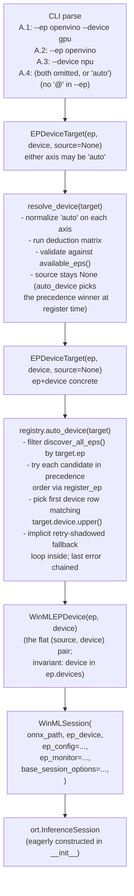
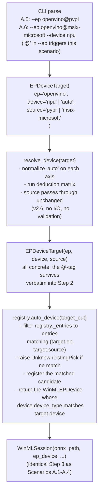
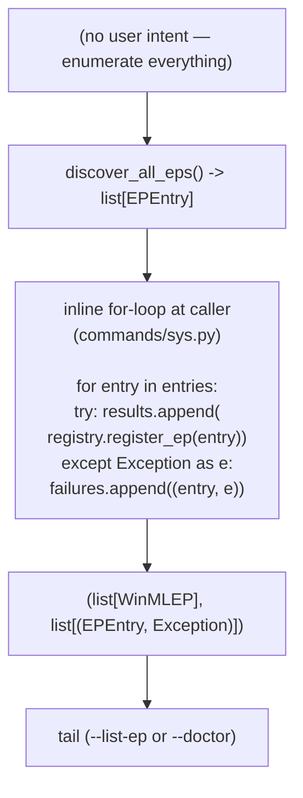
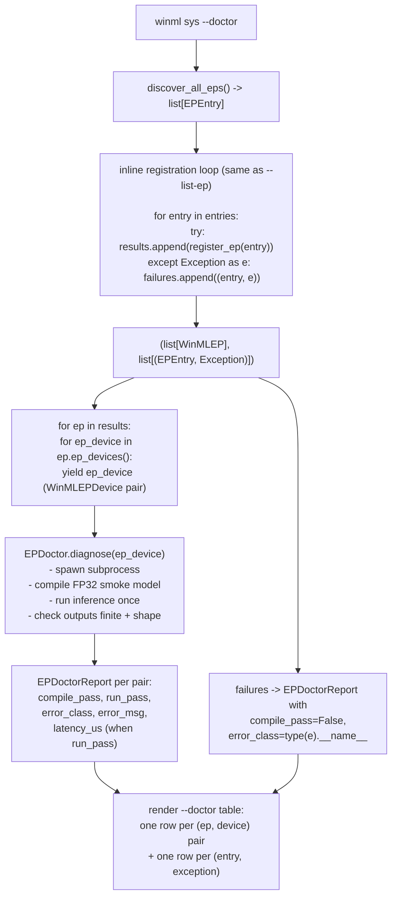

# Session Core Loops — Scenarios, Classes, APIs, and Two Paths

**Version**: 2.7
**Date**: 2026-06-09
**Status**: Draft — v2.7 splits the §7.1 `--list-ep` status taxonomy into two independent layers: L1 `[failed]` (registration outcome — `register_ep` raised) vs L2 `[incompatible]` (vendor compatibility rule — `is_compatible()` returned False; the DLL may have loaded with a generic fallback). Previously both collapsed to `[incompatible]`, hiding the distinction (e.g., QNN on Intel — DLL loads with a CPU fallback, but the vendor rule overrides). New §7.1.1 documents the two layers; §7.1.2 updates the status-derivation pseudocode; failed entries now carry an `error` field while incompatible entries surface `WinMLEP.devices` for transparency. v2.6 aligned §5.3 + §5.8 with the post-refactor implementation: resolve_device is now pure deduction (no source validation, no registry I/O); WinMLEPRegistry singleton state moved into a ClassVar; registry holds a discovery cache (_entries) + ORT built-ins snapshot (_builtin_eps); source-tag validation lives entirely in auto_device (§5.6). v2.5 promotes the Tier 1/2/3 model from an inline terminology paragraph to a first-class §3; renumbers §3-§10 → §4-§11 accordingly; corrects back-references to 3_design_ep.md that wrongly claimed it owns the Tier model (it uses Stage 1 / Stage 2 partition instead). v2.4 reorganized the doc so the reader meets scenarios first, then class taxonomy, then APIs (each with pseudocode), then the Path A/B walkthroughs that tie them together. Also fixed `resolve_device(target: EPDeviceTarget) -> EPDeviceTarget` — the function keeps its original name but takes the typed intent (prior drafts inconsistently called it `resolve` in the doc and `resolve_device(ep, device, source)` in code). v2.3 renamed `WinMLEPRegistry.auto_ep` → `auto_device`; dropped the `_find_entry` tag-decode helper; collapsed `WinMLDevice` to a single concrete class with internal dispatch tables (see [`4_winml_device.md`](4_winml_device.md) v1.4); pinned the `WinMLEPDevice` composition invariant (`.device` is one of `.ep.devices`). v2.2 dropped `WinMLSession.build` in favor of the direct constructor; added the Scenario-B exception trio (`UnknownListingPick`, `IncompatibleListingPick`, `AmbiguousListingPick`); split Path A walkthroughs by scenario class. v2.1 originally locked in the six-type taxonomy, the registry's `register_ep`-only registrar surface, and §10's class inventory.
**Module**: session
**Companion-To**:
- [`3_design_classes.md`](3_design_classes.md) — **canonical class reference** (read this first for the class taxonomy)
- [`1_req.md`](1_req.md) — user-facing requirements that this doc realizes
- [`3_design_ep.md`](3_design_ep.md) — Stage 1/2 model (registration mechanics) + provider_options merge
- [`4_winml_device.md`](4_winml_device.md) — `WinMLDevice` single concrete class + dispatch tables
- [`console_mockup.py`](console_mockup.py) — `winml sys --list-ep` render
**Depends-On**: [`../../ep-path-design.md`](../../ep-path-design.md), [`monitor/2_coreloop.md`](monitor/2_coreloop.md)

> **For the canonical class reference, see [`3_design_classes.md`](3_design_classes.md).** New readers should land there first to fix the six-class taxonomy and naming principles before reading this doc's path-level flows.

---

## Table of Contents

- [1. Purpose](#1-purpose)
- [2. User Scenario Breakdown](#2-user-scenario-breakdown)
- [3. The Three-Tier EP Check Model](#3-the-three-tier-ep-check-model)
  - [3.1 Tier 1 — Discovery (filesystem-only)](#31-tier-1--discovery-filesystem-only)
  - [3.2 Tier 2 — Registration (DLL load + ORT handle wrap)](#32-tier-2--registration-dll-load--ort-handle-wrap)
  - [3.3 Tier 3 — Validation (subprocess smoke test) — PROPOSED](#33-tier-3--validation-subprocess-smoke-test--proposed)
  - [3.4 How tiers compose with paths](#34-how-tiers-compose-with-paths)
- [4. Class Taxonomy](#4-class-taxonomy)
- [5. Core APIs](#5-core-apis)
  - [5.1 `discover_all_eps()`](#51-discover_all_eps)
  - [5.2 `EPSource.resolve()`](#52-epsourceresolve)
  - [5.3 `resolve_device(target)`](#53-resolve_devicetarget)
  - [5.4 `wrap_ort_device(handle)`](#54-wrap_ort_devicehandle)
  - [5.5 `WinMLEPRegistry.register_ep(entry)`](#55-winmlepregistryregister_epentry)
  - [5.6 `WinMLEPRegistry.auto_device(target)`](#56-winmlepregistryauto_devicetarget)
  - [5.7 `WinMLSession.__init__`](#57-winmlsession__init__)
  - [5.8 `WinMLEPRegistry` — lockdown](#58-winmlepregistry--lockdown)
  - [5.9 `_build_session_options` body after the refactor](#59-_build_session_options-body-after-the-refactor)
- [6. Path A — User Intent → Session](#6-path-a--user-intent--session)
  - [6.1 Scenarios A.1–A.4 — by-name walkthrough](#61-scenarios-a1a4--by-name-walkthrough)
  - [6.2 Scenarios A.5–A.6 — by-listing-pick walkthrough](#62-scenarios-a5a6--by-listing-pick-walkthrough)
  - [6.3 Failure modes per layer](#63-failure-modes-per-layer)
  - [6.4 Programmatic scenario P.1 — direct SDK construction](#64-programmatic-scenario-p1--direct-sdk-construction)
  - [6.5 Persisted-config scenario P.2 — JSON round-trip](#65-persisted-config-scenario-p2--json-round-trip)
- [7. Path B — Enumerate-All → Report](#7-path-b--enumerate-all--report)
  - [7.1 `--list-ep` inventory render](#71---list-ep-inventory-render)
  - [7.2 `--doctor` validation smoke-test](#72---doctor-validation-smoke-test)
  - [7.3 Failure modes per layer](#73-failure-modes-per-layer)
- [8. Stable Identifier for Scenario B](#8-stable-identifier-for-scenario-b)
- [9. CLI Surface Mapping](#9-cli-surface-mapping)
- [10. Open Questions](#10-open-questions)
- [11. Appendix — Class Inventory (2026-06-09)](#11-appendix--class-inventory-2026-06-09)

---

## 1. Purpose

This doc describes the **two core paths** through the session layer end-to-end. Today these paths are scattered across `resolve_device` in `session/ep_device.py`, `WinMLSession` in `session/session.py`, `commands/sys.py`, and `commands/perf.py`. No single document maps the full chain from "user typed `--ep openvino --device gpu`" to "an `InferenceSession` runs against the right `OrtEpDevice` handle." This is that map.

It is also the locked-in type and API contract for the session/EP module — the class taxonomy (§4), API set (§5), and the path-level flows (§6–§7) all sit next to each other rather than chasing cross-doc breadcrumbs.

**In scope:**

- The six user-discoverable scenarios this module serves (§2).
- The three-tier mechanical model (Tier 1 Discovery → Tier 2 Registration → Tier 3 Validation) and how Path A and Path B compose against it (§3).
- The six-class taxonomy and which class each layer produces/consumes (§4).
- The seven public APIs with signatures, raises, pseudocode, and per-scenario cross-references (§5).
- Path A (one intent → one session) walked under both Scenario A (by-name) and Scenario B (by-listing-pick) — §6.
- Path B (enumerate-all → report) and its two render tails (`--list-ep`, planned `--doctor`) — §7.
- The Scenario B identifier syntax (`<ep>@<source-tag>`) and its derivation algorithm (§8).
- The CLI surface mapping for every `winml <cmd> <flags>` that touches the session layer (§9).
- A full appendix inventory of every existing class in the EP / session / discovery / sysinfo domain (§11) with the rename / fold / drop verdicts.

**Out of scope:**

- Registration mechanics internals (catalog-row deduction, handle-binding mechanics, `provider_options` three-layer merge). Covered by [`3_design_ep.md`](3_design_ep.md) under its Stage 1 / Stage 2 partition. Plugin discovery (`EP_PATH`, `EPSource`) is in [`../../ep-path-design.md`](../../ep-path-design.md). The Tier 1/2/3 model itself is defined in §3 of this doc.
- `WinMLDevice` dispatch tables and `ep_metadata` schemas. Covered by [`4_winml_device.md`](4_winml_device.md).
- The monitor's per-op tracing loop. Covered by [`monitor/2_coreloop.md`](monitor/2_coreloop.md).
- Compile-specific session options (`SessionOptions.AddConfigEntry`, EP context flags). Covered by [`../compiler/3_design_spec.md`](../compiler/3_design_spec.md).

**Terminology mapping.** This doc uses "Path A" / "Path B" as the user-facing decomposition (cardinality of intent; see §6 and §7) and "Tier 1/2/3" as the internal mechanical decomposition (see §3). [`3_design_ep.md`](3_design_ep.md) uses "Stage 1 / Stage 2" for the same registration mechanics — Stage 1 covers Tier 1 + Tier 2; there is no Stage equivalent for Tier 3 because validation is not yet implemented.

## 2. User Scenario Breakdown

The session/EP module exists to serve nine discoverable user actions. Each is walked in detail under §6 (Path A) or §7 (Path B); this section is the index. Path A (single intent → single session) has six CLI scenarios plus two programmatic scenarios; Path B (enumerate-all → report) has two CLI scenarios.

### Scenario A.1 — `winml perf --ep openvino --device gpu`
Both axes explicit, no source pin. User wants one specific (EP, device) pair; the system picks the precedence-winning source. **See §6.1.**

### Scenario A.2 — `winml perf --ep openvino`
EP explicit, device defaulted via catalog (`default_device_for_ep`). **See §6.1.**

### Scenario A.3 — `winml perf --device npu`
Device explicit, EP inferred from `default_ep_for_device` (registration-aware). **See §6.1.**

### Scenario A.4 — `winml perf` (both omitted)
Hardware auto-detect via `auto_detect_device()`. **See §6.1.**

### Scenario A.5 — `winml perf --ep openvino@pypi`
Source pin (Scenario B by-listing-pick), device defaulted. The user ran `--list-ep` first, saw the tag, types it back. **See §6.2.**

### Scenario A.6 — `winml perf --ep openvino@pypi --device npu`
Source pin AND device explicit. Full Scenario B form. **See §6.2.**

### Scenario P.1 — Programmatic SDK
Direct Python construction: `WinMLSession(onnx_path, ep_device, …)` where `ep_device: WinMLEPDevice` is obtained from `WinMLEPRegistry.instance().auto_device(target)`. **See §6.4.**

### Scenario P.2 — Persisted JSON Config
`compiler/configs.py` JSON round-trip. Old configs (no `source` field) reload as `EPDeviceTarget(source=None)`; re-resolve at session-build time. **See §6.5.**

### Scenario B.1 — `winml sys --list-ep`
Broad enumeration; renders one row per discovered `EPEntry` with status (primary / shadowed / incompatible) and per-device facts (memory, capabilities, …). **See §7.1.**

### Scenario B.2 — `winml sys --doctor`
**PROPOSED** — design only; not implemented. Per-(ep, device) smoke test via `EPDoctor.diagnose`. **See §7.2.**

## 3. The Three-Tier EP Check Model

Three mechanical stages turn an EP's on-disk presence into a session-bound device. They are progressive: each tier subsumes the work of the prior. **Tier 1** is filesystem-only; **Tier 2** loads the DLL and asks ORT for handles; **Tier 3** spawns a subprocess and runs end-to-end inference.

This decomposition is internal to the session/EP module. The companion [`3_design_ep.md`](3_design_ep.md) describes the same registration mechanics under a "Stage 1 / Stage 2" partition (Stage 1 ≈ Tier 1 + Tier 2 combined; there is no Stage equivalent for Tier 3 because validation is not yet implemented). Where the two docs talk about the same work, this doc's tier names are the operational view; `3_design_ep.md`'s stages are the registration-mechanics view.

| Tier | Work | API | Raises | Output | Consumed by |
|---|---|---|---|---|---|
| **Tier 1 — Discovery** | walk `EP_PATH`, glob filesystem, no DLL load | `discover_all_eps()` → `list[EPEntry]` | nothing (per-source errors swallowed) | filesystem-discovery records | Every scenario |
| **Tier 2 — Registration** | one `ort.register_execution_provider_library` call per `EPEntry`; re-query `ort.get_ep_devices()`; wrap handles | `WinMLEPRegistry.register_ep(entry)` → `WinMLEP` | `WinMLEPRegistrationFailed` (load error or zero-device contribution) | success-only `WinMLEP` aggregate | Every scenario |
| **Tier 3 — Validation** *(PROPOSED — not implemented)* | subprocess per `(EP, device)` pair: compile FP32 smoke graph, run once, check outputs finite + shape | `EPDoctor.diagnose(ep_device)` → `EPDoctorReport` | none (failures recorded as data) | per-pair `compile_pass` / `run_pass` / `latency_us` | Only Scenario B.2 (`winml sys --doctor`) |

### 3.1 Tier 1 — Discovery (filesystem-only)

Walks every `EPSource` in `EP_PATH` (`PyPISource`, `NuGetSource`, `MSIXPackageSource`, `WinMLCatalogSource`, `DirectorySource`); produces one `EPEntry` per `(ep_name, on-disk source)` hit without loading any DLL. The defining property is filesystem-only — no DLL opened, no driver touched, no hardware queried. Per-source errors are logged and swallowed; the failing source yields nothing; the walk does not abort.

See §5.1 and §5.2 for the `discover_all_eps()` and `EPSource.resolve()` pseudocode (renumbered §5 here was previously §4).

### 3.2 Tier 2 — Registration (DLL load + ORT handle wrap)

`register_ep(entry)` calls `ort.register_execution_provider_library(entry.dll_path)`, re-queries `ort.get_ep_devices()` for handles whose `ep_name` matches, and wraps each in a `WinMLDevice`. Returns a success-only `WinMLEP` aggregate satisfying `len(devices) >= 1`. Two distinct failures both surface as `WinMLEPRegistrationFailed`: (a) DLL load error (driver missing, ABI mismatch, native crash inside `register_execution_provider_library`); (b) DLL loads but contributes zero `OrtEpDevice` rows for this `ep_name` on this hardware (success-only invariant violation). Callers cannot distinguish (a) from (b) by exception class — they read the message or check the cause.

The cache is keyed on `entry.dll_path`, so re-registering the same DLL is O(1) and returns the same `WinMLEP` instance — across CLI commands in the same process, and across Path A invocations after a Path B broad-loop ran first.

Path A consumes Tier 2 indirectly through `auto_device(target)` (§5.6 — renumbered from §4.6), which filters discovered entries by `target.ep` (and optionally `target.source`), calls `register_ep` on each candidate in precedence order, and returns the first matched `WinMLEPDevice` pair. The retry-shadowed fallback lives inside `auto_device`, not at the call site. Path B (§7.1 — renumbered from §6.1) consumes Tier 2 directly as an inline loop over every discovered entry, capturing both successes (`list[WinMLEP]`) and failures (`list[(EPEntry, Exception)]`) as data so the renderer can show `[incompatible]` rows inline.

### 3.3 Tier 3 — Validation (subprocess smoke test) — PROPOSED

**PROPOSED — `ep_doctor.py` does not exist yet.** For each `WinMLEPDevice` pair produced by Tier 2, `EPDoctor.diagnose(ep_device)` spawns a subprocess that (1) compiles an FP32 smoke model (`Add + Mul + MatMul + Relu`) with the pair's `OrtEpDevice` bound via `add_provider_for_devices`, (2) runs `session.run` once on a deterministic input, (3) verifies each output is finite and has the expected shape. The result is `EPDoctorReport`: `compile_pass`, `run_pass`, `error_class`, `error_msg`, and (on `run_pass=True`) `latency_us`.

Subprocess-per-pair isolation is load-bearing: a native crash in one EP's compile path for one device class must not poison the report on the same EP's other device-class pair, even when both pairs come from the same `WinMLEP`. Failures from Tier 2 (the `(EPEntry, Exception)` entries) skip Tier 3 entirely — there is no handle to bind, so a synthetic `compile_pass=False` report is produced from the registration-time exception class. See §7.2 (renumbered from §6.2) for the walkthrough.

### 3.4 How tiers compose with paths

| Scenario | Tier 1 | Tier 2 | Tier 3 | Cardinality |
|---|---|---|---|---|
| A.1–A.6, P.1, P.2 (Path A) | yes | yes (precedence-ordered try inside `auto_device`) | no | one entry → one `WinMLEPDevice` |
| B.1 (`--list-ep`) | yes | yes (fan-out: every entry; failures captured as data) | no | all entries |
| B.2 (`--doctor`) | yes | yes (fan-out) | yes (per `WinMLEPDevice` pair) | all entries × all device classes |

No scenario consumes only Tier 1, and Tier 3 is never reached without Tier 2 having succeeded for at least one pair.

## 4. Class Taxonomy

Six data classes, one role each. The naming principle: **`WinML*`-prefixed classes are predefined or system-generated** — they cannot be crafted from CLI strings; they require a system API (the static catalog, an ORT registration, the device factory). **Non-prefixed classes are user-craftable** — they are constructible from strings or paths so tests, configs, and the CLI parser can build them directly. For the canonical reference (full method tables and invariants), see [`3_design_classes.md`](3_design_classes.md).

| Class | Role | Created by | Prefix rule | Appears in |
|---|---|---|---|---|
| `EPDeviceTarget(ep: str, device: str, source: str \| None = None)` | Pure intent. `"auto"` allowed on either axis. Optional `source` carries the Scenario B disambiguator. Construction-time validation lives in `EPDeviceTarget.__post_init__`. | CLI parser, JSON config loader, tests, `resolve_device()` output | **No prefix** — user-craftable | A.1–A.6, P.1, P.2 |
| `EPDeviceSpec(ep, device, default_provider_options)` | Catalog row — what *could* exist for an EP, independent of installation state. Process-constant. | static `EP_DEVICE_SPECS` table in `ep_device.py` | **`WinML*`** — predefined | All scenarios (consulted by `resolve_device`) |
| `EPEntry(ep_name, dll_path, source, status, version)` | Filesystem-discovery record. One per `(ep_name, on-disk-source)` pair. No DLL load. | `discover_all_eps()` walking each `EPSource.resolve()`; tests may construct directly | **No prefix** — user-craftable (for tests); produced by filesystem-only scan in production | B.1, B.2; consumed by Path A inside `auto_device` |
| `WinMLDevice` | Vendor-normalized adapter over `ort.OrtEpDevice` — single concrete class; dispatches by `ep_name` internally via module-level tables. See [`4_winml_device.md`](4_winml_device.md). | `wrap_ort_device(handle)` after a successful registration | **`WinML*`** — system-generated | All scenarios (handle lives inside every `WinMLEPDevice`) |
| `WinMLEP(source: EPEntry, devices: tuple[WinMLDevice, ...])` | Successful per-source registration aggregate. Invariant: `len(devices) ≥ 1`. | `WinMLEPRegistry.register_ep(entry)` | **`WinML*`** — system-generated | B.1, B.2 (collected; rendered); A.1–A.6 transiently inside `auto_device` |
| `WinMLEPDevice(ep: WinMLEP, device: WinMLDevice)` | Flat `(source, device)` pair — the project mirror of `ort.OrtEpDevice`. Invariant: `.device` is one of `.ep.devices` (same object, not a copy). | `WinMLEPRegistry.auto_device(target)` (Path A) and `WinMLEP.ep_devices()` (enumerator); the `WinMLSession(...)` constructor consumes it | **`WinML*`** — system-generated | A.1–A.6, P.1, P.2 (passed to constructor); B.2 (flattened pairs fed to `EPDoctor.diagnose`) |

Role splits:

- **`EPDeviceTarget` is the user's pick.** Either axis may be the literal `"auto"`. The optional `source` field carries the Scenario B disambiguator. The CLI parser, JSON config loader, and tests all construct it.
- **`EPDeviceSpec` is the catalog row.** Lives as the `EP_DEVICE_SPECS` table in [`ep_device.py`](../../../src/winml/modelkit/session/ep_device.py).
- **`EPEntry` is the filesystem-discovery record.** Produced by walking `EP_PATH` without loading any DLL. Carries the source tag (one of the closed seven listed in §8), the DLL path, the source's version string, and a `status` of `"primary"` or `"shadowed"` derived from precedence position.
- **`WinMLDevice` is the runtime adapter.** Wraps one `OrtEpDevice` handle and exposes vendor-specific `ep_metadata` through a unified API.
- **`WinMLEP` is the successful per-source registration aggregate.** One EP DLL that loaded plus the tuple of `WinMLDevice` handles it contributed. `len(devices) ≥ 1` means a `WinMLEP` cannot represent a "failed registration" — failures stay separate (see §5.5).
- **`WinMLEPDevice` is the flat pair.** The project's typed mirror of `ort.OrtEpDevice`. Invariant: `.device` is always one of `.ep.devices` (same object identity, not a copy). The compound `WinMLEPRegistry.auto_device(target)` returns one pair directly (Path A); `WinMLEP.ep_devices()` flattens the aggregate into a tuple of pairs for the Path B enumerators.

Failures are represented as `(EPEntry, Exception)` pairs, not as a seventh class. `WinMLEP` is success-only by design; this keeps consumers ergonomic (no `if ep.devices: ...` null checks scattered across renderer code) and pushes the union into the failure-list shape at the broad-enumeration call site (§7).

**`WinMLEP` and `WinMLEPDevice` are reached via `register_ep` / `auto_device` / `ep_devices()`, never as top-level constructors in user code.** Tests may patch the registry to return synthetic instances; production callers never call `WinMLEP(...)` or `WinMLEPDevice(...)` directly.

## 5. Core APIs

Seven public primitives compose Path A and Path B. The breakdown below pairs each API with its signature, the exceptions it raises, a pseudocode body (10–20 lines) showing the algorithm, and which §2 scenarios consume it.

| # | API | Module |
|---|---|---|
| 5.1 | `discover_all_eps()` | `ep_path.py` |
| 5.2 | `EPSource.resolve()` | `ep_path.py` |
| 5.3 | `resolve_device(target)` | `session/ep_device.py` |
| 5.4 | `wrap_ort_device(handle)` | `session/winml_device.py` |
| 5.5 | `WinMLEPRegistry.register_ep(entry)` | `session/ep_registry.py` |
| 5.6 | `WinMLEPRegistry.auto_device(target)` | `session/ep_registry.py` |
| 5.7 | `WinMLSession.__init__` | `session/session.py` |

§5.8 below locks the `WinMLEPRegistry` public surface; §5.9 walks the `_build_session_options` body after the refactor.

### 5.1 `discover_all_eps()`

**Module:** `ep_path.py`

**Signature:**
```python
def discover_all_eps() -> list[EPEntry]: ...
```

**Used by:** Scenarios B.1, B.2 directly; Scenarios A.1–A.6 indirectly through `WinMLEPRegistry.auto_device` (Step 5.6) — auto_device consults the registry's `_entries` discovery cache, which is populated by one `discover_all_eps()` call at registry construction. `resolve_device` no longer calls `discover_all_eps()` (v2.6).

**Raises:** Nothing. Per-source errors are logged and swallowed (the failing source yields nothing).

**Pseudocode:**
```python
def discover_all_eps() -> list[EPEntry]:
    """Walk every EPSource in EP_PATH (PyPISource, NuGetSource,
    MSIXPackageSource, WinMLCatalogSource, DirectorySource) and produce
    one EPEntry per (ep_name, on-disk source) pair. Filesystem-only;
    no DLL load."""
    out: list[EPEntry] = []
    for source in EP_PATH:                  # precedence order
        try:
            for entry in source.resolve():  # yields EPEntry
                out.append(entry)
        except Exception as e:
            logger.warning("source %s.resolve() raised: %s", source, e)
            continue
    return out                              # precedence-ordered
```

Cheap; safe to call on every CLI invocation. The result depends only on filesystem state.

### 5.2 `EPSource.resolve()`

**Module:** `ep_path.py`

**Signature:**
```python
class EPSource(ABC):
    @abstractmethod
    def resolve(self) -> Iterator[EPEntry]: ...
```

**Used by:** `discover_all_eps()` (Step 5.1) — every Scenario reaches `EPSource.resolve` transitively.

**Raises:** Each concrete subclass is responsible for swallowing its own internal errors (yielding nothing on failure). `discover_all_eps()` also defensively wraps the call (see Step 5.1 above).

**Pseudocode (one subclass shape; PyPISource shown):**
```python
class PyPISource(EPSource):
    def resolve(self) -> Iterator[EPEntry]:
        """Walk the active venv site-packages for installed plugin EP
        wheels and yield one EPEntry per (ep_name, dll_path) hit."""
        for dll_path in self._scan_site_packages():
            ep_name = EPCatalog.ep_name_for_dll(dll_path.name)
            if ep_name is None:
                continue
            yield EPEntry(
                ep_name=ep_name,
                dll_path=dll_path,
                source="pypi",
                status="primary",   # narrowed to primary/shadowed later
                version=self._version_of(dll_path),
            )
```

**Current state.** Today's source code at `ep_path.py:215` returns `Iterator[tuple[str, Path]]`; the locked-in shape is `Iterator[EPEntry]`. The five subclasses (`PyPISource`, `NuGetSource`, `MSIXPackageSource`, `WinMLCatalogSource`, `DirectorySource`) migrate together in the casing-sweep PR — each subclass's `resolve()` body becomes the `EPEntry` construction it currently delegates back up to `discover_all_eps`.

### 5.3 `resolve_device(target)`

**Module:** `session/ep_device.py`

**Signature:**
```python
def resolve_device(target: EPDeviceTarget) -> EPDeviceTarget: ...
```

**Used by:** Scenarios A.1–A.6, P.1, P.2 — the CLI boundary and SDK boundary. **Pure deduction; no DLL load, no filesystem scan, no registry I/O.** `source` passes through unchanged; validation against discovered `EPEntry`s happens later in [`WinMLEPRegistry.auto_device`](#56-winmlepregistryauto_devicetarget) (§5.6).

**Raises:**
- `ValueError` — unknown EP after expansion; unknown device class; no registered EP backs the requested device.

**Pseudocode:**
```python
def resolve_device(target: EPDeviceTarget) -> EPDeviceTarget:
    """Pure deduction: fill 'auto' axes from catalog + sysinfo.

    No DLL load, no filesystem scan, no registry I/O. ``source``
    passes through unchanged — source-tag validation against discovered
    EPEntries lives in :meth:`WinMLEPRegistry.auto_device` (§5.6).
    """
    ep = target.ep
    device = target.device

    # Resolve device axis first
    if device == "auto":
        if ep == "auto":
            device = auto_detect_device()                # sysinfo
        else:
            device = default_device_for_ep(expand_ep_name(ep))
            if device is None:
                raise ValueError(...)
    else:
        device = device.lower()                          # already validated by EPDeviceTarget

    # Resolve ep axis (device is concrete now)
    if ep == "auto":
        ep_full = default_ep_for_device(device)          # registration-aware
        if ep_full is None:
            raise ValueError(...)
        ep = short_ep_name(ep_full)

    return EPDeviceTarget(ep=expand_ep_name(ep), device=device, source=target.source)
```

**Note on source validation.** Prior versions of this doc placed Scenario B source-tag validation inside `resolve_device` (raising `UnknownListingPick` when `target.source` didn't match any discovered `EPEntry`). v2.6 removes that step: `resolve_device` is now purely deductive with no I/O, and `auto_device` (§5.6) owns all source-tag validation. The net failure mode for an invalid Scenario B tag is identical — `UnknownListingPick` still raises — but it fires at session-build time (auto_device) rather than at parse/load time (resolve_device).

**Comparison to prior signature.** v2.3 doc said `resolve(target) -> EPDeviceTarget`; code said `resolve_device(ep: str | None, device: str | None, source: str | None = None) -> EPDeviceTarget` — both wrong. v2.4 unifies on `resolve_device(target)`: keeps the original function name; takes typed `EPDeviceTarget` input matching its `EPDeviceTarget` output everywhere else.

`IncompatibleListingPick` is deferred to a later batch (it needs visibility into a prior Path B broad-loop failure list; Path A invocations don't have one).

### 5.4 `wrap_ort_device(handle)`

**Module:** `session/winml_device.py`

**Signature:**
```python
def wrap_ort_device(d: ort.OrtEpDevice) -> WinMLDevice: ...
```

**Used by:** `WinMLEPRegistry.register_ep` (Step 5.5) when wrapping each contributed `OrtEpDevice` handle into a `WinMLDevice`.

**Raises:** Never raises on construction. EPs whose `ep_name` is absent from the dispatch tables surface with `None` / `()` for vendor-specific properties rather than crashing the renderer. See [`4_winml_device.md`](4_winml_device.md) §6.

**Pseudocode:**
```python
def wrap_ort_device(d: ort.OrtEpDevice) -> WinMLDevice:
    """Trivial factory over the WinMLDevice(d) constructor.

    Under the single-class design (v1.4), vendor-specific properties
    dispatch on d.ep_name internally at property-access time via
    module-level tables. There is no per-EP subclass dispatch at
    construction time."""
    return WinMLDevice(d)
```

### 5.5 `WinMLEPRegistry.register_ep(entry)`

**Module:** `session/ep_registry.py`

**Signature:**
```python
class WinMLEPRegistry:
    def register_ep(self, entry: EPEntry) -> WinMLEP: ...
```

**Used by:** Scenarios A.1–A.6 transitively through `auto_device` (Step 5.6); Scenarios B.1 and B.2 directly via the caller-side broad-loop (§7.1).

**Raises:**
- `WinMLEPRegistrationFailed` — ORT's `register_execution_provider_library` raised, OR the loaded DLL contributed zero `OrtEpDevice` rows for this entry's `ep_name` (empty device set is a registration failure under the success-only invariant).

**Pseudocode:**
```python
def register_ep(self, entry: EPEntry) -> WinMLEP:
    """Atomically register one EPEntry's DLL with ORT and return a
    success-only WinMLEP aggregate. Idempotent at entry.dll_path
    granularity (re-registering the same DLL returns the same WinMLEP)."""

    # Step 1 — idempotency cache.
    if entry.dll_path in self._registered:
        return self._registered[entry.dll_path]

    # Step 2 — load DLL (or no-op for bundled). Fast-path against
    # ort.get_ep_devices() guards third-party callers that registered
    # the same DLL outside this registry.
    self._load_ep_dll(entry)                  # raises WinMLEPRegistrationFailed

    # Step 3 — re-read ort.get_ep_devices() and collect every handle
    # whose ep_name matches this entry; wrap each via wrap_ort_device.
    handles = self._pick_handle(entry.ep_name, ort.get_ep_devices())
    devices = tuple(wrap_ort_device(h) for h in handles)

    # Step 4 — assert success-only invariant, cache, return.
    if not devices:
        raise WinMLEPRegistrationFailed(
            f"DLL {entry.dll_path} loaded but contributed 0 devices"
        )
    ep = WinMLEP(source=entry, devices=devices)
    self._registered[entry.dll_path] = ep
    return ep
```

### 5.6 `WinMLEPRegistry.auto_device(target)`

**Module:** `session/ep_registry.py`

**Signature:**
```python
class WinMLEPRegistry:
    def auto_device(self, target: EPDeviceTarget) -> WinMLEPDevice: ...
```

**Used by:** Scenarios A.1–A.6 (the Path A tail right before `WinMLSession.__init__`); Scenario P.1 (programmatic) directly.

**Raises:**
- `ValueError` — `target.ep == "auto"` or `target.device == "auto"` (caller must run `resolve_device` first).
- `UnknownListingPick(ep, source)` — `target.source` is set but no discovered `EPEntry` matches. v2.6: this raise lives entirely inside `auto_device`; `resolve_device` no longer performs source-tag validation.
- `DeviceNotFound` — candidates registered cleanly but none exposed `target.device`. Semantically distinct from `WinMLEPRegistrationFailed` (which fires when every candidate's registration raised).
- `WinMLEPRegistrationFailed` — at least one candidate's registration raised AND no later candidate succeeded. Last underlying exception chained as `__cause__`.
- `AmbiguousListingPick` — (defensive) more than one entry matched `target.source`; tag-derivation algorithm bug signal.

**Pseudocode:**
```python
def auto_device(self, target: EPDeviceTarget) -> WinMLEPDevice:
    """Compound Path A tail: resolve discovered entries for target.ep
    down to one (source, device) pair and return it. The retry-shadowed
    fallback that previously lived as caller-side code lives here."""

    if target.ep == "auto" or target.device == "auto":
        raise ValueError("auto_device requires a resolved EPDeviceTarget")

    ep_full = expand_ep_name(target.ep)
    candidates = self._entries_for(ep_full)        # registry's _entries cache
    if not candidates:
        raise WinMLEPNotDiscovered(f"No EPEntry for ep={target.ep!r}")

    if target.source is not None:
        candidates = [e for e in candidates
                      if entry_source_tag(e) == target.source]
        if not candidates:
            raise UnknownListingPick(target.ep, target.source)

    last_exc: Exception | None = None
    any_registered = False
    target_device = target.device.upper()
    for cand in candidates:                       # precedence order
        try:
            ep = self.register_ep(cand)
        except WinMLEPRegistrationFailed as e:
            last_exc = e
            continue
        any_registered = True
        for pair in ep.ep_devices():
            if pair.device.device_type == target_device:
                return pair                       # invariant: pair.device in pair.ep.devices

    # Split: clean registration but missing device class vs total failure.
    if any_registered:
        raise DeviceNotFound(
            f"Registered EPs did not expose device {target.device!r}"
        )
    raise WinMLEPRegistrationFailed(
        f"No candidate registered + exposed device {target.device!r}"
    ) from last_exc
```

### 5.7 `WinMLSession.__init__`

**Module:** `session/session.py`

**Signature:**
```python
class WinMLSession:
    def __init__(
        self,
        onnx_path: str | Path,
        ep_device: WinMLEPDevice,
        *,
        ep_config: EPConfig | None = None,
        ep_monitor: WinMLEPMonitor | None = None,
        base_session_options: ort.SessionOptions | None = None,
    ) -> None: ...
```

**Used by:** Scenarios A.1–A.6, P.1, P.2 — the Path A constructor tail. Scenario B.2 (`--doctor`) constructs `InferenceSession` directly inside subprocess workers; it does not go through this constructor.

**Raises:**
- `ort.RuntimeException` — passed through verbatim on compile-time error (unsupported op, missing driver). The constructor does not catch or fall back; the caller decides.

**Pseudocode:**
```python
def __init__(self, onnx_path, ep_device, *,
             ep_config=None, ep_monitor=None, base_session_options=None):
    """Path A user entry. Direct constructor — no .build() classmethod.
    Existing call sites that don't supply ep_monitor keep working
    unchanged (default None)."""

    self._onnx_path = Path(onnx_path)
    self._ep_device = ep_device
    self._ep_config = ep_config
    self._ep_monitor = ep_monitor

    so = _build_session_options(                   # see §5.9
        ep_device, ep_config, ep_monitor, base_session_options,
    )

    # Eager construction matches current shape at session/session.py:200.
    # On compile-time error, ORT raises RuntimeException; we let it bubble.
    self._session = ort.InferenceSession(str(self._onnx_path), sess_options=so)
    self._state = SessionState.COMPILED
```

Subclass extension: `WinMLQairtSession` (`session/qairt/qairt_session.py:44`) extends `__init__` to default `ep_device` to `auto_device(resolve_device(EPDeviceTarget(ep="qnn", device="npu")))` when `None`; the new `ep_monitor` kwarg propagates via `**kwargs` in subclasses that don't name it explicitly.

### 5.8 `WinMLEPRegistry` — lockdown

This subsection locks the registry's public surface to **two** methods — one atomic (`register_ep`) and one compound (`auto_device`). Every prior public surface — `list_all`, `available_eps`, `available_ep_devices` — is dropped from the class.

```python
class WinMLEPRegistry:
    def register_ep(self, entry: EPEntry) -> WinMLEP: ...
    def auto_device(self, target: EPDeviceTarget) -> WinMLEPDevice: ...
```

**State held by the singleton:**

```python
class WinMLEPRegistry:
    _instance: ClassVar[WinMLEPRegistry | None] = None  # singleton handle
    _entries: list[EPEntry]      # discovery cache (one filesystem scan per process)
    _registered: dict[Path, WinMLEP]   # idempotency cache, keyed by entry.dll_path
    _builtin_eps: frozenset[str]       # ORT built-ins (CPU, DML, …) snapshotted at __init__
```

The singleton holds three pieces of state. **`_entries`** is the discovery cache: `__init__` calls `list(discover_all_eps())` once, and `auto_device` reads it via the private `_entries_for(ep_name)` method. **`_registered`** is the DLL-load idempotency cache, keyed by `entry.dll_path`; re-registering the same DLL is a true no-op that returns the same `WinMLEP`. **`_builtin_eps`** is a frozenset captured from `ort.get_available_providers()` at `__init__` — it's how `available_eps()` reports built-in EPs (CPU, DML, bundled Azure) without callers reaching past the registry to query ORT directly. The registry is the canonical ORT wrapper; no other module imports `onnxruntime` for "which providers are available" queries.

`_entries_for(ep_name)` is **registry-internal** (private; called only by `auto_device`). The public surface remains exactly two methods (`register_ep`, `auto_device`); the broad-listing claim below is unchanged because `_entries_for` is not exposed to callers.

**Singleton pattern:**

The singleton is implemented via the class-level `_instance: ClassVar[WinMLEPRegistry | None] = None`. Callers obtain the instance via `WinMLEPRegistry.instance()`; the classmethod constructs on first call and returns the cached handle thereafter. There is no module-level `get_registry()` helper and **no module-level `_winml_ep_registry` global** (prior drafts had one; v2.6 moves it into the class to match the §5.8 documented spec — singleton state is owned by the class itself, not by the module).

```python
@classmethod
def instance(cls) -> WinMLEPRegistry:
    """Return the process-wide singleton, constructing on first call."""
    if cls._instance is None:
        cls._instance = cls()       # __init__ snapshots _entries + _builtin_eps
    return cls._instance
```

Tests that need a fresh instance reset `WinMLEPRegistry._instance = None` and re-call `instance()` — this re-runs `__init__` and re-snapshots the discovery cache and ORT built-ins.

**Private helpers (kept internal):**

| Helper | Purpose |
|---|---|
| `_entries_for(self, ep_name: str) -> list[EPEntry]` | Reads the singleton's `_entries` discovery cache and returns the subset whose `ep_name` matches. Called only by `auto_device`. Keeps the public surface at two methods (no broad-listing accessor leaks out). |
| `_load_ep_dll(self, entry: EPEntry) -> None` | The actual `ort.register_execution_provider_library` call, with the `ort.get_ep_devices()` fast-path guard. Raises `WinMLEPRegistrationFailed` on ORT exception. |
| `_pick_handle(self, ep_name: str, devices: list[ort.OrtEpDevice]) -> list[ort.OrtEpDevice]` | Filters ORT's enumeration to handles whose `ep_name == ep_name`, deduplicates by `(vendor_id, device_id)`. No device-class filter; that is caller's concern via `ep.ep_devices()`. |
| `_entry_source_tag(entry: EPEntry) -> str` | Module-private helper that mirrors `commands.sys._describe_source` so `auto_device` can match against `EPDeviceTarget.source` without depending on a CLI module. |

**Idempotency contract.** Re-registering the same `entry.dll_path` returns the *same* `WinMLEP` instance — object identity is preserved. Tests, repeated CLI calls within one process, and the Path B inline loop all rely on this. Two `EPEntry` rows that resolve to the same absolute DLL path (e.g., one constructed from a tag, one constructed by `discover_all_eps()`) hit the same cache slot.

**What `register_ep` does NOT do:**

- It does **not** discover. Discovery is `discover_all_eps()`'s job; the registry takes a pre-built `EPEntry` as input.
- It does **not** filter devices to one device class. The returned `WinMLEP.devices` tuple contains every class the DLL contributed. Filtering to a single `(source, device)` pair is the caller's concern — done via `WinMLEP.ep_devices()` followed by a list-comprehension on `device.device_type`.
- It does **not** decode tag strings. That work is owned by `auto_device` (it does its own tag-filter on `discover_all_eps()`).
- It does **not** expose broad listing. Callers that need every registration (`--list-ep`, `--doctor`) write an inline loop over `discover_all_eps()`; the loop is six lines (see §7.1).
- It does **not** raise `DeviceNotFound`. A loaded DLL contributing zero devices is a `WinMLEPRegistrationFailed` (invariant violation); a loaded DLL contributing devices but none matching the user's `--device` class is a caller-side empty-filter outcome — for Path A that filter is inside `auto_device`, for Path B it is in the renderer.
- It does **not** retry against shadowed candidates. The single-source contract (one `EPEntry` in, one `WinMLEP` out, or raise) means `register_ep` is atomic. Primary-failed-try-shadowed lives inside `auto_device` (Path A's compound entry point); Path B (`--list-ep`) registers each `EPEntry` independently and captures failures as data — no fallback at all (see §7.1).

**Why split into atomic + compound.** There is exactly one atomic operation the registry performs — load one DLL, wrap its handles, build the aggregate. That is `register_ep`. The compound path (resolve a target → filter discovered entries → try them in precedence order → pick the matching device class) is the most-used Path A entry; it ships as `auto_device` so the call site is a single line instead of a five-step inline composition. Cardinality (one entry vs many entries) stays a caller-side concern — `auto_device` walks one filtered precedence list, Path B's `--list-ep` walks all entries; neither tries to be the other.

The tag-decode logic that earlier drafts factored into a private `_find_entry(target) -> EPEntry` helper now lives directly inside `auto_device` — no separate helper. The decode rule (walk `discover_all_eps()`, filter by `(target.ep, target.source)`, raise `UnknownListingPick` / `AmbiguousListingPick` defensively) survives unchanged; only the indirection through a named helper is dropped.

### 5.9 `_build_session_options` body after the refactor

`_build_session_options` (`session/session.py:170`) is the helper that the `WinMLSession.__init__` body calls to build the `ort.SessionOptions` it passes to `ort.InferenceSession`. The locked-in shape narrows it significantly:

```python
def _build_session_options(
    ep_device: WinMLEPDevice,
    ep_config: EPConfig | None,
    ep_monitor: WinMLEPMonitor | None,
    base_session_options: ort.SessionOptions | None,
) -> ort.SessionOptions:
    so = base_session_options if base_session_options is not None else ort.SessionOptions()
    if ep_monitor is not None:
        for key, value in ep_monitor.get_session_options().items():
            so.add_session_config_entry(key, value)
    options = _build_provider_options(ep_device, ep_config, ep_monitor)
    so.add_provider_for_devices([ep_device.device._ort], options)
    return so
```

The current body at `session/session.py:191` calls `WinMLEPRegistry.get_instance().register_ep(ep_device)` to *re-derive* the `OrtEpDevice` handle from the intent-meaning `WinMLEPDevice`. Under the locked-in taxonomy, the caller has already done the registration and pair pick (Steps 5.3 + 5.6 of the Path A composition), so `_build_session_options` receives the new-meaning `WinMLEPDevice` pair and reaches the handle directly via `ep_device.device._ort`. **No `register_ep` call inside the helper.** The session-options helper becomes a thin wrapper over `add_provider_for_devices` plus the monitor's session-config entries.

## 6. Path A — User Intent → Session

Path A is the foundational walk: one user, one intent, one session. Every programmatic `WinMLSession(onnx_path, ep_device, ...)` construction, every `winml perf`, every `winml compile`, and every direct SDK call lands here.

Path A is **one path with two scenarios**, not two sub-paths. The composition is identical for Scenario A (by-name) and Scenario B (by-listing-pick) — the difference is in the *input* to `resolve_device` (does `target.source` come from the user or stay `None`?) and in the *strictness* of `auto_device`'s validation (v2.6: Scenario B rejects source-tag mismatches inside `auto_device`, which Scenario A would silently deduce around — `resolve_device` itself is now purely deductive and passes `source` through unchanged).

**Path A composition (three steps + the constructor call; same shape for Scenario A and B):**

```python
target_in    = parse_cli_args()                        # EPDeviceTarget; may have "auto"
target       = resolve_device(target_in)               # EPDeviceTarget; all concrete
ep_device    = registry.auto_device(target)            # WinMLEPDevice; matched pair
session      = WinMLSession(onnx_path, ep_device,
                            ep_config=..., ep_monitor=..., base_session_options=...)
```

The first three lines are universal: Scenario A's `target_in` has `"auto"` values for `resolve_device` to fill in; Scenario B's `target_in` carries an explicit `source` and concrete `ep` + `device`, so `resolve_device` is mostly a no-op (it just passes the concrete target through, including `source`). `auto_device` then takes the resolved target, walks the registry's `_entries` cache filtered by `target.ep` (and optionally `target.source`) in precedence order, calls `register_ep` on each candidate, and returns the first `WinMLEPDevice` whose device class matches `target.device.upper()`.

### 6.1 Scenarios A.1–A.4 — by-name walkthrough

The user typed `--ep <name|auto>` and/or `--device <class|auto>` with no `@<source-tag>`. The CLI parser produces an `EPDeviceTarget` with `source=None` and may have `"auto"` on either axis. The four sub-scenarios:

- **A.1** — `--ep <name> --device <class>` (both explicit). `resolve_device` validates only.
- **A.2** — `--ep <name>` only. `resolve_device` fills `device` from `default_device_for_ep(ep)`.
- **A.3** — `--device <class>` only. `resolve_device` fills `ep` from `default_ep_for_device(device)` filtered by `available_eps()`.
- **A.4** — both omitted (or both `"auto"`). `resolve_device` runs `auto_detect_device()`, then falls through to the device-only branch.

All four follow the same three-step flow:



**Step 1 — `resolve_device(target)` (§5.3).** Pure deduction. Walks the matrix inherited from the prior `resolve_device(ep, device)` body:

| `ep` given | `device` given | Behavior |
|---|---|---|
| yes | yes | Validate both; return |
| yes | no | `default_device_for_ep(ep)` from catalog |
| no | yes | `default_ep_for_device(device)` filtered by `available_eps()` (registration-aware — see [`3_design_ep.md`](3_design_ep.md) §6.4) |
| no | no | `auto_detect_device()` walks the hardware-priority list, intersects with `available_eps()`, falls through to the device-only branch |

The `"auto"` sentinel on either axis is normalized to `None` up-front. Because `available_eps()` is cheap, lru-cached, and name-only, the entire deduction phase stays sub-millisecond.

Invariant: `resolve_device` either returns an `EPDeviceTarget` with no `"auto"` values whose `(ep, device)` is in `EP_DEVICE_SPECS`, or it raises `ValueError`. In Scenario A, `target.source` stays `None` — `auto_device` (Step 2) picks the precedence winner at registration time.

**Step 2 — `registry.auto_device(target)` (§5.6).** Compound Path A entry. Filters `discover_all_eps()` by `target.ep`, tries each candidate in precedence order via `register_ep` (with the idempotency cache), and returns the first `WinMLEPDevice` whose `device.device_type == target.device.upper()`. The retry-shadowed fallback runs inline: if `register_ep` raises on the precedence-winner, `auto_device` records the exception and continues to the next candidate; only if all candidates fail does it raise `WinMLEPRegistrationFailed` with the last error chained.

Invariant on the returned pair: `pair.device in pair.ep.devices` (same object identity, not a copy).

**Step 3 — `WinMLSession(onnx_path, ep_device, …)` (§5.7).** The constructor takes the chosen `WinMLEPDevice` pair directly. Internally it runs the three-layer `provider_options` merge (catalog default → user config → monitor overrides; see [`3_design_ep.md`](3_design_ep.md) §8.1), calls `so.add_provider_for_devices([ep_device.device._ort], options)` on a fresh `ort.SessionOptions`, and constructs `ort.InferenceSession` eagerly. `ep_monitor` defaults to `None`; non-monitor call sites omit it entirely. On compile-time error ORT raises `RuntimeException`; the constructor surfaces it verbatim.

### 6.2 Scenarios A.5–A.6 — by-listing-pick walkthrough

The user previously ran `winml sys --list-ep`, saw one or more rows under an EP heading, and types one back as `--ep <name>@<source-tag>[ --device <class>]`. The CLI parser produces an `EPDeviceTarget` with a non-None `source` and concrete `ep`. `device` may still be `"auto"`/omitted (then defaulted from the catalog) or the user-supplied class.

- **A.5** — `--ep <name>@<tag>` only. `resolve_device` deduces `device` (e.g., via `default_device_for_ep`) and passes `source` through unchanged; `auto_device` validates the tag and raises `AmbiguousListingPick` if the resolved class is not contributed by the matched entry.
- **A.6** — `--ep <name>@<tag> --device <class>`. Both axes explicit; `resolve_device` is a no-op on both; `auto_device` validates the tag and the contributed device-class set.

The flow is the same three steps as A.1–A.4 — `resolve_device` → `registry.auto_device(target)` → `WinMLSession(...)` — with two differences:

1. **`auto_device` validates `source` (not `resolve_device`).** v2.6: `resolve_device` is purely deductive and passes `target.source` through unchanged. `auto_device` looks up the matching `EPEntry` against the registry's `_entries` discovery cache and raises `UnknownListingPick(ep, source_tag)` if no row matches. (When `auto_device` has access to a prior Path B broad-loop failure list — the persisted-config reload case — it can also raise `IncompatibleListingPick`. The Path A pure invocation does not see a failure list and defers the incompatibility signal to the inner `register_ep` retry.)

2. **Ambiguous-device handling is stricter.** If the user did not supply `--device` and the matched entry contributed more than one device class, `auto_device` raises `AmbiguousListingPick(ep, source_tag, [classes])` — the user must either re-run with `--device <class>` or accept the EP's catalog-default device.

Step 2 (`auto_device`) and Step 3 (constructor) are identical to Scenarios A.1–A.4. The only difference visible at register-time is that `target.source` is the user-named tag — so `auto_device`'s internal filter narrows to exactly that one `EPEntry` even when a different one would have won precedence, and the inner `register_ep` loads that DLL. The retry-shadowed loop inside `auto_device` is a no-op in Scenario B because the source-tag filter usually leaves only one candidate.



The Scenario B contract is intentionally stricter than Scenario A's: A silently deduces; B refuses to silently substitute. See [`1_req.md`](1_req.md) §2 R2 for the user-facing statement of this contract.

### 6.3 Failure modes per layer

| Layer | Scenario | Failure | Raised as | Caller can... |
|---|---|---|---|---|
| `resolve_device` | A.1-A.4 | Unknown EP short-name (`--ep foo`) | `ValueError` | Fix input |
| `resolve_device` | A.1-A.4 | `--device` only, no installed EP claims that class | `ValueError("No registered EP for device …")` | Install plugin, set `WINMLCLI_EP_PATH`, or pass `--ep` |
| `resolve_device` | A.1-A.4 | Both given; resolved EP not in `available_eps()` | `ValueError("EP X not registered on this host. Hint: install the plugin or set WINMLCLI_EP_PATH.")` | Install plugin, set env var |
| `resolve_device` | A.4 | `auto_detect_device()` finds no plugin EP backing any hardware | falls through to bundled CPU | None needed; CPU always works |
| `auto_device` | A.5-A.6 | Source tag does not match any discovered `EPEntry` for the EP | `UnknownListingPick(ep, source_tag)` | Re-run `winml sys --list-ep` to see valid tags |
| `auto_device` | A.5-A.6 (P.2 reload) | Source's broad-loop registration raised | `IncompatibleListingPick` (cause: original `WinMLEPRegistrationFailed`) | Pick a different row |
| `auto_device` | A.5 | `device="auto"` and entry contributes multiple classes with no clean catalog default | `AmbiguousListingPick(ep, source_tag, [classes])` | Add `--device <class>` |
| `auto_device` | any | Multiple entries match a tag (defensive — algorithm bug) | `AmbiguousListingPick` | File bug against tag derivation |
| `auto_device` (inner `register_ep`) | any | DLL fails to register (load error, ABI mismatch, missing dep) | `WinMLEPRegistrationFailed` (last error chained after all candidates exhausted) | Inspect logs for the underlying native error |
| `auto_device` (inner `register_ep`) | any | DLL loaded but contributed zero devices total | `WinMLEPRegistrationFailed` (invariant `len(devices) >= 1`) | Pick a different EP, verify hardware |
| `auto_device` (device-class match) | any | No `WinMLEPDevice` in any successful candidate's flat tuple matches the requested device class | `DeviceNotFound` (candidates registered cleanly but none exposed `target.device`) | Pick a different `--device`; verify hardware |
| `WinMLSession(...)` | any | Compile-time error (unsupported op for this EP+device) | ORT raises `RuntimeException` | Use different EP or fall back to CPU |
| `session.run` | any | Runtime crash (driver issue, OOM, native SEGV) | ORT raises or process crashes | Out of scope for Path A; use `winml sys --doctor` to pre-validate |

### 6.4 Programmatic scenario P.1 — direct SDK construction

The Python SDK call into `WinMLSession(onnx_path, ep_device, ...)` is Path A from a non-CLI entry point. There is no `argparse` step — the caller builds the `EPDeviceTarget` directly, walks the three steps, and invokes the constructor. The shape is identical to the CLI walks above; only the entry point differs.

```python
from winml.modelkit.session import (
    EPDeviceTarget, resolve_device,
    WinMLEPRegistry, WinMLSession,
)

# Step 0 — user code constructs the intent directly.
target = EPDeviceTarget(ep="openvino", device="npu", source=None)   # Scenario A shape
# (or: EPDeviceTarget(ep="openvino", device="npu", source="pypi")   — Scenario B shape)

# Step 1 — resolve (fills 'auto', validates).
resolved = resolve_device(target)

# Step 2 — compound: filter discovered entries by (ep, source), register the
# precedence-winner (with retry-shadowed fallback), pick the matching device
# row, and return the WinMLEPDevice pair.
ep_device = WinMLEPRegistry.instance().auto_device(resolved)

# Step 3 — direct constructor.
session = WinMLSession(
    onnx_path="model.onnx",
    ep_device=ep_device,
    ep_config=None,
    ep_monitor=None,                    # optional; omit for non-monitor sites
)
```

Existing call sites that already construct `WinMLSession(onnx_path, ep_device)` without a monitor keep working unchanged (`ep_monitor=None` is the default). Existing call sites in `commands/perf.py`, `commands/compile.py`, and `models/auto.py` fall in this bucket — they construct the `WinMLEPDevice` pair (via `resolve_device(EPDeviceTarget(...))` + `auto_device`) and pass it to the constructor.

Tests bypass `auto_device` entirely by patching the registry to return synthetic `WinMLEP` / `WinMLEPDevice` instances — see [`3_design_classes.md`](3_design_classes.md) §3 for the test patterns.

### 6.5 Persisted-config scenario P.2 — JSON round-trip

`WinMLCompileConfig` (`compiler/configs.py:285`) persists the user's intent across compile runs. The JSON shape:

```json
{
  "ep_device": {
    "ep": "openvino",
    "device": "npu",
    "source": "pypi"
  },
  "validate": true,
  ...
}
```

The `source` field is **optional**. Two cases at load:

- **New JSON (with `source`)** — `EPDeviceTarget(ep="openvino", device="npu", source="pypi")` is rehydrated as-is. The load-time `resolve_device(target)` passes `source` through unchanged (v2.6: no validation in resolve_device); the subsequent `auto_device(resolved)` validates the tag against the registry's `_entries` discovery cache. If `source="pypi"` is no longer present (the user uninstalled the wheel between saves), `auto_device` raises `UnknownListingPick` — the user sees the failure rather than silently binding to a different source.
- **Old JSON (no `source`)** — `EPDeviceTarget(ep="openvino", device="npu", source=None)`. The load-time `resolve_device(target)` runs the Scenario A path: the deduction matrix is a no-op (both axes already concrete), and `auto_device` (Step 2) binds to the **current** precedence winner. **No version pinning, no silent failure.** If `openvino@pypi` was the winner when the config was saved and `openvino@msix-microsoft` is the winner now, the reloaded session binds to `msix-microsoft` — the persisted config did not pin the source, so the current host's precedence wins.

This behavior is user-visible — see [`1_req.md`](1_req.md) §3 C1 for the stability statement. Scripts that need cross-environment stability must save new-format JSON (include `source`) and must be prepared to handle `UnknownListingPick` when re-loading on a different host. There is no `version` field on the persisted config and no automatic version compatibility shim; the load path is `resolve_device → auto_device → constructor` exactly as in P.1, with the JSON acting as the input substitute for `parse_cli_args()`.

## 7. Path B — Enumerate-All → Report

Path B is the enumeration walk: no user-supplied intent, no single target. The caller wants a full inventory of "every `(ep, source)` combination this machine can serve" — for either render (`--list-ep`) or validation (`--doctor`). Path B does not introduce new registry methods; it loops the same `register_ep` at higher cardinality and ends in a different tail.



**The caller-side loop:**

```python
results, failures = [], []
for entry in discover_all_eps():
    try:
        results.append(registry.register_ep(entry))
    except Exception as e:
        failures.append((entry, e))
```

This is the **only** place that `register_ep` is called in a fan-out pattern. Path A's `register_ep` is one-call-one-`WinMLEP`; Path B's enumeration is the explicit six-line loop that captures failures as data so the renderer can show `[incompatible]` rows inline.

There is no `registry.list_all()`. The registry stays atomic-and-idempotent (§5.8); the cardinality lives where the cardinality decision is made — at the CLI command. Both `--list-ep` and `--doctor` write the same six-line loop; their downstream renderer logic diverges, the enumeration loop does not.

The `register_ep` idempotency cache (keyed by `entry.dll_path`) means that if a process already ran the inline loop once and then runs a Path A invocation against the same DLL, the second call is a fast O(1) cache hit — the DLL was loaded by the earlier walk.

### 7.1 `--list-ep` inventory render

Consumer: [`commands/sys.py`](../../../src/winml/modelkit/commands/sys.py). The render takes the loop's `(results, failures)` output and produces one numbered entry per `(ep_name, source)` pair, grouped under an EP heading.

#### 7.1.1 Two independent failure layers

A row can end up "not a usable target" for two semantically distinct reasons. The renderer treats them as separate statuses so the user can tell them apart:

| Layer | What it checks | Mechanism | User-visible status |
|---|---|---|---|
| **L1 — Registration outcome** | Did ORT actually load the DLL and expose at least one matching device? | `register_ep(entry)` raised `WinMLEPRegistrationFailed` | `[failed]` (with `error` field) |
| **L2 — Vendor compatibility rule** | Does the host hardware match what the EP targets? | `entry.source.is_compatible()` returned `False` for the EP-level first-entry source | `[incompatible]` |

The two layers are **independent** and can disagree. Common cases:

- **L1 fails, L2 doesn't:** OpenVINO DLL has an ABI mismatch on Linux; `register_ep` raises; rule says nothing. Tag: `[failed]`.
- **L1 passes, L2 fails:** QNN on Intel — `register_ep` succeeds (QNN ships a CPU fallback that loads on any host), but `EP_CATALOG.vendor_requirements_for("QNNExecutionProvider")` declares Qualcomm hardware, which sysinfo doesn't detect → `is_compatible()` returns False. The DLL loaded and `WinMLEP.devices` contains a CPU handle, but the vendor rule overrides to `[incompatible]` because the EP is fundamentally targeting silicon that isn't here.
- **Both fail:** rare but possible (incompatible AND the DLL can't even load) — L1 wins because it's the more concrete failure; the row renders as `[failed]`.
- **Both pass:** normal — row renders as `[primary]` or `[shadowed]` per the precedence walk below.

#### 7.1.2 Status derivation

Render-time only; no `status` field exists on `WinMLEP`. The discovery-time `EPEntry.status` carries `"primary"` / `"shadowed"` from precedence position, but the renderer ignores it because it reflects source-list ordering, not registration outcome.

```
For each ep_name appearing in results or failures:
  # L2 evaluated once per EP, from first row's source.
  ep_compatible = first_row.entry.source.is_compatible()

  primary_seen = False
  for entry in walk order:
    if (entry, exception) in failures:
      status = "failed"              # L1 wins
      error_field = exception
    elif entry -> WinMLEP in results:
      if not ep_compatible:
        status = "incompatible"      # L2 vendor rule
      else:
        status = "primary" if not primary_seen else "shadowed"
        primary_seen = True
```

In plain English:

- **Primary** — first source under this EP name that produced a `WinMLEP` AND the host satisfies the vendor rule.
- **Shadowed** — subsequent successful source under the same EP name that also satisfies the vendor rule. Available for Scenario B (`--ep <name>@<that-source-tag>`) but not what Scenario A's deduction picks.
- **Failed** — `register_ep` raised. The DLL didn't load (driver missing, ABI mismatch, native crash inside `register_execution_provider_library`) or loaded but ORT enumerated zero matching devices. Carries an `error` field with the exception class + message.
- **Incompatible** — `register_ep` succeeded but the EP-level `is_compatible()` rule returned False (the EP targets hardware vendors not detected on this host). The `WinMLEP.devices` may contain a generic fallback handle (e.g. QNN's CPU fallback on Intel) but the row is opinionated: this EP is not the right target for this machine.

#### 7.1.3 What stays unchanged

The locked-in semantic is the "Intel NPU/GPU/CPU lie" fix from [`3_design_ep.md`](3_design_ep.md) §6.5: `--list-ep` does not show static `EP_DEVICE_SPECS` declarations of devices that aren't actually present. A row appears only when grounded by either a `WinMLEP.devices` entry (real handle) or an `EPEntry` (real on-disk DLL), never by a catalog claim alone.

The render-time DTOs (`EntryRow`, `DeviceRow`, `EpBlock`) live in [`console_mockup.py`](console_mockup.py). The mockup consumes a list of `WinMLEP` for the success groups and a list of `(EPEntry, Exception)` for the failed entries; `[incompatible]` rows are sourced from the success list but flagged via the EP-level compat boolean.

### 7.2 `--doctor` validation smoke-test

Consumer: [`commands/sys.py`](../../../src/winml/modelkit/commands/sys.py) (PROPOSED — `ep_doctor.py` does not exist yet; the `EPDoctor.diagnose(ep_device: WinMLEPDevice) -> EPDoctorReport` signature below is a PROPOSED API specified for this design and implemented under the queued doctor PR). Builds on `--list-ep`'s data: starts from the same `(results, failures)` output, iterates the flat `WinMLEPDevice` pairs (one smoke test per pair), and records a per-pair `EPDoctorReport`. The `failures` list skips Tier 3 entirely — there is no handle to bind, so `compile_pass=False` is recorded with the carried exception class.



The pair iteration is intentionally flat — one smoke test per `(source, device)` combination — because that is the cardinality at which native crashes happen. A SEGV in `OpenVINOExecutionProvider`'s NPU compile path must not poison the report on its GPU pair, even when both come from the same `WinMLEP`. The subprocess-per-pair isolation enforces this.

```python
# Pseudocode for the iteration (commands/sys.py side):
results, failures = [], []
for entry in discover_all_eps():
    try:
        results.append(WinMLEPRegistry.instance().register_ep(entry))
    except Exception as e:
        failures.append((entry, e))

reports: dict[tuple[str, str], EPDoctorReport] = {}

# Successful registrations -> one report per WinMLEPDevice flat pair.
for ep in results:
    for ep_device in ep.ep_devices():
        key = (ep.source.ep_name, ep_device.device.device_type)
        reports[key] = EPDoctor.diagnose(ep_device)        # subprocess-isolated

# Failed registrations -> synthetic report; no handle to bind.
for entry, exc in failures:
    key = (entry.ep_name, "<unbound>")
    reports[key] = EPDoctorReport(
        compile_pass=False,
        run_pass=False,
        error_class=type(exc).__name__,
        error_msg=str(exc),
        latency_us=None,
    )

render_doctor_table(reports)
```

The subprocess runs the FP32 smoke model end-to-end (see [`3_design_ep.md`](3_design_ep.md) §7.4):

1. **Compile** — `ort.InferenceSession(model, sess_options=so)` with the doctor's `WinMLEPDevice` bound via `add_provider_for_devices([ep_device.device._ort], options)`.
2. **Run** — `session.run(...)` once on a deterministic FP32 input over the `Add + Mul + MatMul + Relu` graph.
3. **Check** — verify each output is finite (no NaN/Inf) and has the expected shape.

Returns `EPDoctorReport` per pair with `compile_pass`, `run_pass`, `error_class`, `error_msg`, and (on `run_pass=True`) `latency_us`. The subprocess wrapper catches `BrokenProcessPool` so a plugin that SEGVs mid-inference is rendered as `[crashed: native]` instead of bringing down the doctor itself.

The contrast with `--list-ep` (§7.1): `--list-ep` reports what registered; `--doctor` reports what *works end-to-end*. A pair can appear under `primary` in `--list-ep` and still come back as `[compile failed]` in `--doctor` — that is the entire point of having Tier 3 (see §3.3). Conversely, `[incompatible]` rows in `--list-ep` cannot promote in `--doctor`; they skip the subprocess and synthesize a `compile_pass=False` report from the registration-time exception.

### 7.3 Failure modes per layer

| Layer | Failure | Raised as | Caller can... |
|---|---|---|---|
| `discover_all_eps` | Any single `EPSource.resolve()` raises | swallowed; yields empty result for that source | Inspect the source's own diagnostics; the walk does not abort |
| inline loop | DLL fails to register | captured as `(EPEntry, WinMLEPRegistrationFailed)` row; loop continues | `--list-ep` renders `[incompatible]`; `--doctor` records `compile_pass=False` |
| inline loop | EP registered but contributed zero devices on this hardware | captured as `(EPEntry, WinMLEPRegistrationFailed)` row (invariant violation collapses to the same class); loop continues | Drop from render or show as `[incompatible]` with hardware-vendor hint |
| `EPDoctor.diagnose` | Subprocess SEGV / `exit(127)` | `BrokenProcessPool`; wrapper catches → `error_class="BrokenProcessPool"` | Render `[crashed: native]`; remaining pairs continue |
| `EPDoctor.diagnose` | Compile fail (graph rejected by EP) | `compile_pass=False` + `error_class` + `error_msg` | Render `[compile failed]` |
| `EPDoctor.diagnose` | Run fail (compile OK, then exception during `session.run`) | `run_pass=False` + `error_class` + `error_msg` | Render `[run failed]` |
| `EPDoctor.diagnose` | Per-pair timeout exceeded | wrapper kills subprocess → `error_class="Timeout"` | Render `[timeout]`; pair contributes no latency |

The contrast with §6.3 is structural: Path A raises *to the caller* (one intent → one outcome → caller decides); Path B captures failures *as data* (every source gets a row, including the failed ones). That asymmetry is what makes Path B a reporting walk rather than a session-construction walk.

## 8. Stable Identifier for Scenario B

### 8.1 CLI syntax

The identifier appears in `--list-ep` rows and is re-typed by the user on a subsequent command:

```
--ep <ep-short-name>                              # default source, default device  (Scenario A)
--ep <ep-short-name>@<source-tag>                 # specific source, default device  (Scenario B)
--ep <ep-short-name>@<source-tag> --device <class># specific source AND device       (Scenario B)
```

The presence of `@` in `--ep` is the lexical dispatch — Scenario B if present, Scenario A otherwise. Mixing `--ep ...@...` with a Scenario-A-style `--device auto` is allowed: `auto` means "let the catalog default fill in"; the Scenario B path just raises `AmbiguousListingPick` if the source contributes more than one class without a clean default. Mixing it with a concrete `--device <class>` is the standard Scenario B form.

### 8.2 Source-tag derivation

Tags are derived deterministically from intrinsic source properties only — they do not depend on render order, lexical sort, or `EP_PATH` ordering beyond what's required to enumerate peers. The closed set of seven base tags:

```python
BASE_TAG = {
    "bundled":        "bundled",         # CPU / DML / Azure built into ORT
    "pypi":           "pypi",            # PyPISource — venv-installed wheels
    "nuget":          "nuget",           # NuGetSource — NuGet packages
    "msix-microsoft": "msix-microsoft",  # MSIXPackageSource, family prefix MicrosoftCorporationII.WinML.*
    "msix-workload":  "msix-workload",   # MSIXPackageSource, family prefix WindowsWorkload.EP.*
    "winml-catalog":  "winml-catalog",   # WinMLCatalogSource — Microsoft.Windows.AI.MachineLearning.ExecutionProviderCatalog
    "directory":      "directory",       # DirectorySource — WINMLCLI_EP_PATH glob hits
}

def derive_source_tag(entry: EPEntry, peers: list[EPEntry]) -> str:
    """Shortest unique tag among peers (entries for the same ep_name).

    Disambiguator priority (applied only when the base tag collides
    with another peer):
      1. version       (when peers have distinct version strings)
      2. parent-dir    (basename of dll_path.parent — primarily for
                        DirectorySource peers)
      3. 8-char hash   (sha256(dll_path)[:8] — last-resort fallback)
    """
```

**Naming rationale.** `winml-catalog` is the WinML EP Catalog mechanism documented by Microsoft (`Microsoft.Windows.AI.MachineLearning.ExecutionProviderCatalog` + `EnsureReadyAsync`/`FindAllProviders`, available in Windows App SDK 1.8.1+ and the standalone `Microsoft.Windows.AI.MachineLearning` package, on Windows 11 24H2+). The previously-proposed `msix-catalog` tag was renamed to `msix-microsoft` because "catalog" is Microsoft's term for the WinML EP Catalog API; we cede the word to its owner. The two `msix-*` tags are named after the *publisher namespace* of the matched MSIX family — Microsoft's official publisher (`MicrosoftCorporationII.WinML.*`) vs the Windows Workload publisher (`WindowsWorkload.EP.*`) — which is how `MSIXPackageSource` already distinguishes them via `family_name_prefix`.

Examples (for an OpenVINO group):

| Peers | Tag for each |
|---|---|
| `(pypi)`, `(msix-microsoft)` | `openvino@pypi`, `openvino@msix-microsoft` — base tags suffice |
| `(pypi)`, `(winml-catalog)` | `openvino@pypi`, `openvino@winml-catalog` — base tags suffice |
| `(pypi v1.4.1)`, `(pypi v1.5.0)` | `openvino@pypi-1.4.1`, `openvino@pypi-1.5.0` — version disambiguator |
| `(directory C:\src\ov-dev\)`, `(directory C:\src\ov-rel\)` | `openvino@directory-ov-dev`, `openvino@directory-ov-rel` — parent-dir disambiguator |
| `(pypi)`, `(directory C:\repro-bug\)` | `openvino@pypi`, `openvino@directory-repro-bug` — heterogeneous base tags, no extra disambiguator needed |

### 8.3 `--list-ep` displays the tag

Each numbered entry shows the tag as the bracketed identifier:

```
#1 primary       [openvino@pypi]
#2 shadowed      [openvino@msix-microsoft]
#3 shadowed      [openvino@winml-catalog]
#4 incompatible  [openvino@msix-workload]
```

The user re-types the bracketed contents (without brackets) as `--ep openvino@msix-microsoft`.

### 8.4 Stability caveat

Identifiers are stable within a stable environment session, NOT across user environment changes. See [`1_req.md`](1_req.md) §3 C1 for the full statement. The most acute case: when peers exist that require the parent-dir disambiguator, adding a new `WINMLCLI_EP_PATH` entry can shift the parent-dir basename a row resolves to (because what was previously a unique base tag becomes a colliding one). Scripts that pin `--ep openvino@directory-ov-dev` and then have a sibling directory installed may either continue to work or start raising `UnknownListingPick` — there is no silent substitution.

The structural follow-up to this caveat (option B: a globally stable identifier independent of disambiguator order) is logged in §10.

## 9. CLI Surface Mapping

Every CLI surface that touches the session layer walks either Path A or Path B. The mapping below is exhaustive for the current command set.

| Command | Path | Scenario | APIs called | Notes |
|---|---|---|---|---|
| `winml sys --list-ep` | B | B.1 | `discover_all_eps()` + inline loop over `register_ep` | Inventory render; status derived per §7.1 |
| `winml sys --doctor` | B | B.2 | `discover_all_eps()` + inline loop over `register_ep` → `EPDoctor.diagnose` per `WinMLEPDevice` pair | Subprocess per pair; design only, see §7.2 and [`3_design_ep.md`](3_design_ep.md) §7.8 |
| `winml perf --ep <name> --device <class>` | A | A.1 (by-name) | `resolve_device` → `registry.auto_device` → `WinMLSession(...)` | Both axes explicit |
| `winml perf --ep <name>` | A | A.2 (by-name) | `resolve_device` → `registry.auto_device` → `WinMLSession(...)` | Device defaulted via catalog |
| `winml perf --device <class>` | A | A.3 (by-name) | `resolve_device` → `registry.auto_device` → `WinMLSession(...)` | EP defaulted via `default_ep_for_device` (registration-aware) |
| `winml perf` | A | A.4 (by-name) | `resolve_device` → `registry.auto_device` → `WinMLSession(...)` | Auto-detect strongest hardware-and-EP-backed device |
| `winml perf --ep <name>@<tag>` | A | A.5 (by-listing-pick) | `resolve_device` → `registry.auto_device` → `WinMLSession(...)` | `@` triggers Scenario B; v2.6: `auto_device` owns source-tag validation (`resolve_device` is pure deduction) |
| `winml perf --ep <name>@<tag> --device <class>` | A | A.6 (by-listing-pick) | `resolve_device` → `registry.auto_device` → `WinMLSession(...)` | `@` + explicit device class |
| `winml compile …` | A | A.1-A.6 | same as `winml perf` shapes | Constructor tail diverges (compile-mode flags); see [`../compiler/3_design_spec.md`](../compiler/3_design_spec.md) |
| `WinMLSession(...)` programmatic (P.1) | A | A.1-A.6 | same as `winml perf` shapes | Programmatic callers build an `EPDeviceTarget`, walk the three steps, and end at `WinMLSession(onnx_path, ep_device, …)` — see §6.4 |
| Persisted-config reload (P.2) | A | A.1-A.6 | JSON `→` `EPDeviceTarget.from_dict` → same steps | Old JSON without `source` reloads as `source=None` and re-resolves to current host's precedence winner — see §6.5 |

The Path A vs Path B split is **cardinality of intent**: one target (perf, compile, programmatic) versus all targets (inventory, validation). The Scenario A vs Scenario B split is **shape of intent within Path A**: name-and-device strings (deduction-eligible) versus a fully-qualified listing pick (deduction-skipping). Path B never has Scenario A/B distinction because it has no user intent — its scenarios (B.1 vs B.2) are tail-render choices, not intent shapes.

## 10. Open Questions

Items below surfaced during the design discussion but are out of scope for this refactor. Each is a concrete question with a deferred decision; resolving any of them is a separate PR.

- **`Ep` → `EP` casing sweep + `EpEntry` nesting in `src/`.** The locked-in classes here use `EP` uppercase per the canonical acronym table ([`docs/naming-convention.md`](../../naming-convention.md) §1). Current `src/winml/modelkit/ep_path.py` still has `EpCatalog`, `EpSource`, `PyPiSource`, `MsixPackageSource`, `ResolvedEp` — all queued for a one-shot rename PR (see §11 inventory). The same PR nests the old `EpEntry` (EP-metadata catalog row) into `EPCatalog` as `EPCatalog.Row` so the top-level `EPEntry` name belongs to the new discovery record (renamed from `ResolvedEp`). Test imports and downstream consumers update in the same PR.

- **`EPSource.resolve() -> Iterator[EPEntry]` refactor.** The current signature is `Iterator[tuple[str, Path]]` — i.e., the caller receives raw `(ep_name, dll_path)` pairs and `discover_all_eps()` constructs the `ResolvedEp` (→ `EPEntry`) records itself. The locked-in `EPSource.resolve() -> Iterator[EPEntry]` shape moves the record construction into each source, so `discover_all_eps()` becomes a simple flatten. The refactor is queued for the same PR as the casing sweep.

- **`WinMLEPDevice` flat-pair construction ergonomics.** `WinMLEPDevice(ep: WinMLEP, device: WinMLDevice)` requires both halves and is system-generated. The convenience accessor `WinMLEP.ep_devices() -> tuple[WinMLEPDevice, ...]` is mandatory; whether to also expose `WinMLEPDevice.__getitem__` patterns (e.g., subscript by `device_type` string) is open. Recommendation: ship without, add if call-sites demand it.

- **Source-tag derivation needs a follow-up PR.** §8.2 specifies the algorithm (shortest unique tag among peers; version → parent-dir → 8-char hash disambiguator order); the implementation lives in the discovery layer as a `derive_source_tag(entry, peers)` helper and a corresponding parse-from-CLI helper. Neither helper exists today. The PR adding them should also wire the `--list-ep` render to display tags (rather than the current ad-hoc "Source: PyPI / onnxruntime-ep-openvino" label) and add the `@`-split branch to the `--ep` flag parser.

- **`source_kind` derivation still relies on prefix inspection inside `MSIXPackageSource`.** The closed set in §8.2 covers all five `EPSource` subclasses (`PyPISource` → `pypi`, `NuGetSource` → `nuget`, `DirectorySource` → `directory`, `WinMLCatalogSource` → `winml-catalog`, `MSIXPackageSource` → `msix-microsoft` or `msix-workload`). The remaining smell is that `MSIXPackageSource` produces two tags depending on `family_name_prefix.startswith(...)` rather than being typed-split into `MSIXMicrosoftSource` and `MSIXWorkloadSource`. Either approach yields the same closed set of seven tags downstream.

- **`IncompatibleListingPick` in `auto_device`.** Today's `auto_device` raises `UnknownListingPick` when `target.source` doesn't match a discovered `EPEntry`, but does not yet raise `IncompatibleListingPick` when the matched entry's prior broad-loop registration failed. Wiring this needs a way for `auto_device` to see a Path B broad-loop failure list — likely as an optional kwarg the persisted-config reload path passes in. Deferred to a follow-up batch. (v2.6: source-tag validation moved from `resolve_device` to `auto_device`; this open question moves with it.)

- **Stable identifier — option B (globally stable across environment changes).** Option A ships in v1 because the caveat in [`1_req.md`](1_req.md) §3 C1 is acceptable for the workflows we know of. Option B (a content-based hash that survives `WINMLCLI_EP_PATH` mutations and MSIX install state changes) is not ruled out, but defining it requires nailing down "what makes two `EPEntry` records 'the same source' across environment changes" — likely the DLL path itself, but that breaks when the same MSIX package is re-installed at a new versioned path. Deferred.

- **Multi-instance hardware disambiguation.** If a machine has two NVIDIA GPUs, `register_ep(EPEntry-for-NvTensorRtRtx)` returns *one* `WinMLEP` whose `.devices` tuple contains one row after `(vendor_id, device_id)` dedup. There is no instance index on `EPDeviceTarget` today — by design, since the target is meant to be a pure machine-portable intent. If we ever need to bind a session to "the second NVIDIA GPU specifically," we will need to add `instance_index: int = 0` to `EPDeviceTarget` and surface a per-instance selector in the CLI. Deferred until we have real demand.

- **Inline-loop caching across CLI invocations.** Each CLI call currently re-runs the expensive enumeration. The `register_ep` idempotency cache covers *within-process* repeated calls but not *across-process* invocations. For interactive workflows (running `winml sys --list-ep` followed by `winml perf`), a process-life cache would amortize the cost; a cross-process cache would require a file-backed store with invalidation rules tied to plugin discovery state (e.g., invalidate when `WINMLCLI_EP_PATH` changes or any candidate DLL's mtime changes). Tradeoff is unclear until we have user telemetry on interactive vs scripted usage patterns.

- **EPDoctor subprocess details.** Serialization format (JSON vs pickle), default per-pair timeout, error-classification taxonomy (worker crash vs model failure vs hardware unavailable vs precision mismatch), and smoke-model construction (runtime `onnx.helper` vs static `.onnx` checked into `assets/`). The current design ([`3_design_ep.md`](3_design_ep.md) §7) locks in the subprocess-isolation invariant and the FP32 smoke shape but defers these concrete choices to the implementation PR.

- **`OpenVINOExecutionProvider.AUTO` cataloging.** The OpenVINO plugin DLL exposes both `OpenVINOExecutionProvider` and `OpenVINOExecutionProvider.AUTO` as distinct `ep_name`s in `ort.get_ep_devices()` ([`3_design_ep.md`](3_design_ep.md) §10.7). `EP_DEVICE_SPECS` catalogs only the canonical name; the `.AUTO` variant is invisible to both `resolve_device` and the inline loop. Whether to add `.AUTO` rows depends on whether session-bound `.AUTO` differs from canonical at compile or runtime — pending an empirical test.

- **Shadowed candidate visibility in `--list-ep`.** Today's render shows source attribution for each shadowed candidate but only the precedence-winner is what Scenario A picks. Should `--list-ep --verbose` show whether each shadowed candidate has at least one healthy device class? Deferred until shadow-resolution debugging has concrete demand.

## 11. Appendix — Class Inventory (2026-06-09)

This appendix enumerates every existing class in the EP / session / discovery / sysinfo domain, flags casing violations against the canonical acronym table ([`docs/naming-convention.md`](../../naming-convention.md) §1), and records a verdict (`KEEP` / `RENAME-AND-KEEP` / `DROP` / `FOLD-INTO-OTHER`). The corrected names below are what `src/` should look like after the queued rename PR; this appendix is the canonical reference for that PR's diff.

### 11.1 Intent layer

| Current name | File:line | Casing | Corrected name | Role | Scenario | Lifecycle | Verdict |
|---|---|---|---|---|---|---|---|
| `WinMLEPDevice` | `session/ep_device.py:54` | OK | `EPDeviceTarget` | **Currently** = pure intent `(ep, device)`; **being redefined** as the flat `(WinMLEP, WinMLDevice)` pair. The intent role moves to a new class `EPDeviceTarget`. | CLI parse, JSON config rehydrate. | Constructed at CLI parse; consumed by `resolve_device` and dropped after `auto_device`. | **RENAME-AND-KEEP (semantic split)**: split into `EPDeviceTarget` (intent, no prefix) + new `WinMLEPDevice` (system-generated flat pair). The current single-class meaning is dropped. |

### 11.2 Catalog layer

| Current name | File:line | Casing | Corrected name | Role | Scenario | Lifecycle | Verdict |
|---|---|---|---|---|---|---|---|
| `EPDeviceSpec` | `session/ep_device.py:136` | OK | `EPDeviceSpec` | Catalog row — `(ep, device, default_provider_options)`. Process-constant. | Used by `lookup_device_spec`, `default_device_for_ep`, `default_ep_for_device`, `eps_for_device` — every `resolve_device()` deduction step consults it. | Module-level constant; never instantiated by callers. | **KEEP** |
| `EpEntry` | `ep_path.py:64` | `Ep` → `EP` | `EPCatalog.Row` (**nested inside `EPCatalog`**) | Per-EP metadata: `name`, `dll_name`, `vendor_requirements`. Used only by `EPCatalog` internals — `grep EpEntry src/` returns hits in `ep_path.py` only. | Static row inside `EPCatalog._ENTRIES`. | Module-level constant; never instantiated by callers. | **RENAME-AND-NEST** as `EPCatalog.Row`. Frees the top-level `EPEntry` name for the §3 discovery record without introducing the synthetic `EPCatalogRow`. External callers reference `EPCatalog.Row` only when type-annotating — which is rare since lookups return scalar fields, not rows. |
| `EpCatalog` | `ep_path.py:76` | `Ep` → `EP` | `EPCatalog` | Single source of truth for EP metadata (name, DLL filename, vendor requirements). All methods are classmethods; used as a namespace. | Consulted by `MSIXPackageSource.list_installed` (dll → ep name), `discover_eps` (vendor compatibility), `_parse_winmlcli_ep_path` (DLL pattern table). | Process-wide; instantiation rejected by convention. | **RENAME-AND-KEEP** |

### 11.3 Discovery layer (`ep_path.py`)

| Current name | File:line | Casing | Corrected name | Role | Scenario | Lifecycle | Verdict |
|---|---|---|---|---|---|---|---|
| `EpSource` (ABC) | `ep_path.py:215` | `Ep` → `EP` | `EPSource` | Abstract base for `(ep_name, dll_path)` providers. `resolve()` will change shape to `Iterator[EPEntry]` (see §10 open question). | Each subclass exposes one origin (PyPI, NuGet, MSIX, Catalog, Directory). | Module-level. | **RENAME-AND-KEEP** |
| `PyPiSource` | `ep_path.py:250` | `PyPi` → `PyPI` | `PyPISource` | pip-installed plugin EP wheels. | Default `EP_PATH` row. | Constructed in `_default_ep_sources()`. | **RENAME-AND-KEEP** |
| `NuGetSource` | `ep_path.py:307` | OK (NuGet is title-case product name, not an acronym) | `NuGetSource` | NuGet-cached plugin EP packages. | Default `EP_PATH` row. | Constructed in `_default_ep_sources()`. | **KEEP** |
| `DirectorySource` | `ep_path.py:447` | OK | `DirectorySource` | Filesystem directory drop (vendor installer, dev build, `WINMLCLI_EP_PATH` glob). | Default `EP_PATH` row; also dynamically created by `_parse_winmlcli_ep_path()`. | Constructed in `_default_ep_sources()` and at env-var-parse time. | **KEEP** |
| `WinMLCatalogSource` | `ep_path.py:528` | OK | `WinMLCatalogSource` | WinAppSDK `ExecutionProviderCatalog` (MSIX-delivered EPs). | Default `EP_PATH` row. | Constructed in `_default_ep_sources()`. | **KEEP** |
| `MsixPackageSource` | `ep_path.py:766` | `Msix` → `MSIX` | `MSIXPackageSource` | WinRT `PackageManager` MSIX EP discovery by family-name prefix. Produces both `msix-microsoft` and `msix-workload` tags depending on `family_name_prefix`. | Dynamic — `list_installed()` enumerates installed packages and produces fully-pinned sources at runtime. | Per-installed-package at discovery time. | **RENAME-AND-KEEP** (consider future split into `MSIXMicrosoftSource` / `MSIXWorkloadSource` per §9 open question). |
| `ResolvedEp` | `ep_path.py:1189` | `Ep` → `EP`; also a rename | `EPEntry` | One `(ep_name, dll_path, source, status, version)` filesystem-discovery hit. Returned by `discover_all_eps()`. The locked-in §4 type. | Output of every `EPSource.resolve()` after the signature refactor; primary input to `register_ep`. | Per-discovery-walk. | **RENAME-AND-KEEP** to `EPEntry`. The name is freed because the prior `EpEntry` (EP-metadata catalog row) is nested into `EPCatalog` as `EPCatalog.Row` per §11.2 — no top-level collision. |

### 11.4 Registration layer

| Current name | File:line | Casing | Corrected name | Role | Scenario | Lifecycle | Verdict |
|---|---|---|---|---|---|---|---|
| `WinMLEPRegistry` | `session/ep_registry.py:37` | OK | `WinMLEPRegistry` | Process-singleton registrar. Public surface narrowed to **two methods**: atomic `register_ep(entry: EPEntry) -> WinMLEP` + compound `auto_device(target: EPDeviceTarget) -> WinMLEPDevice`. State: `_instance: ClassVar`, `_entries: list[EPEntry]` (discovery cache), `_registered: dict[Path, WinMLEP]` (idempotency cache), `_builtin_eps: frozenset[str]` (ORT built-ins snapshot). See §5.8 for lockdown. | All Path A and Path B registration goes through this. | Singleton; one instance per process. | **KEEP** (with public-surface narrowing per §5.8: drop `list_all`, `available_eps`, `available_ep_devices`, `get_instance` → `instance`). |
| `WinMLEPNotDiscovered` | `session/ep_device.py:30` | OK | `WinMLEPNotDiscovered` | Exception. Raised by `resolve_device()` when an `--ep <name>` doesn't match any discovered `EPEntry`. | Path A `resolve_device()` fast-fail. | Raised. | **KEEP** (already aligned with the success-or-raise contract; `register_ep` no longer raises this because it takes a pre-built entry). |
| `WinMLEPRegistrationFailed` | `session/ep_device.py:34` | OK | `WinMLEPRegistrationFailed` | Exception. Raised by `register_ep` when ORT's load fails or zero devices come back. | Single registration sink. | Raised. | **KEEP** |
| `DeviceNotFound` | `session/ep_device.py:38` | OK | `DeviceNotFound` | Exception. Raised by `auto_device` when candidates registered cleanly but none exposed `target.device`. Semantically distinct from `WinMLEPRegistrationFailed` (which fires only when every candidate's registration *raised*). Not raised by `register_ep` itself (which atomically loads one DLL and trusts the success-only invariant). | `auto_device` pair-pick failure (Step 5.6). | Raised. | **KEEP** (raised by `auto_device`; not part of `register_ep` contract). |
| `AmbiguousMatch` | `session/ep_device.py:42` | OK | `AmbiguousMatch` | Exception. Multiple `(vendor_id, device_id)`-distinct handles survive dedup. Registry-bug signal. | Inside `register_ep` (logged not raised in v2 design — registry-bug signal). | Logged. | **KEEP** (logged, not part of public-raise contract). |
| `WinMLEPMonitorMismatch` | `session/ep_device.py:46` | OK | `WinMLEPMonitorMismatch` | Exception. Raised when `WinMLSession.perf()` gets a monitor for a different EP. | Monitor lifecycle. | Raised. | **KEEP** |
| `UnknownListingPick` | `session/ep_device.py:50` | OK | `UnknownListingPick` | Exception. Raised by `auto_device` (first-line validation in its source-tag filter step) when the resolved target's tag does not match any discovered `EPEntry` — covers the `--ep <name>@<tag>` arg or persisted-config `source` cases. Carries `ep` and `source_tag` in `args`. | Scenario B `auto_device` (Step 5.6); P.2 reload of a persisted `source` that no longer exists. v2.6: `resolve_device` no longer raises this. | Raised. | **NEW** — locked in §5-§6. |
| `IncompatibleListingPick` | `session/ep_device.py:67` | OK | `IncompatibleListingPick` | Exception. Raised by `auto_device` (Scenario B) when the matched `EPEntry`'s broad-loop registration raised. Carries the original `WinMLEPRegistrationFailed` as `__cause__`. The user explicitly named a broken row; Path A refuses to fall back. | Scenario B Step 5.6 (`auto_device`), only when it has access to the broad-loop failure list. | Raised. | **NEW** — locked in §6.2; full wiring deferred per §10. |
| `AmbiguousListingPick` | `session/ep_device.py:86` | OK | `AmbiguousListingPick` | Exception. Raised by `auto_device` (Scenario B Step 5.6) when `device="auto"` is passed alongside an `@<tag>` whose matched entry contributes more than one device class with no clean catalog-default fallback. Also raised defensively if more than one entry matches a tag (tag-algorithm bug signal). Carries `ep`, `source_tag`, and the candidate-classes list. | Scenario B Step 5.6 (`auto_device`). | Raised. | **NEW** — locked in §6.2. |

### 11.5 Session layer

| Current name | File:line | Casing | Corrected name | Role | Scenario | Lifecycle | Verdict |
|---|---|---|---|---|---|---|---|
| `WinMLSession` | `session/session.py:197` | OK | `WinMLSession` | ONNX Runtime session bound to one `(EP, device)` target. The existing `__init__` at `session/session.py:200` is the Path A user entry; it gains a new optional `ep_monitor: WinMLEPMonitor \| None = None` kwarg (default `None` — existing call sites work unchanged). NO `build()` classmethod is added; the direct constructor is the entry point. | Programmatic, `winml perf`, `winml compile`. | Per-session. | **KEEP unchanged + add optional `ep_monitor` kwarg.** Signature shift: `ep_device` parameter takes the new-meaning `WinMLEPDevice` flat-pair instead of the old intent-meaning `WinMLEPDevice`. |
| `WinMLSessionError`, `CompilationError`, `DeviceNotAvailableError`, `InferenceError`, `NotCompiledError` | `session/session.py:129–166` | OK | (unchanged) | Session exception family. | Session lifecycle. | Raised. | **KEEP** |
| `SessionState` | `session/session.py:64` | OK | `SessionState` | Enum: `INITIALIZED` / `COMPILED` / `INFERRING` / `ERROR`. | Session lifecycle. | Per-session. | **KEEP** |
| `PerfContext` | `session/session.py:73` | OK | `PerfContext` | Frozen dataclass yielded by `WinMLSession.perf()`: `(stats, monitor)`. | Perf-window context. | Per perf() entry. | **KEEP** |
| `WinMLQairtSession` | `session/qairt/qairt_session.py:44` | OK | `WinMLQairtSession` | QAIRT-specific WinMLSession subclass (CSV trace). | QNN tooling. | Per-session. | **KEEP** |
| `PerfStats` | `session/stats.py` | OK | `PerfStats` | Latency-stats accumulator. | Perf window. | Per perf() entry. | **KEEP** |
| `_build_session_options` | `session/session.py:170` | OK (private) | `_build_session_options` | Module-private helper called from `WinMLSession.__init__`. Post-refactor body (see §5.9) is just the monitor session-config entries + `add_provider_for_devices([ep_device.device._ort], options)` — NO `register_ep` call inside (caller has already invoked `auto_device` or pre-resolved the pair). | Used in `WinMLSession.__init__` only. | Per session construction. | **KEEP** (body narrowed per §5.9). |

### 11.6 Sysinfo classes participating in the EP/device flow

| Current name | File:line | Casing | Corrected name | Role | Scenario | Lifecycle | Verdict |
|---|---|---|---|---|---|---|---|
| `CPU` / `GPU` / `NPU` / `RAM` | `sysinfo/hardware.py:75, 142, 208, 260` | OK | (unchanged) | Hardware enumeration via WMI. `GPU.get_all()` / `NPU.get_all()` are consulted by `_get_detected_vendors()` for `EPCatalog.is_compatible()` and by `auto_detect_device()` for Path A's neither-axis branch. | Tier 1 vendor compatibility; Path A auto-detect. | WMI query-cached per `get_all()` call. | **KEEP** |
| `EPPackage` | `sysinfo/software.py:225` | OK | `EPPackage` | Discovered AppX/MSIX EP package descriptor. **Predates** the unified `EP_PATH` discovery layer. Not consumed by the new `discover_all_eps` flow — `MSIXPackageSource.list_installed()` is the canonical replacement. | `winml sys --packages` legacy listing (status unclear; verify with `commands/sys.py`). | Per-call enumeration. | **OPEN QUESTION**: likely **FOLD-INTO-OTHER** (`MSIXPackageSource.list_installed()` covers the same ground with the right type). If `commands/sys.py` still consumes it, deprecate after the unified discovery layer ships. |
| `PythonRuntime` | `sysinfo/software.py:83` | OK | `PythonRuntime` | Reports `runtime_arch` (`amd64` / `arm64ec`). Consumed by `PyPISource.resolve()` and `NuGetSource.resolve()` for `{arch}` template substitution. | Tier 1 discovery `{arch}` rendering. | Module-level cached `.get()`. | **KEEP** |
| `OS`, `PipPackage` | `sysinfo/software.py:15, 163` | OK | (unchanged) | General system info; not part of EP/device flow. | `winml sys` overall report. | Per query. | **KEEP** (out of scope for this taxonomy). |
| `CimInstance`, `PnpDevice`, `AppxPackage` | `sysinfo/helper.py:34, 84, 174` | OK | (unchanged) | WMI / Appx low-level helpers. | Internal to sysinfo. | Per call. | **KEEP** (internal). |
| `AdapterInfo` | `sysinfo/pdh_adapters.py:78` | OK | (unchanged) | PDH adapter listing for GPU monitor. | Monitor consumption. | Per call. | **KEEP** (monitor-side, not Path A/B). |
| `SysInfo` | `sysinfo/sysinfo.py:9` | OK | (unchanged) | Top-level facade. | `winml sys`. | Per command. | **KEEP** |

### 11.7 Retired / planned-new

| Name | File | Status |
|---|---|---|
| `available_eps()` | `session/ep_registry.py:239` | **KEEP as module-level helper** (consumed by `resolve_device()`); not on `WinMLEPRegistry`'s public surface. |
| `available_ep_devices()` | `session/ep_registry.py:272` | **DROP** — superseded by Path B inline loop over `register_ep`. |
| `ensure_initialized()` | `session/ep_registry.py:312` | **DROP** (or refactor into a top-level `warmup()` helper). Pre-loading EPs is a CLI-side concern, not a registry method. |
| `discover_eps()` | `ep_path.py:1203` | **KEEP** (winner-per-EP convenience; built on top of `discover_all_eps()`). |
| `WinMLEP` | (new) | **NEW** — locked in §4. Constructed only by `WinMLEPRegistry.register_ep`. |
| `WinMLDevice` (single concrete class + module-level dispatch tables) | (new) `session/winml_device.py` | **NEW** — full spec in [`4_winml_device.md`](4_winml_device.md). No ABC, no per-EP subclasses; per-EP `ep_metadata` schemas live in dispatch tables keyed on `ep_name`. |
| `WinMLEPDevice` (NEW MEANING) | (new — same name reassigned) `session/ep_device.py` | **NEW** — flat `(WinMLEP, WinMLDevice)` pair. Invariant: `.device in .ep.devices` (same object). Constructed only by `WinMLEPRegistry.auto_device()` and by tests; never by direct user code. The old intent meaning moves to `EPDeviceTarget`. |
| `EPDeviceTarget` | (new) `session/ep_target.py` (proposed) | **NEW** — pure intent. Replaces the old `WinMLEPDevice` intent meaning. |
| `WinMLEPRegistry.auto_device` | (new method on existing class) | **NEW** — compound Path A entry: `EPDeviceTarget → WinMLEPDevice` with tag-decode filter + retry-shadowed fallback inside. Returns a pair; rejects `target.ep == "auto"` or `target.device == "auto"`. See §5.6. |
| `_find_entry()` | (dropped from design) | **DROPPED** — earlier drafts (v2.2) factored the tag-decode helper out; v2.3 absorbs it into `auto_device`. Tests that previously bypassed `_find_entry` to feed `register_ep` directly continue to do so (the atomic `register_ep` is still on the public surface). |
| `UnknownListingPick`, `IncompatibleListingPick`, `AmbiguousListingPick` | (new) `session/ep_device.py` | **NEW** — Scenario B exception trio raised by `auto_device` (Step 5.6; first-line validation in its source-tag filter). v2.6: `resolve_device` is now pure deduction and no longer raises this trio. See §11.4 for full role/scenario/lifecycle. |

### 11.8 Out-of-domain class flagged for documentation only

| Current name | File:line | Casing | Note |
|---|---|---|---|
| `EpSwitchRequest` | `serve/schema.py:23` | `Ep` → `EP` | Pydantic request model for the (in-development) `winml serve` HTTP API. Outside the session/EP module's core taxonomy but shares the EP vocabulary. **RENAME-AND-KEEP** to `EPSwitchRequest` in the same casing-sweep PR for consistency. |
