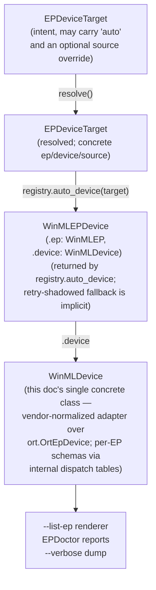

# WinMLDevice — Vendor-Normalized Runtime Device Abstraction

**Version**: 1.5
**Date**: 2026-06-16
**Status**: Draft — v1.5 splits the single-tuple `facts()` display helper into **`device_facts()`** (Architecture + Driver — device-intrinsic, surfaces in *Available Devices*) and **`ep_facts()`** (Memory + Capabilities — EP-mediated, surfaces in per-source EP rows). `compiler_version` stays as a public property but is dropped from default render (available via `available_metadata()` for `--verbose`). Aligned with `console_mockup.py` v3 attribute split: device-intrinsic stays once per physical device; EP-mediated repeats per (EP, source) row. v1.4 collapsed the `WinMLDevice` ABC + per-EP subclass hierarchy (`OpenVINODevice` / `QNNDevice` / `DmlDevice` / `CpuDevice` / `AzureDevice` / `UnknownDevice`) into a **single concrete class** with internal dispatch tables keyed on `self._ort.ep_name`; the prior six-subclass design was over-engineered for v1 (zero current `ep_metadata` consumers in `src/`; one future consumer = `--list-ep` renderer; one speculative = `EPDoctor`). Also renamed the registry compound method `auto_ep` → `auto_device` (the return is a `WinMLEPDevice` pair, not a `WinMLEP`), and dropped the internal `_find_entry` tag-decode helper (absorbed into `auto_device`). v1.3 updated §3 flow + §8 file-location map for the `WinMLSession.build` drop (the user-facing tail is now the direct `WinMLSession(onnx_path, ep_device, ...)` constructor with an optional `ep_monitor` kwarg). v1.2 originally aligned with the six-class taxonomy locked in `2_coreloop.md` v2.1 (the `EPDeviceTarget` / `EPEntry` / `WinMLEP` / `WinMLEPDevice`-pair shape; the `WinMLEPRegistry.register_ep`-only surface).
**Module**: session
**Companion-To**:
- [`3_design_classes.md`](3_design_classes.md) — **canonical class reference** (read this first)
- [`1_req.md`](1_req.md) — user-facing requirements (R3 enumeration consumes this adapter)
- [`2_coreloop.md`](2_coreloop.md) — the six-type taxonomy (§2) and API surface (§3) — `WinMLDevice` is one entry
- [`3_design_ep.md`](3_design_ep.md) — Tier 1/2/3 EP model
- [`console_mockup.py`](console_mockup.py) — proposed `winml sys --list-ep` output that consumes this abstraction
**Depends-On**: [`../../ep-path-design.md`](../../ep-path-design.md)

> **For the canonical class reference, see [`3_design_classes.md`](3_design_classes.md).** New readers should land there first to fix the class taxonomy before reading the `WinMLDevice` spec below.

---

## Table of Contents

1. [Purpose](#1-purpose)
2. [Scope](#2-scope)
3. [Type Taxonomy — Where `WinMLDevice` Fits](#3-type-taxonomy--where-winmldevice-fits)
4. [The Concrete Class](#4-the-concrete-class)
5. [Internal Dispatch Tables](#5-internal-dispatch-tables)
6. [Factory](#6-factory)
7. [Consumers](#7-consumers)
8. [File Location and Module Shape](#8-file-location-and-module-shape)
9. [Naming Concern: `WinMLDevice` vs `WinMLEPDevice` — superseded](#9-naming-concern-winmldevice-vs-winmlepdevice--superseded)
10. [Empirical Metadata Reference](#10-empirical-metadata-reference)
11. [Open Questions](#11-open-questions)
12. [Appendix](#12-appendix)

---

## 1. Purpose

`ort.OrtEpDevice.ep_metadata` is a free-form `dict[str, str]` whose keys are **vendor-specific**. The OpenVINO plugin reports NPU memory as `NPU_DEVICE_TOTAL_MEM_SIZE` and GPU memory as `GPU_DEVICE_TOTAL_MEM_SIZE`; QNN reports something else entirely; DML doesn't use `ep_metadata` at all (its hardware facts live on `device.metadata`). Code that wants to show "memory of this device" must currently know all vendor schemas.

`WinMLDevice` is an **adapter** over `ort.OrtEpDevice` that exposes vendor-specific fields through a unified API (`memory_bytes`, `architecture`, `capabilities`, etc.). A **single concrete class** holds the API; per-EP metadata schemas are handled by **internal dispatch tables** keyed on `self._ort.ep_name`. Consumers never touch `ep_metadata` directly.

The renderer (`winml sys --list-ep`), `EPDoctor` reports, and any future hardware-facing code all become EP-agnostic.

---

## 2. Scope

**In scope:**

- A single concrete class `WinMLDevice` defining the unified runtime-device API.
- Internal dispatch tables (module-level constants) that map per-EP `ep_metadata` schemas onto the unified API. Grow organically as new EPs are observed empirically.
- Direct construction: `WinMLDevice(handle)` from an `ort.OrtEpDevice`. (The earlier `wrap_ort_device(handle)` factory shim was deleted in v2.10 — it forwarded one-line to the constructor and existed only for a per-EP dispatch table that v1.4 collapsed into property-access-time dispatch.)
- The metadata-introspection method (`available_metadata`) that returns the raw keys the underlying `OrtEpDevice` exposes — for `--verbose` mode and debugging.

**Out of scope:**

- `EPDoctor` smoke-test logic (Tier 3, separate effort).
- Session-build / registration (`register_ep` already settled in `3_design_ep.md` §5).
- Schema persistence across ORT versions (treated as best-effort; see [§11](#11-open-questions)).
- A subclass hierarchy. The v1.3 ABC + six-subclass design is replaced by the single-class + dispatch-table approach here. The empirically-observed per-EP schemas are preserved verbatim as dispatch-table entries; only the dispatch mechanism changed (class polymorphism → table lookup).

---

## 3. Type Taxonomy — Where `WinMLDevice` Fits

`WinMLDevice` is one entry in the six-class session/EP taxonomy. The full table — `EPDeviceTarget`, `EPDeviceSpec`, `EPEntry`, `WinMLDevice`, `WinMLEP`, `WinMLEPDevice` (the flat pair) — lives in [`2_coreloop.md`](2_coreloop.md) §2. Read that first; this section only restates where `WinMLDevice` sits in the flow.



The Path B counterpart is an inline 6-line loop at the caller side (no `list_all` method on the registry; see [`2_coreloop.md`](2_coreloop.md) §5.1) — `WinMLDevice` is reached the same way: via `WinMLEP.ep_devices()` on each successful row, then `.device` on each `WinMLEPDevice` pair. Failed rows have no `WinMLDevice` to wrap.

Key facts (all spelled out in [`2_coreloop.md`](2_coreloop.md) §2-§3):

- `WinMLDevice` is **reached via `WinMLEPDevice.device` (and ultimately `WinMLEP.devices`)** — it is never a top-level registry return.
- `WinMLDevice` is the *adapter* over `ort.OrtEpDevice`; it isolates the renderer from per-vendor `ep_metadata` schemas via the internal dispatch tables in §5.
- `WinMLDevice` does **not** participate in session-build directly. The `WinMLSession(onnx_path, ep_device, ...)` constructor consumes a `WinMLEPDevice` (the flat pair), reaches the underlying `ort.OrtEpDevice` handle via `ep_device.device._ort`, and plumbs that into `add_provider_for_devices`. The rich `WinMLDevice` surface is for display + introspection only.

---

## 4. The Concrete Class

```python
from collections.abc import Mapping
from typing import Final

import onnxruntime as ort


class WinMLDevice:
    """Vendor-normalized adapter over ort.OrtEpDevice. Single concrete class;
    per-EP metadata schemas handled by internal dispatch tables (see §5).

    OS-bound: cannot be hand-constructed without an OrtEpDevice.
    Instantiated via ``WinMLDevice(handle)`` inside
    ``WinMLEPRegistry.register_ep`` after a successful ORT registration
    produced the underlying OrtEpDevice. Tests instantiate directly when
    the handle is mocked.
    """

    def __init__(self, ort_device: ort.OrtEpDevice) -> None:
        self._ort = ort_device

    # ---- common properties (no per-EP dispatch needed) ------------------

    @property
    def ep_name(self) -> str:
        """The EP this device is exposed under (may include suffixes like '.AUTO')."""
        return self._ort.ep_name

    @property
    def device_type(self) -> str:
        """'NPU' | 'GPU' | 'CPU' — uppercased from device.type.name."""
        return self._ort.device.type.name.upper()

    @property
    def hardware_name(self) -> str:
        """Human-readable hardware description.

        Prefers ep_metadata['FULL_DEVICE_NAME'] when present; falls back to
        device.metadata['Description']; finally to '<unknown>'.
        """
        return (
            self._ort.ep_metadata.get("FULL_DEVICE_NAME")
            or self._ort.device.metadata.get("Description")
            or "<unknown>"
        )

    @property
    def vendor(self) -> str:
        """Hardware vendor (e.g., 'Intel Corporation'). From device.vendor."""
        return self._ort.device.vendor

    @property
    def ep_vendor(self) -> str:
        """EP vendor (e.g., 'Intel' for OpenVINO, 'Microsoft' for DML)."""
        return self._ort.ep_vendor

    @property
    def library_path(self) -> str | None:
        """The DLL that produced this device, or None for bundled EPs."""
        return self._ort.ep_metadata.get("library_path") or None

    # ---- vendor-specific properties — internal dispatch on self.ep_name -

    @property
    def memory_bytes(self) -> int | None:
        """Total device memory in bytes, or None when not applicable / unknown.
        Dispatches on self.ep_name via _MEMORY_KEY_TABLES (see §5)."""
        ...

    @property
    def architecture(self) -> str | None:
        """Short architecture string (e.g., 'v20.4.4', 'intel64'), or None.
        Dispatches on self.ep_name."""
        ...

    @property
    def capabilities(self) -> tuple[str, ...]:
        """Normalized capability flags (e.g., ('FP32', 'FP16', 'INT8')).
        Vendor strings get short-name-normalized via the per-EP rewrite
        tables (see §5). Returns empty tuple when unknown."""
        ...

    @property
    def driver_version(self) -> str | None:
        """Driver version, when the EP exposes it. Dispatches on ep_name."""
        ...

    @property
    def compiler_version(self) -> str | None:
        """Compiler version, when the EP exposes it. Dispatches on ep_name."""
        ...

    # ---- introspection --------------------------------------------------

    def available_metadata(self) -> Mapping[str, str]:
        """Raw ep_metadata mapping — for --verbose / debug dumps."""
        return dict(self._ort.ep_metadata)

    # ---- display helpers ------------------------------------------------
    # Split into two methods that mirror the two sections of
    # `winml sys --list-ep` per `console_mockup.py` v3:
    #
    #   - device_facts() → invariant per (hardware, kernel) — surfaces in
    #     the *Available Devices* section, once per physical device.
    #   - ep_facts()     → varies per (EP, source) for the same device —
    #     surfaces in the *Available Execution Providers* section, once
    #     per per-source row.
    #
    # Why split?
    #   - Architecture (uarch) and driver_version reflect the silicon +
    #     kernel driver. They don't change because OpenVINO 1.4.1
    #     replaces 1.8.79.0 on the same NPU. Belong in Devices.
    #   - memory_bytes and capabilities reflect the EP runtime's view
    #     of the device — OpenVINO's allocator reports a different
    #     pool size than DML's; the FP16/INT8 capability set depends
    #     on what the EP version supports. Belong in EP-section per
    #     source.
    #   - compiler_version (OpenVINO NPU compiler build) is per-EP
    #     metadata that varies by EP version. Carry as a property but
    #     defer from default render to `--verbose`.

    def device_facts(self) -> tuple[str, ...]:
        """Device-intrinsic facts for the *Available Devices* section.

        Returns Architecture + Driver — values keyed off the underlying
        silicon and kernel driver, invariant across the EPs that bind
        to the device. Empty entries are skipped.
        """
        out: list[str] = []
        if (a := self.architecture) is not None:
            out.append(f"Architecture: {a}")
        if (d := self.driver_version) is not None:
            out.append(f"Driver: {d}")
        return tuple(out)

    def ep_facts(self) -> tuple[str, ...]:
        """EP-mediated facts for the *Available Execution Providers* section.

        Returns Memory + Capabilities — values keyed off this specific
        EP runtime's view of the device, which can differ between
        sources of the same EP (e.g. OpenVINO 1.4.1 vs 1.8.79.0
        report different addressable memory) and between different EPs
        on the same hardware (OpenVINO vs DML on the iGPU). Empty
        entries are skipped.
        """
        out: list[str] = []
        if (m := self.memory_bytes) is not None:
            out.append(f"Memory: {_format_bytes(m)}")
        if caps := self.capabilities:
            out.append(f"Capabilities: {', '.join(caps)}")
        return tuple(out)
```

`compiler_version` stays as a public property (e.g. OpenVINO's NPU compiler build); it is surfaced via `available_metadata()` for `--verbose` debug dumps but **not** included in either default-render method — the value is high-cardinality and rarely actionable for users without deep EP context.

`_format_bytes` is a private utility (e.g., `17179869184 → "16.0 GiB"`).

### 4.1 Attribute attribution — which field goes in which `--list-ep` section

| `WinMLDevice` property | `device_facts()` (Devices section) | `ep_facts()` (EP section) | Surfaced via `--verbose` only |
|---|---|---|---|
| `device_type` (NPU/GPU/CPU) | rendered as section header tag | reused as sub-row tag (`NPU:` / `GPU:` / `CPU:`) | — |
| `hardware_name` | ✓ | (omitted — would duplicate Devices) | — |
| `vendor` | ✓ (right-justified) | (omitted) | — |
| `architecture` | **✓** | — | — |
| `driver_version` | **✓** | — | — |
| `memory_bytes` | — | **✓** | — |
| `capabilities` | — | **✓** | — |
| `compiler_version` | — | — | **✓** (via `available_metadata()`) |
| `library_path` | — | rendered in the source row's `Path:` line | — |

CPU-specific kernel facts (cores / threads) are gathered separately via the `sysinfo.CPU` enumerator — not part of `WinMLDevice` because they predate the EP layer and don't require ORT registration to query.

Why a single class? Concretely: zero current `ep_metadata` consumers exist in `src/` today; the one near-future consumer is the `--list-ep` renderer in `commands/sys.py`; one speculative consumer is `EPDoctor`. The six-subclass design was carrying weight (test surface, import structure, factory dispatch) for a per-EP-method-override contract that nothing in the codebase actually consumes. A single concrete class with module-level dispatch tables preserves the empirical schemas where they were going to live anyway (as the bodies of `OpenVINODevice.memory_bytes` etc.) and removes the polymorphism overhead.

---

## 5. Internal Dispatch Tables

The vendor-specific properties on `WinMLDevice` (`memory_bytes`, `architecture`, `capabilities`, `driver_version`, `compiler_version`) dispatch on `self._ort.ep_name` via module-level constants. These tables preserve the empirically-observed schemas from the prior subclass design verbatim — only the dispatch mechanism changed.

The tables grow organically as new EP schemas are observed empirically; an EP whose `ep_name` is absent from a table contributes `None` (or `()` for `capabilities`) without crashing.

### `OpenVINOExecutionProvider` (and `OpenVINOExecutionProvider.AUTO`)

Schema from the empirical probe (`temp/probe_output.txt`):

```python
_OPENVINO_MEMORY_KEYS = {
    "NPU": "NPU_DEVICE_TOTAL_MEM_SIZE",
    "GPU": "GPU_DEVICE_TOTAL_MEM_SIZE",
    # CPU → None
}
_OPENVINO_DRIVER_KEYS = {
    "NPU": "NPU_DRIVER_VERSION",
    # GPU / CPU → None
}
_OPENVINO_COMPILER_KEYS = {
    "NPU": "NPU_COMPILER_VERSION",
    # GPU / CPU → None
}
_OPENVINO_CAPABILITY_REWRITES = {
    "GPU_HW_MATMUL":  "MatMul",
    "GPU_USM_MEMORY": "USM",
    "EXPORT_IMPORT":  "",   # drop
}
# architecture: ep_metadata['DEVICE_ARCHITECTURE'] —
# 'GPU: vendor=0x8086 arch=v20.4.4' normalized to 'v20.4.4'
# capabilities: ep_metadata['OPTIMIZATION_CAPABILITIES'] tokens, rewritten per above.
```

The `.AUTO` variant shares OpenVINO's schema and is handled by the same table entries (the dispatch keys are the full `ep_name`, both `OpenVINOExecutionProvider` and `OpenVINOExecutionProvider.AUTO`).

### `QNNExecutionProvider`

Schema TBD — to be confirmed empirically. Likely sources: `htp_arch`, `soc_id`, `soc_model`, QAIRT version fields. Implementer adds entries to the dispatch tables after running the probe on a QNN-equipped machine.

### `DmlExecutionProvider`

DML's hardware facts live on `device.metadata`, not `ep_metadata`:

- `memory_bytes` → parse `device.metadata['DxgiVideoMemory']` (e.g., `'128 MB'` → bytes)
- `architecture` → `None` (DML doesn't expose a uarch string)
- `capabilities` → `()`

DML-specific extras (`DxgiAdapterNumber`, `Discrete`) are exposed via `available_metadata()` — no typed accessor on the class for them in v1. If `--list-ep` demand for them grows, add named properties to the concrete class with a DML-only branch (still ep_name-keyed; no subclass).

### `CPUExecutionProvider` (bundled)

Minimal: bundled with ORT, no `ep_metadata`, just basic hardware fields:

- `memory_bytes` → `None`
- `architecture` → constant `'x64'` (or detect via `platform.machine()`)
- `capabilities` → `()`
- Cores count surfaces via `sysinfo.hardware.CPU.get_all()` at the renderer side, not via `WinMLDevice`.

### `AzureExecutionProvider` (bundled)

Mostly placeholder — all vendor-specific properties return `None` / `()`. `available_metadata()` still dumps whatever the bundled EP carries.

### Unknown / not-yet-cataloged `ep_name`

EPs whose `ep_name` is absent from all dispatch tables contribute `None` / `()` for vendor-specific properties; common properties (`ep_name`, `device_type`, `hardware_name`, `vendor`, `ep_vendor`, `library_path`) still work; `available_metadata()` still dumps the raw payload. New EPs surface in `--list-ep` with limited info rather than crashing.

### Future (`VitisAIDevice`, `MIGraphXDevice`, `TensorrtDevice`, `NvTensorRtRtxDevice`)

Each requires empirical probing on the respective hardware. Add entries to the dispatch tables — no new class — as they get installed and we observe their `ep_metadata` schemas.

---

## 6. Construction (no factory)

`WinMLDevice` is constructed directly: `WinMLDevice(handle: ort.OrtEpDevice)`. There is no factory function. Earlier drafts had `wrap_ort_device(handle)` as a one-line forward to the constructor; v2.10 deleted it. The factory's prior justification was a per-EP `_DEVICE_CLASSES` dispatch map that selected an ABC subclass — that map collapsed into the per-property dispatch tables in §5, leaving the factory as a dead abstraction layer. `WinMLEPRegistry.register_ep` constructs each device inline:

```python
devices = tuple(WinMLDevice(h) for h in deduped)
```

Construction never raises. EPs whose `ep_name` is absent from the dispatch tables surface with `None` / `()` for vendor-specific properties rather than crashing the renderer.

---

## 7. Consumers

### `winml sys --list-ep` renderer

Today's renderer reaches into `OrtEpDevice.device.type.name` and `OrtEpDevice.ep_metadata` directly. After this refactor it consumes `WinMLDevice` and splits attribute reads by section per §4.1:

```python
# Available Devices section — once per physical device.
# Pick any one WinMLDevice handle that covers this hardware (e.g.,
# the primary EP's NPU handle). Architecture + Driver are invariant
# across EP sources, so reading from one handle suffices.
for dev in primary_devices_by_type:
    # device_tag    = dev.device_type            # 'NPU' / 'GPU' / 'CPU'
    # hardware_name = dev.hardware_name          # 'Intel(R) AI Boost'
    # vendor        = dev.vendor                 # 'Intel Corporation'
    # device_facts  = dev.device_facts()         # ('Architecture: 4000', 'Driver: ...')

# Available Execution Providers section — once per (EP, source, device).
for source_row in source_rows_for_ep:
    for dev in source_row.winml_ep.devices:
        # dev.device_type → sub-row label (NPU: / GPU: / CPU:)
        # facts          = dev.ep_facts()        # ('Memory: 16.0 GiB', 'Capabilities: ...')
```

The renderer no longer knows about `NPU_DEVICE_TOTAL_MEM_SIZE` or `GPU_DEVICE_TOTAL_MEM_SIZE`. Adding a new EP means adding rows to the §5 dispatch tables — no renderer change.

### `EPDoctor.diagnose(ep_device, ort_device)` (future Tier 3)

`EPDoctorReport` can carry both a `device_facts: tuple[str, ...]` and an `ep_facts: tuple[str, ...]` populated from `WinMLDevice(ort_device).device_facts()` and `.ep_facts()`. Per-(ep, device) smoke-test results then surface human-readable hardware context without re-extracting metadata.

### `--verbose` mode

`WinMLDevice(ort_dev).available_metadata()` returns the raw `ep_metadata` dict for power users who want to see every field the plugin exposes. Implements requirement #4 from the user's list ("a unified metadata list method indicating what metadata the device provides").

---

## 8. File Location and Module Shape

```
src/winml/modelkit/session/
    ep_target.py         (NEW — EPDeviceTarget dataclass + resolve();
                          see 2_coreloop.md §2-§3)
    ep_device.py         (existing — EP_DEVICE_SPECS, EPDeviceSpec;
                          the new flat-pair WinMLEPDevice(ep: WinMLEP,
                          device: WinMLDevice) also lives here)
    ep_registry.py       (existing — WinMLEPRegistry; surface NARROWED to
                          one public method: register_ep(entry: EPEntry)
                          -> WinMLEP. See 2_coreloop.md §3.1)
    session.py           (existing — WinMLSession(onnx_path, ep_device,
                          *, ep_config=None, ep_monitor=None,
                          base_session_options=None) direct constructor.
                          No private tag-decode helper here; the tag
                          decode is absorbed into registry.auto_device.)
    winml_device.py      (NEW — this doc's single WinMLDevice class +
                          module-level dispatch tables; no factory
                          function — callers construct via
                          WinMLDevice(handle) directly)
src/winml/modelkit/
    ep_path.py           (existing — EPSource ABC, PyPISource, NuGetSource,
                          MSIXPackageSource, WinMLCatalogSource,
                          DirectorySource; discover_all_eps() returns
                          list[EPEntry]. Casing sweep queued — see
                          2_coreloop.md §8 + §9 inventory)
```

`winml_device.py` exports:

```python
__all__ = [
    "WinMLDevice",
]
```

Re-exported from `session/__init__.py` so consumers do `from winml.modelkit.session import WinMLDevice`. There are no per-EP subclass exports — the prior `OpenVINODevice` / `QNNDevice` / `DmlDevice` / `CpuDevice` / `AzureDevice` / `UnknownDevice` names are deleted, not deprecated.

`commands/sys.py` and (eventually) `session/ep_doctor.py` are the only intended consumers in v1.

---

## 9. Naming Concern: `WinMLDevice` vs `WinMLEPDevice` — superseded

This section is **superseded** by [`5_type_taxonomy.md`](5_type_taxonomy.md) §10. The shape of the naming concern changed: `WinMLEPDevice` was redefined from "pure intent `(ep, device)`" to "post-registration aggregate of `WinMLEP` + `WinMLDevice | None` + `Exception | None`." The intent role moved to a new type, `EPTarget`. The three-way confusion that now exists — `EPTarget` (intent) vs `WinMLDevice` (runtime adapter) vs `WinMLEPDevice` (aggregate) — is treated in §10 of the taxonomy doc.

For this doc's purposes: every public symbol in `winml_device.py` should explicitly contrast itself with `WinMLEPDevice` (the aggregate) in its docstring. The aggregate carries a `WinMLDevice` in its `.device` field; a first-time reader could mix the wrapping aggregate up with the wrapped adapter.

---

## 10. Empirical Metadata Reference

Full empirical `ep_metadata` schemas captured at `temp/probe_output.txt` on an Intel Core Ultra 7 258V + Intel Arc 140V machine, ORT 1.24.5, OpenVINO PyPI 1.4.1+f33af4f.

### OpenVINO `ep_metadata` keys observed

`AVAILABLE_DEVICES`, `DEVICE_ARCHITECTURE`, `DEVICE_GOPS`, `DEVICE_LUID`, `DEVICE_PCI_INFO`, `DEVICE_TYPE`, `DEVICE_UUID`, `EXECUTION_DEVICES`, `FULL_DEVICE_NAME`, `MODEL_PTR`, `NPU_COMPILER_VERSION`, `NPU_DEVICE_ALLOC_MEM_SIZE`, `NPU_DEVICE_TOTAL_MEM_SIZE`, `NPU_DRIVER_VERSION`, `GPU_DEVICE_ID`, `GPU_DEVICE_MAX_ALLOC_MEM_SIZE`, `GPU_DEVICE_TOTAL_MEM_SIZE`, `GPU_EXECUTION_UNITS_COUNT`, `GPU_MEMORY_STATISTICS`, `GPU_UARCH_VERSION`, `MAX_BATCH_SIZE`, `NUM_STREAMS`, `OPTIMAL_BATCH_SIZE`, `OPTIMAL_NUMBER_OF_INFER_REQUESTS`, `OPTIMIZATION_CAPABILITIES`, `RANGE_FOR_ASYNC_INFER_REQUESTS`, `RANGE_FOR_STREAMS`, `library_path`, `os_driver_version`, `ov_device`, `version`

NPU subset reads `NPU_*` keys; GPU subset reads `GPU_*` keys; CPU is sparse.

### DML `device.metadata` keys observed

`Description`, `Discrete`, `DxgiAdapterNumber`, `DxgiHighPerformanceIndex`, `DxgiVideoMemory`, `LUID`. `ep_metadata` is just `{'version': '1.24.5'}` — no rich data.

### Bundled CPU

`device.metadata` is just `{'Description': 'Intel(R) Core(TM) Ultra 7 258V'}`. No LUID. `ep_metadata` is `{'version': '1.24.5'}` only.

### Not yet empirically captured

QNN, VitisAI, MIGraphX, Tensorrt, NvTensorRtRtx, Azure — extend `temp/probe_double_register.py` on a properly-equipped machine to capture each schema before implementing the matching subclass.

---

## 11. Open Questions

1. **Schema versioning across ORT releases.** If ORT 1.25 renames `NPU_DEVICE_TOTAL_MEM_SIZE` → `NPU_TOTAL_MEM_BYTES`, the `_OPENVINO_MEMORY_KEYS` dispatch table silently returns `None`. Should each EP's dispatch-table block declare the minimum ORT version it was verified against? **Recommendation:** annotate each table block with a `# verified against ORT 1.24.5` comment + an empirical assertion in tests; leave runtime detection out of v1.

2. **`to_dict()` for JSON serialization.** `--list-ep --format json` will want a structured representation. Add `WinMLDevice.to_dict() -> dict[str, Any]` returning every property + the raw `available_metadata()` payload? Or keep this as a separate render-time concern? **Recommendation:** add `to_dict()` on `WinMLDevice`; consumers can opt in.

3. **Test strategy without real hardware.** Unit tests must construct `WinMLDevice` instances without a working ORT plugin. Plan: build a `_FakeOrtEpDevice` test helper (mirroring `temp/probe_double_register.py`'s pattern) that takes raw `ep_name` + `ep_metadata` dict + `device.type` + `device.metadata` and produces something quacking like `ort.OrtEpDevice`. The single-class design makes the test matrix simpler than under the ABC: one `WinMLDevice` constructor, one set of property assertions per representative `ep_name`.

---

## 12. Appendix

### 12.1 Concrete `memory_bytes` sketch (single-class with dispatch table)

```python
_OPENVINO_MEMORY_KEYS: Final[dict[str, str]] = {
    "NPU": "NPU_DEVICE_TOTAL_MEM_SIZE",
    "GPU": "GPU_DEVICE_TOTAL_MEM_SIZE",
}
# (additional tables for QNN, DML, etc. added as schemas are observed empirically)


class WinMLDevice:
    ...
    @property
    def memory_bytes(self) -> int | None:
        ep = self._ort.ep_name
        if ep in ("OpenVINOExecutionProvider", "OpenVINOExecutionProvider.AUTO"):
            key = _OPENVINO_MEMORY_KEYS.get(self.device_type)
            if key is None:
                return None
            raw = self._ort.ep_metadata.get(key)
            try:
                return int(raw) if raw else None
            except ValueError:
                return None
        if ep == "DmlExecutionProvider":
            # Parse e.g. '128 MB' from device.metadata['DxgiVideoMemory'].
            return _parse_size_string(self._ort.device.metadata.get("DxgiVideoMemory"))
        return None
```

The dispatch shape is intentionally flat: the per-EP block lives inside the property, the lookup tables live as module-level constants. No subclass, no method override, no factory dispatch map. New EPs add an `elif ep == "...":` branch + a module-level table — the per-EP schema lives in one place at module scope, not spread across a class body.

### 12.2 Version notes

| Version | Date       | Author | Changes |
|---------|------------|--------|---------|
| 1.0     | 2026-06-05 | session refactor team | Initial draft. Specifies an ABC + per-EP subclass set, the factory pattern, and the renderer / EPDoctor consumers. Implementation deferred. |
| 1.4     | 2026-06-07 | session refactor team | Collapses the ABC + six-subclass design into a single concrete class with module-level dispatch tables. Drops the `_DEVICE_CLASSES` factory dispatch map; `wrap_ort_device` becomes a trivial `WinMLDevice(d)` wrapper. Subclass exports (`OpenVINODevice`, `QNNDevice`, `DmlDevice`, `CpuDevice`, `AzureDevice`, `UnknownDevice`) are deleted, not deprecated. Empirical schemas from the prior subclass bodies are preserved verbatim as dispatch-table entries. |
| 1.5     | 2026-06-22 | review feedback | Deletes the trivial `wrap_ort_device(d)` shim — it was a one-line forward to the constructor whose only justification (`_DEVICE_CLASSES` dispatch map) had already been collapsed in v1.4. Callers (`WinMLEPRegistry.register_ep`, tests) now construct via `WinMLDevice(handle)` directly. |
