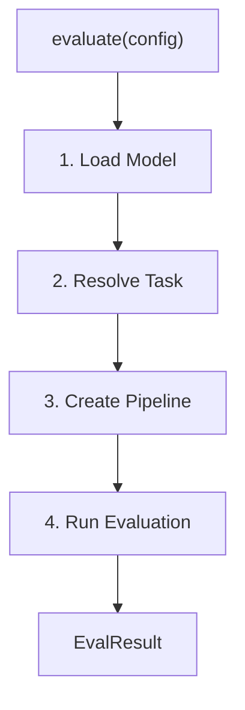

# Eval Module - Core Loop Design

**Version**: 1.0  
**Date**: 2026-03-04  
**Status**: Implemented  

---

## 1. Overview

This document describes the core execution flow of `wmk eval` — from user
input to evaluation result.

---

## 2. Input & Output

### Input

The user provides:
- **Model**: HF model ID (e.g., `microsoft/resnet-50`) or ONNX file + model ID
- **Dataset**: HF dataset name, split, sample count
- **Optional**: task override, dataset column overrides, device

### Output

`EvalResult` containing task-specific metrics from the HF evaluator
(e.g., `{"accuracy": 0.70, "total_time_in_seconds": 1.38, ...}`).

---

## 3. Module Structure

```
modelkit/
├── commands/
│   └── eval.py              # CLI: options → WinMLEvaluationConfig → evaluate()
└── eval/
    ├── __init__.py
    ├── config.py             # WinMLEvaluationConfig
    └── evaluator.py          # evaluate(), helpers
```

---

## 4. Core Loop



### Step 1: Load Model

| Input | What happens |
|---|---|
| `model_id` only | `WinMLAutoModel.from_pretrained(model_id)` — builds ONNX, returns model with HF config |
| `model_path` + `model_id` | `WinMLAutoModel.from_onnx(model_path)` + `AutoConfig.from_pretrained(model_id)` |

The model object carries `model.config` (HF `PretrainedConfig`) which provides
`id2label`, `label2id`, and `architectures` for downstream steps.

### Step 2: Resolve Task

Priority: explicit `--task` > `_detect_task_from_config(model.config)` > error.

Task resolution reuses `modelkit.loader.task._detect_task_from_config()` — the
same logic used by `wmk perf` and `wmk build`.

### Step 3: Create Pipeline

Creates an HF `pipeline(task, model, ...)` with preprocessors auto-loaded from
`model_id`. The model ID string is passed to all four preprocessor params
(`tokenizer`, `feature_extractor`, `image_processor`, `processor`). The pipeline
loads only what the task needs based on its `_load_*` flags.

### Step 4: Run Evaluation

1. Load dataset via `load_dataset(name, split, streaming=True)`, take N samples
2. Build `evaluator.compute()` kwargs — pass `label_mapping` from `model.config.label2id` for classification tasks
3. Run `evaluator(task).compute(pipeline, data, ...)` → metric dict
4. Return `EvalResult(config, metrics, num_samples)`

---

## 5. Usage Scenarios

### Scenario 1: HF Model ID Only

```bash
wmk eval --model-id microsoft/resnet-50 --dataset ILSVRC/imagenet-1k
```

Model built via `from_pretrained`. Task and preprocessor auto-resolved from model ID.

### Scenario 2: ONNX File + HF Model ID

```bash
wmk eval -m model.onnx --model-id microsoft/resnet-50 --dataset ILSVRC/imagenet-1k
```

ONNX loaded directly. Config and preprocessor loaded from model ID.

### Scenario 3: ONNX Without Model ID (Future)

Planned for models with local HF-format config files alongside the ONNX file.
Requires `--task` explicitly.

---

## 6. Base Class Changes

`WinMLPreTrainedModel.device` returns `torch.device` (was `str`) and `.to()`
accepts `torch.device` — required by HF pipeline's device comparison logic.
