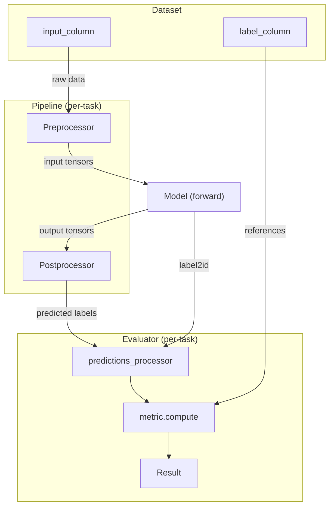

# Eval CLI - Design

**Version**: 1.0  
**Date**: 2026-03-04  
**Status**: Implemented  

---

## 1. Overview

The eval CLI (`wmk eval`) runs model inference on real datasets and computes
quality metrics such as accuracy. This gives confidence that the ONNX model
built from a HuggingFace model through the ModelKit pipeline (export → optimize
→ quantize → compile) has no significant quality loss compared to the original.

### Supported Tasks & Metrics

| Task | Metrics | Description |
|---|---|---|
| `image-classification` | `accuracy` | Top-1 accuracy — fraction of correctly classified samples. |
| `text-classification` | `accuracy` | Fraction of correctly classified samples. |
| `token-classification` | `overall_precision`, `overall_recall`, `overall_f1`, `overall_accuracy` | Span-level precision, recall, and F1 (exact entity match via `seqeval`). Per-entity-type breakdowns (`{type}.precision`, `{type}.recall`, `{type}.f1`, `{type}.number`) are also reported. |
| `object-detection` | `map`, `map_50`, `map_75`, `map_small`, `map_medium`, `map_large`, `mar_1`, `mar_10`, `mar_100` | COCO-standard mean Average Precision at IoU 0.50–0.95 (primary), plus size-based mAP and recall at varying detection limits. |
| `image-segmentation` | `iou` | Intersection over Union (IoU) measuring overlap between predicted and ground-truth segmentation masks. |

All tasks also report performance metrics: `total_time_in_seconds`, `samples_per_second`, and `latency_in_seconds`.

---

## 2. Usage

### 2.1 CLI Command

```bash
# Use default dataset (auto-detected from task)
wmk eval -m microsoft/resnet-50
wmk eval -m model.onnx --model-id dslim/bert-base-NER

# Evaluate HF model directly (builds ONNX internally)
wmk eval -m microsoft/resnet-50 --dataset imagenet-1k

# Evaluate a pre-built ONNX model
wmk eval -m model.onnx --model-id microsoft/resnet-50 --dataset imagenet-1k

# Multi-config dataset with column overrides
wmk eval -m model.onnx --model-id Intel/bert-base-uncased-mrpc \
    --dataset glue --dataset-name mrpc \
    --column input_column=sentence1 \
    --column second_input_column=sentence2

# Explicit label mapping and shuffle control
wmk eval -m model.onnx --model-id microsoft/resnet-50 \
    --label-mapping '{"cat": 281, "dog": 207}' --shuffle
```

### 2.2 Python API

```python
from modelkit.eval import DatasetConfig, WinMLEvaluationConfig, evaluate

config = WinMLEvaluationConfig(
    model_id="microsoft/resnet-50",
    dataset=DatasetConfig(path="imagenet-1k", samples=100),
)
result = evaluate(config)
print(result.metrics)  # {"accuracy": 0.70, ...}
```

### 2.3 WinMLEvaluationConfig Fields

| Field | Type | Description |
|---|---|---|
| `model_id` | `str` | HF model ID. Required. |
| `model_path` | `str \| None` | Path to .onnx file. When set, uses ONNX model instead of building from `model_id`. |
| `task` | `str \| None` | HF pipeline task (e.g., `image-classification`). Auto-detected from `model_id` if omitted. |
| `device` | `str` | Target device: `cpu`, `gpu`, `npu`. |
| `dataset` | `DatasetConfig` | Dataset configuration (see below). |

**DatasetConfig Fields**

| Field | Type | Description |
|---|---|---|
| `path` | `str` | HF dataset path (e.g., `imagenet-1k`, `glue`). Required. Aligns with `load_dataset(path=)`. |
| `name` | `str \| None` | Config name for multi-config datasets (e.g., `mrpc`). Aligns with `load_dataset(name=)`. |
| `split` | `str` | Dataset split (default: `validation`). |
| `samples` | `int` | Number of samples (default: `100`). |
| `shuffle` | `bool` | Whether to shuffle before sampling (default: `True`). |
| `seed` | `int` | Random seed for reproducible shuffling (default: `42`). |
| `columns_mapping` | `dict[str, str]` | Column overrides for evaluator `compute()` (e.g., `{"input_column": "sentence1"}`). If empty, HF evaluator uses its per-task defaults. |
| `label_mapping` | `dict[str, int] \| None` | Explicit label name → ID mapping for label alignment (see §4.4). Overrides automatic resolution. |
| `streaming` | `bool` | Whether to stream dataset to avoid full download (default: `False`). |


## 3. Architecture

### 3.1 Diagram

The eval system is built on top of HuggingFace `pipeline` and `evaluate` APIs.
The following diagram shows the data flow:



**HF Pipeline** handles per-task inference. Each task has a dedicated pipeline
class (e.g., `ImageClassificationPipeline`, `TextClassificationPipeline`) that
implements three steps:
- `preprocess()` — converts raw input (image, text) into model input tensors
- `_forward()` — calls `model(**inputs)` to get output tensors
- `postprocess()` — converts output tensors into human-readable predictions
  (e.g., logits → softmax → label strings)

**HF Evaluator** handles metric computation. Each task has a dedicated evaluator
class with a default metric (e.g., `accuracy` for classification, `seqeval` for
token classification). The evaluator iterates over the dataset, runs the pipeline
on each sample, and computes the metric by comparing predicted labels against
ground truth labels.

### 3.2 Integration Contract

To plug an ONNX model into the HF pipeline/evaluator flow, the following
contracts must be satisfied:

#### Model Task

The task string (e.g., `"image-classification"`) determines which pipeline class
and evaluator class to instantiate.

```python
task = config.task or _detect_task_from_config(model.config)
```

Task resolution reuses `_detect_task_from_config()` from `modelkit.loader.task`.

#### Model ID and Preprocessor

The pipeline needs preprocessors (tokenizer, image processor, etc.) to convert
raw input data into model input tensors. We pass the HF model ID string to all
four preprocessor params. The pipeline loads only what the task needs:

```python
pipe = pipeline(
    task,
    model=model,
    framework="pt",
    tokenizer=config.model_id,
    feature_extractor=config.model_id,
    image_processor=config.model_id,
    processor=config.model_id,
    device="cpu",  # WinML tensors are always CPU; EP handles acceleration
)
```

Note: `device` is always `"cpu"` because PyTorch does not recognize `"npu"` as
a valid device type. WinML device/EP selection is handled at the ORT session
level, not at the torch tensor level.

#### Model Class

The pipeline uses duck typing — it calls `model(**preprocessed_inputs)` and
reads properties from the model object. The model class must provide:

```python
class WinMLModelForImageClassification(WinMLPreTrainedModel):

    # forward() — per-task input/output convention
    def forward(self, pixel_values, **kwargs) -> ImageClassifierOutput:
        ...
        return ImageClassifierOutput(logits=logits)

    # config — PretrainedConfig from AutoConfig.from_pretrained(model_id)
    # provides: config.id2label, config.label2id, config.num_labels
    config: PretrainedConfig

    # device — dummy torch.device("cpu") to satisfy HF pipeline contract
    # PyTorch doesn't recognize "npu"; WinML EP handles acceleration internally
    @property
    def device(self) -> torch.device:
        return torch.device("cpu")

    # to() — no-op; pipeline skips it because model.device matches pipeline.device
    def to(self, *args, **kwargs):
        return self
```

Per-task `forward()` conventions:

| Task | forward() input params | forward() output key |
|---|---|---|
| `image-classification` | `pixel_values` | `logits` |
| `text-classification` | `input_ids`, `attention_mask` | `logits` |
| `token-classification` | `input_ids`, `attention_mask` | `logits` |
| `object-detection` | `pixel_values` | `logits`, `pred_boxes` |
| `image-segmentation` | `pixel_values` | `logits`, `pred_masks` |

Our `WinMLModelFor*` classes implement these conventions. See
`docs/design/automodel/` for the model class design.

#### Postprocessor and Label Mapping

The pipeline's `postprocess()` converts output tensors to predicted labels
via `model.config.id2label[i]`. The evaluator then maps predicted label strings
back to dataset integers via `label_mapping`:

```python
task_evaluator = evaluator(task)
results = task_evaluator.compute(
    model_or_pipeline=pipe,
    data=data,
    label_mapping=model.config.label2id,
)
```

The metric is task-specific and loaded by the HF evaluator. We do not implement
metric computation.

#### Evaluator Task Coverage

Not all tasks have a built-in HF evaluator. The `evaluate.evaluator()` factory
supports a fixed set of tasks. For unsupported tasks (e.g., `object-detection`,
`image-segmentation`), we provide custom evaluators that follow the same
contract as the built-in ones.

---

## 4. Dataset Config

### 4.1 Dataset Loading

The user provides the dataset via `DatasetConfig`, aligned with the HF
`load_dataset()` API:

```python
load_dataset(path="glue", name="mrpc", split="validation")
```

- `path` (optional) — HF dataset identifier, passed as `--dataset`. If omitted,
  a default dataset is used based on the task (see §4.3).
- `name` (optional) — config name for multi-config datasets, passed as
  `--dataset-name`

### 4.2 Shuffle and Sampling

The dataset is loaded fully (non-streaming), then shuffled with a fixed seed
for reproducible label coverage before sampling:

```python
dataset = load_dataset(path, name=name, split=split)
dataset = dataset.shuffle(seed=42)
dataset = dataset.select(range(samples))
```

This ensures that sampled subsets have diverse label coverage, which is critical
for accuracy measurement on smaller sample sizes.

### 4.3 Default Datasets

When `--dataset` is not provided, a per-task default dataset is used for quick
evaluation. The default dataset is intended as a sanity check that the build
pipeline (export → optimize → quantize → compile) preserves model quality.

| Task | Default Dataset | Split | Label Alignment |
|---|---|---|---|
| `image-classification` | `timm/mini-imagenet` | `test` | Yes (synset → index via `imagenet_class_index.json`) |
| `text-classification` | `cornell-movie-review-data/rotten_tomatoes` | `validation` | No |

Default datasets cover many models within a task but not all. For models
trained on different domains, the user should provide an appropriate dataset.

### 4.4 Label Alignment

Dataset label IDs and model label IDs frequently diverge. For example,
`timm/mini-imagenet` uses WordNet synset IDs (`n01532829`) as ClassLabel names
with local 0–99 indices, while ImageNet models use canonical 0–999 indices.
Without alignment, the evaluator would compare mismatched IDs and report
near-zero accuracy.

Label alignment runs as part of `prepare_data()` via the overridable
`align_labels()` method on `WinMLEvaluator`. It performs three steps:

1. **Resolve label mapping** — determine the `{label_name: target_id}` dict
2. **Remap dataset** — apply `Dataset.align_labels_with_mapping()`
3. **Filter unsupported labels** — remove rows whose remapped ID is not in
   the model's `id2label`

#### 4.4.1 Label Mapping Priority

The label mapping is resolved with the following priority (first non-empty
wins):

| Priority | Source | When |
|---|---|---|
| 1 | `DatasetConfig.label_mapping` | User passes `--label-mapping '{...}'` |
| 2 | `label_utils.get_label_mapping()` | Dataset matches a known family (e.g., ImageNet variants) |
| 3 | `model.config.label2id` | Fallback: model's own label vocabulary |

```python
def _get_label_mapping(self, ds_config):
    if ds_config.label_mapping:          # (1) user-provided
        return ds_config.label_mapping
    if should_align_labels(ds_config.path):  # (2) known dataset
        return get_label_mapping(ds_config.path)
    return model.config.label2id         # (3) model fallback
```

#### 4.4.2 Applicability Guards

Alignment only applies when all of the following are true:

- The `label_column` exists in the dataset
- The column's feature type is `ClassLabel` (scalar)

Sequence-typed label columns (e.g., `Sequence(ClassLabel)` in token-
classification) and dict-typed columns (e.g., object-detection) are skipped.
These tasks use string-based label comparison (e.g., `seqeval`) that does not
require integer alignment.

#### 4.4.3 Filtering Unsupported Labels

After remapping, dataset labels may include IDs that the model does not
support. For example, a dataset covering 1000 ImageNet classes evaluated
against a model fine-tuned on 10 classes will have 990 unsupported label IDs.

`_filter_unsupported_labels()` removes these rows:

```python
supported_ids = {int(k) for k in model.config.id2label}
dataset = dataset.filter(lambda row: row[label_column] in supported_ids)
```

If filtering removes all rows, a `ValueError` is raised — the dataset and
model have no label overlap. If some rows are removed, a warning is logged.

#### 4.4.4 Error Handling

If `align_labels_with_mapping()` raises `ValueError` or `KeyError` (e.g.,
unknown label names), the error is wrapped in a `RuntimeError` with context
about which dataset failed. This is intentionally **not** a silent fallback —
misaligned labels produce misleading accuracy, so failing loudly is preferred.

#### 4.4.5 CLI Usage

Explicit label mapping via CLI:

```bash
wmk eval -m model.onnx --model-id microsoft/resnet-50 \
    --label-mapping '{"cat": 281, "dog": 207}'
```

The `--label-mapping` value is a JSON string parsed into `dict[str, int]` and
stored in `DatasetConfig.label_mapping`. When provided, it takes highest
priority and overrides both known-dataset and model-based mappings.

### 4.5 Column Mapping

Each HF evaluator has per-task default column names (e.g., `input_column="image"`
for image-classification, `input_column="text"` for text-classification).

When the dataset uses non-standard column names, the user provides overrides
via `--column key=value` (repeatable). If no overrides are provided, the HF
evaluator uses its own defaults.

```bash
--column input_column=sentence1 --column second_input_column=sentence2
```

### 4.6 Dataset Schema Discovery

Users preparing local datasets need to know the expected column structure. The
`--schema` flag prints the required dataset schema for a given task:

```bash
wmk eval --schema --task object-detection
```

Each evaluator class implements `schema_info()` which returns a human-readable
description of: (1) required dataset columns and types, and (2) `--column`
overrides available when column names differ from defaults.

---

## 5. WinML Evaluator Classes

Evaluation logic differs by model task. Each `WinMLModelEvaluator` subclass
encapsulates three task-specific concerns:

1. **Default dataset** — fallback dataset name/config when not provided.
2. **Column detection** — which `compute()` arguments to pass (e.g.,
   `input_column`, `second_input_column`, `label_column`), detected from
   dataset feature types.
3. **Metric computation** — some tasks delegate to the HF built-in evaluator,
   others require custom implementation.

| Task | Default dataset | Column params | Compute |
|---|---|---|---|
| `image-classification` | `timm/mini-imagenet` | `input_column`, `label_column` | HF built-in |
| `text-classification` | `rotten_tomatoes` | `input_column`, `second_input_column`, `label_column` | HF built-in |
| `token-classification` | — | `input_column`, `label_column` | HF built-in |
| `object-detection` | TBD | `input_column`, `label_column` | Custom (mAP) |
| `image-segmentation` | TBD | `input_column`, `label_column` | Custom (mIoU) |

### 5.1 Built-in Evaluator

For tasks with an HF built-in evaluator, our `WinMLModelEvaluator.compute()`
delegates to `evaluate.evaluator(task).compute(...)`:

| Task | HF Evaluator | Default Metric |
|---|---|---|
| `text-classification` | `TextClassificationEvaluator` | `accuracy` |
| `image-classification` | `ImageClassificationEvaluator` | `accuracy` |
| `question-answering` | `QuestionAnsweringEvaluator` | `squad` |
| `token-classification` | `TokenClassificationEvaluator` | `seqeval` |
| `text-generation` | `TextGenerationEvaluator` | `word_count` |
| `text2text-generation` | `Text2TextGenerationEvaluator` | `bleu` |
| `summarization` | `SummarizationEvaluator` | `rouge` |
| `translation` | `TranslationEvaluator` | `bleu` |
| `automatic-speech-recognition` | `AutomaticSpeechRecognitionEvaluator` | `wer` |
| `audio-classification` | `AudioClassificationEvaluator` | `accuracy` |

Tasks without an HF built-in evaluator (`object-detection`,
`image-segmentation`, etc.) require a custom `compute()` override.

### 5.2 Custom Evaluator

For unsupported tasks, the custom evaluator subclass overrides `compute()` to
handle task-specific prediction processing and metric calculation. The base
class still provides `load_data()` and `detect_columns()`.

All custom evaluators subclass `evaluate.Evaluator` ([source](https://github.com/huggingface/evaluate/tree/main/src/evaluate/evaluator)).
The base `compute()` orchestrates 7 steps. Steps 1, 3, 5, 7 are inherited
(task-agnostic). Steps 2, 4, 6 are overridden (task-specific):

| Step | Base Method | Custom evaluator |
|---|---|---|
| 2 | `prepare_data()` | **override** — task-specific GT format |
| 4 | `prepare_metric()` | **override** — task-specific metric |
| 6 | `predictions_processor()` | **override** — convert pipeline output |
