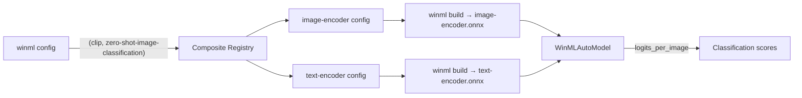

# CLIP — Composite Models

CLIP (`openai/clip-vit-base-patch32`) is a dual-encoder vision-language model: one tower encodes images, the other encodes text, and both project into a shared embedding space. winml-cli treats it as a **composite model** — a model that is split into multiple ONNX sub-models that run together at inference time. For CLIP, the two sub-models are:

| Sub-model | Role | Input shape | Output (projected) |
|-----------|------|-------------|--------------------|
| `image-encoder` | Encodes images into embeddings | `pixel_values` `[1, 3, 224, 224]` | `image_embeds` `[1, 512]` |
| `text-encoder` | Encodes text labels into embeddings | `input_ids` `[1, 77]` | `text_embeds` `[1, 512]` |

Zero-shot classification is achieved by embedding the image and the candidate text labels, then ranking the labels by the cosine similarity between their embeddings. Splitting the towers into two ONNX graphs lets each encoder have fully static shapes (required for efficient NPU compilation) and lets you build, cache, and benchmark them independently.

## Prerequisites

- winml-cli installed and `winml` on your PATH.
- A network connection to download CLIP weights from HuggingFace on first run.

## Overall workflow

The composite model architecture for CLIP:



## Step 1: Generate build configs

```bash
winml config -m openai/clip-vit-base-patch32 --task zero-shot-image-classification -o clip.json
```

Because `(clip, zero-shot-image-classification)` is registered as a composite model, this command produces **two** config files — one per sub-model:

- `clip_image-encoder.json` — export config using `image-feature-extraction` task
- `clip_text-encoder.json` — export config using `feature-extraction` task

Each config includes CLIP-specific optimizations (GELU fusion, LayerNorm fusion, MatMul+Add fusion, and clamp constant values).

## Step 2: Build each sub-model

Build both sub-models individually using their config files:

```bash
# Build the image encoder
winml build -c clip_image-encoder.json -m openai/clip-vit-base-patch32 -o output/image-encoder

# Build the text encoder
winml build -c clip_text-encoder.json -m openai/clip-vit-base-patch32 -o output/text-encoder
```

Each `winml build` runs the full pipeline: export → optimize → quantize → compile. The output directories contain the final ONNX files ready for inference.

To target a specific execution provider (e.g., QNN for NPU):

```bash
winml build -c clip_image-encoder.json -m openai/clip-vit-base-patch32 -o output/image-encoder --ep qnn
winml build -c clip_text-encoder.json -m openai/clip-vit-base-patch32 -o output/text-encoder --ep qnn
```

## Step 3: Benchmark each sub-model

```bash
winml perf output/image-encoder -d npu
winml perf output/text-encoder -d npu
```

This lets you identify whether the image or text encoder is the bottleneck on your target hardware.

## Step 4: Run inference (Python API)

There are two ways to get a ready-to-run model. Both return the same `WinMLModelForZeroShotImageClassification` — a single object that orchestrates the two encoders and combines their projected embeddings into similarity scores — so the inference code afterward is identical.

**Option 1 — Load the ONNX files built in Step 2** (skips re-export/optimization). Pass a dict mapping each component name to its built `model.onnx`, plus the HF config so the composite registry can resolve `(clip, zero-shot-image-classification)`:

```python
from transformers import AutoConfig

from winml.modelkit.models import WinMLAutoModel

model = WinMLAutoModel.from_onnx(
    {
        "image-encoder": "output/image-encoder/model.onnx",
        "text-encoder": "output/text-encoder/model.onnx",
    },
    task="zero-shot-image-classification",
    hf_config=AutoConfig.from_pretrained("openai/clip-vit-base-patch32"),
    skip_build=True,
)
```

**Option 2 — Build both encoders from the HuggingFace model in one call.** `WinMLAutoModel.from_pretrained` detects the composite task and runs the full pipeline for each sub-model:

```python
from winml.modelkit.models import WinMLAutoModel

model = WinMLAutoModel.from_pretrained(
    "openai/clip-vit-base-patch32",
    task="zero-shot-image-classification",
)
```

Either way, run inference the same way — prepare an image plus candidate labels with the HF processor, then call the model:

```python
from PIL import Image
from transformers import CLIPProcessor

processor = CLIPProcessor.from_pretrained("openai/clip-vit-base-patch32")
image = Image.open("cat.jpg")
labels = ["a photo of a cat", "a photo of a dog", "a photo of a car"]
inputs = processor(text=labels, images=image, return_tensors="pt", padding=True)

# Run both encoders and combine into per-label similarity scores
outputs = model(**inputs)
probs = outputs.logits_per_image.softmax(dim=-1)
for label, p in zip(labels, probs[0].tolist()):
    print(f"{label}: {p:.4f}")
```

The text encoder's fixed sequence length (77) is handled for you — the processor's tokens are padded or truncated to match the ONNX graph before each run.

### Customizing shape config per sub-model

Each encoder takes its own `shape_config`, passed through `sub_model_kwargs`. The image encoder accepts vision keys (`height`, `width`); the text encoder accepts text keys (`sequence_length`):

```python
model = WinMLAutoModel.from_pretrained(
    "openai/clip-vit-base-patch32",
    task="zero-shot-image-classification",
    sub_model_kwargs={
        "image-encoder": {"shape_config": {"height": 224, "width": 224}},
        "text-encoder":  {"shape_config": {"sequence_length": 77}},
    },
)
```

## Other composite models

The same composite model pattern is used for:

- **SigLIP** (`google/siglip-base-patch16-224`) — dual-encoder zero-shot image classification; shares the same composite wrapper as CLIP
- **T5** (`google-t5/t5-small`) — encoder + decoder for translation/summarization
- **BART** (`facebook/bart-large-cnn`) — encoder + decoder for summarization and table-question-answering (TAPEX)
- **Marian** (`Helsinki-NLP/opus-mt-en-de`) — encoder + decoder for translation
- **Qwen3** (`Qwen/Qwen3-0.6B`) — prefill + generation decoders for text generation
- **BLIP** (`Salesforce/blip-image-captioning-base`) — vision encoder + text decoder for image-to-text captioning
- **Vision-encoder-decoder** (`microsoft/trocr-base-handwritten`) — vision encoder + text decoder for image-to-text (TrOCR, Donut)

## See also

- [BERT — Config + Build + Perf](bert-config-build.md) — single-model workflow
- [ConvNeXt — Primitive commands](convnext-primitives.md) — step-by-step pipeline
- [Config and build](../concepts/config-and-build.md) — concept overview
