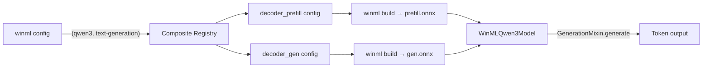

# Qwen3 — Composite Models

Qwen3 (`Qwen/Qwen3-0.6B`, `Qwen/Qwen3-1.7B`, etc.) is a decoder-only large language model that uses grouped-query attention and a sliding-window KV cache. winml-cli treats it as a **composite model** — a model that is split into multiple ONNX sub-models that run together at inference time. For Qwen3, the two sub-models are:

| Sub-model | Role | Input shape (`input_ids`) | Output KV shape |
|-----------|------|--------------------------|-----------------|
| `decoder_prefill` | Processes the full prompt in chunks | `[1, 64]` | `[1, kv_heads, 64, head_dim]` |
| `decoder_gen` | Generates one token at a time | `[1, 1]` | `[1, kv_heads, 1, head_dim]` |

Both sub-models share the same weights and KV cache buffer. Splitting prefill from generation lets each ONNX graph have fully static shapes, which is required for efficient NPU compilation.

## Prerequisites

- winml-cli installed and `winml` on your PATH.
- A network connection to download Qwen3 weights from HuggingFace on first run.
- At least 4 GB free disk space (for `Qwen3-0.6B`; larger variants need more).

## Step 1: Generate build configs

```bash
winml config -m Qwen/Qwen3-0.6B --task text-generation -o qwen3.json
```

Because `(qwen3, text-generation)` is registered as a composite model, this command produces **two** config files — one per sub-model:

- `qwen3_decoder_prefill.json` — export config using `feature-extraction` task
- `qwen3_decoder_gen.json` — export config using `text2text-generation` task

Each config includes Qwen3-specific optimizations (dynamo export, opset 18, GeLU fusion, RMSNorm fusion, MatMul+Add fusion, clamp constant values, and remove-IsNaN-in-attention-mask).

## Step 2: Build each sub-model

Build both sub-models individually using their config files:

```bash
# Build the prefill sub-model
winml build -c qwen3_decoder_prefill.json -m Qwen/Qwen3-0.6B -o output/prefill

# Build the generation sub-model
winml build -c qwen3_decoder_gen.json -m Qwen/Qwen3-0.6B -o output/gen
```

Each `winml build` runs the full pipeline: export (via torch dynamo) → optimize → quantize → compile. The output directories contain the final ONNX files ready for inference.

To target a specific execution provider (e.g., QNN for NPU):

```bash
winml build -c qwen3_decoder_prefill.json -m Qwen/Qwen3-0.6B -o output/prefill --ep qnn
winml build -c qwen3_decoder_gen.json -m Qwen/Qwen3-0.6B -o output/gen --ep qnn
```

## Step 3: Benchmark each sub-model

```bash
winml perf output/prefill -d npu
winml perf output/gen -d npu
```

This lets you identify whether the prefill or generation phase is the bottleneck on your target hardware.

## Step 4: Run inference (Python API)

The `WinMLQwen3Model` class combines both sub-models into a single generation pipeline that implements HuggingFace's `GenerationMixin` interface:

```python
from winml.modelkit.models.hf.qwen import WinMLQwen3Model

# Build and load both sub-models in one call
model = WinMLQwen3Model.from_pretrained("Qwen/Qwen3-0.6B", task="text-generation")

# Or load pre-built ONNX files (skips re-export/optimization)
from winml.modelkit.models.auto import WinMLAutoModel
from transformers import AutoConfig

prefill = WinMLAutoModel.from_pretrained("output/prefill/model.onnx", skip_build=True)
gen = WinMLAutoModel.from_pretrained("output/gen/model.onnx", skip_build=True)
config = AutoConfig.from_pretrained("Qwen/Qwen3-0.6B")

model = WinMLQwen3Model(
    sub_models={"decoder_prefill": prefill, "decoder_gen": gen},
    config=config,
)

# Generate text using HF's standard generate() API
from transformers import AutoTokenizer

tokenizer = AutoTokenizer.from_pretrained("Qwen/Qwen3-0.6B")
inputs = tokenizer("Hello, how are you?", return_tensors="pt")
output_ids = model.generate(**inputs, max_new_tokens=50)
print(tokenizer.decode(output_ids[0], skip_special_tokens=True))
```

### Customizing shape config per sub-model

You can pass different `shape_config` to each sub-model via `sub_model_kwargs`:

```python
model = WinMLQwen3Model.from_pretrained(
    "Qwen/Qwen3-0.6B",
    task="text-generation",
    sub_model_kwargs={
        "decoder_prefill": {"shape_config": {"max_cache_len": 512, "seq_len": 64}},
        "decoder_gen":     {"shape_config": {"max_cache_len": 512, "seq_len": 1}},
    },
)
```

## How it works internally

The composite model architecture for Qwen3:



Key design decisions:

- **Dynamo export required** — TorchScript fails for Qwen3; dynamo produces opset 18 graphs.
- **Sliding-window KV cache** — Uses Slice+Concat (FIFO) instead of index_copy_. New KV tokens are appended at the end of the buffer; oldest tokens are evicted.
- **Static shapes throughout** — Both sub-models have fixed input/output shapes, enabling ahead-of-time compilation for NPU.
- **GenericTask registration** — Sub-models are registered as `WinMLModelForGenericTask` so their raw ONNX outputs (logits + KV) are preserved without task-specific post-processing.

## Other composite models

The same composite model pattern is used for:

- **T5** (`google-t5/t5-small`) — encoder + decoder architecture for translation/summarization
- **Mu2** — encoder-decoder with custom code (`trust_remote_code=True`)

## See also

- [BERT — Config + Build + Perf](bert-config-build.md) — single-model workflow
- [ConvNeXt — Primitive commands](convnext-primitives.md) — step-by-step pipeline
- [Config and build](../concepts/config-and-build.md) — concept overview
