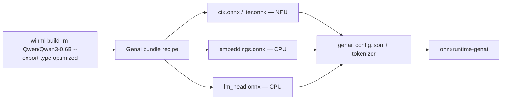

# Qwen3 — Genai Bundle

Qwen3 (`Qwen/Qwen3-0.6B`) is a decoder-only LLM. To run it on the NPU with
[onnxruntime-genai](https://github.com/microsoft/onnxruntime-genai), the model is
exported as a **bundle** — a directory of cooperating ONNX graphs plus the
runtime metadata and tokenizer that onnxruntime-genai loads together:

| File | Role | Device | Precision |
|------|------|--------|-----------|
| `ctx.onnx` | Transformer **prefill** graph (processes the prompt) | NPU (QNN) | `w8a16` |
| `iter.onnx` | Transformer **decode** graph (one token per step) | NPU (QNN) | `w8a16` |
| `embeddings.onnx` | Token embedding lookup | CPU | `fp32` |
| `lm_head.onnx` | Final vocab projection | CPU | `w4a32` |
| `genai_config.json` + tokenizer | onnxruntime-genai runtime metadata | — | — |

`ctx.onnx` and `iter.onnx` are the two sub-models of Qwen3's transformer-only
composite: prefill bakes in a context sequence length, decode is fixed to a
single token. The embedding table and vocab projection stay on CPU. Splitting the
model this way lets the compute-heavy transformer run on the NPU HTP while the
memory-bound companions stay on CPU.

## Prerequisites

- winml-cli installed and `winml` on your PATH.
- A network connection to download Qwen3 weights from HuggingFace on first run.
- An NPU target with the QNN execution provider available.

## Overall workflow



## Step 1: Build the bundle (one command)

`--export-type optimized` switches `winml build` from the stock per-model ONNX
output to the full genai bundle. It resolves `--ep`/`--device` like a normal
build — honoring an explicit value, otherwise probing the host — and builds the
recipe for that resolved target, so on an NPU host no flags are needed:

```bash
winml build -m Qwen/Qwen3-0.6B -o out/qwen3-bundle --export-type optimized
```

This builds (or reuses from cache) all four components and assembles them, writing
`out/qwen3-bundle/genai_config.json` alongside the ONNX graphs and tokenizer.
`--output-dir` is required — the bundle is a directory — and `--use-cache` is not
supported for bundles. On a host without the NPU the resolved target has no recipe
and the build fails fast; pin `--ep qnn --device npu` to build the bundle anywhere
(e.g. CI), since an explicit target skips host detection.

The Qwen3 transformer's quantization scheme is fixed by its recipe (`w8a16`, the
scheme its QNN HTP export is tuned for), so it is not overridable — passing a
`--precision` that differs from `w8a16` is rejected rather than silently reverted.
The CPU companions likewise keep their bundle-standard precisions.

Force a clean rebuild of every component with `--rebuild`.

!!! note "Backward-compatible shortcut"
    When `--export-type` is omitted, an **explicit `--ep qnn`** targeting the NPU
    still routes a registered family to its bundle. The NPU target may be
    explicit (`--device npu`) or resolved from `auto` — whether `--device auto`
    is typed or `--device` is omitted:

    ```bash
    winml build -m Qwen/Qwen3-0.6B -o out/qwen3-bundle --device npu --ep qnn
    # or, letting device auto-detection pick the NPU (--device may be omitted):
    winml build -m Qwen/Qwen3-0.6B -o out/qwen3-bundle --ep qnn
    ```

    Qwen3 on any other target — CPU, GPU, or an auto-detected NPU *without* an
    explicit `--ep qnn` — still produces the stock composite build. `--export-type
    generic` always forces the stock build, even on the NPU. A pinned
    `--ep`/`--device` that contradicts the recipe fails fast rather than silently
    reverting.

## Step 2: Tune context and prefill lengths (optional)

`winml build` uses the recipe defaults: context length (static KV cache) `2048`
and prefill sequence length `64`. To change those, use the equivalent developer
script, which exposes the extra knobs and delegates to the same builder:

```bash
uv run python scripts/qwen3.py export \
  --device npu \
  --output out/qwen3-bundle \
  --max-cache-len 4096 \
  --prefill-seq-len 128
```

The script also accepts `--embeddings <onnx>` and `--lm-head <onnx>` to reuse
pre-built companions (skipping their builds), and `--force-rebuild` to rebuild
everything from scratch.

## Step 3: Run the bundle (generate text)

The assembled bundle runs through onnxruntime-genai. Benchmark prompt processing
and token generation on the NPU with `winml perf`:

```bash
winml perf -m out/qwen3-bundle --runtime winml-genai --device npu --compile \
  --compile-timeout 600 --max-new-tokens 20 --prompt "What is the capital of France?"
```

`--device npu` selects the QNN execution provider: `winml perf` registers the WinML
QNN EP and the bundle's `context` and `iterator` stages run on the NPU HTP, while the
CPU companions handle the embedding lookup and vocab projection. The command reports
time-to-first-token (prefill) and decode throughput, and writes a results JSON under
`~/.cache/winml/perf/`.

!!! tip "One command from a model id (auto-build)"
    `winml perf --runtime winml-genai` also accepts a HuggingFace **model id** directly.
    When `-m` is not a prebuilt bundle directory, it builds the genai bundle on demand
    (into `~/.cache/winml/`, reused on later runs) and then benchmarks it — no separate
    `winml build` step:

    ```bash
    winml perf -m Qwen/Qwen3-0.6B --runtime winml-genai --compile \
      --compile-timeout 600 --max-new-tokens 20 --prompt "What is the capital of France?"
    ```

    The auto-build always targets the NPU HTP via QNN (the only supported genai bundle
    target today). `-o/--output` stays the results-JSON path, and `--rebuild` forces a
    fresh bundle. To persist the bundle at a specific directory instead, run `winml build`
    (Step 1) and point `perf -m` at that folder.

!!! warning "`--compile` is required on the NPU"
    The genai NPU path needs `--compile` (EPContext pre-compilation): each QNN stage is
    compiled once to a context binary before generation. Without `--compile`,
    onnxruntime-genai compiles the QNN context in-memory at model-creation time, which
    can fault before the first token. Use `--compile-timeout <seconds>` to bound how long
    each stage may take before falling back to the original ONNX.

!!! note "Known caveat: non-zero exit on teardown"
    On Windows ARM64, after generation completes and the results JSON is saved, the
    process may exit with a native `0xC0000374` (heap corruption) during
    onnxruntime-genai / QNN-EP **teardown**. This fires after all work is done — the
    generated tokens and the saved perf metrics are unaffected — and originates in the
    native runtime below winml-cli, not in the bundle or the build.

## How it maps to the composite system

The bundle reuses winml-cli's existing composite-model machinery — it does not add
a parallel export path:

- The transformer (`ctx` + `iter`) is the registered `qwen3_transformer_only`
  composite, built for the NPU with `w8a16` precision.
- `embeddings` and `lm_head` are built as ordinary single models on CPU.
- A final assembly step applies the Qwen3 ONNX passes, writes the QNN stage
  session options, and emits `genai_config.json`.

Every model-specific value lives in a data-only **genai-bundle recipe** registered
by the Qwen3 model package, so the `winml build` routing itself stays
architecture-agnostic. Registering a recipe for another decoder family is all that
is needed to give it the same one-command bundle build.

## See also

- [winml build](../commands/build.md) — full flag reference and the genai-bundle trigger
- [CLIP — Composite Models](clip-composite.md) — the composite-model pattern this builds on
- [Supported Models](../reference/supported-models.md) — validated architectures
- [Output Layout](../reference/output-layout.md) — what each output file contains
