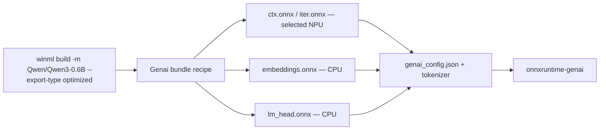

# Qwen3 — Genai Bundle

Qwen3 (`Qwen/Qwen3-0.6B`) is a decoder-only LLM. To run it on the NPU with
[onnxruntime-genai](https://github.com/microsoft/onnxruntime-genai), the model is
exported as a **bundle** — a directory of cooperating ONNX graphs plus the
runtime metadata and tokenizer that onnxruntime-genai loads together:

| File | Role | Device | Precision |
|------|------|--------|-----------|
| `ctx.onnx` | Transformer **prefill** graph (processes the prompt) | NPU (QNN, VitisAI, or OpenVINO) | `w8a16` |
| `iter.onnx` | Transformer **decode** graph (one token per step) | NPU (QNN, VitisAI, or OpenVINO) | `w8a16` |
| `embeddings.onnx` | Token embedding lookup | CPU | `fp32` |
| `lm_head.onnx` | Final vocab projection | CPU | `w4a32` |
| `genai_config.json` + tokenizer | onnxruntime-genai runtime metadata | — | — |

`ctx.onnx` and `iter.onnx` are the two sub-models of Qwen3's transformer-only
composite: prefill bakes in a context sequence length, decode is fixed to a
single token. The embedding table and vocab projection stay on CPU. Splitting the
model this way lets the compute-heavy transformer run on the selected NPU while
the memory-bound companions stay on CPU. On Intel, OpenVINO runs the `context`
and `iterator` stages on the NPU; the embedding lookup and `lm_head` projection
remain on CPU.

## Prerequisites

- winml-cli installed and `winml` on your PATH.
- A network connection to download Qwen3 weights from HuggingFace on first run.
- For NPU inference, a compatible QNN (Qualcomm), VitisAI (AMD), or OpenVINO
  (Intel) execution provider. Intel NPU runs also require a compatible Intel NPU
  driver and OpenVINO NPU plugin, available through a compatible ONNX Runtime
  OpenVINO EP installation. CPU inference does not require an NPU provider.

## Overall workflow


```mermaid
graph LR
    A["winml build -m Qwen/Qwen3-0.6B --export-type optimized"] --> B[Genai bundle recipe]
    B --> C[ctx.onnx / iter.onnx — selected NPU]
    B --> D[embeddings.onnx — CPU]
    B --> E[lm_head.onnx — CPU]
    C --> F[genai_config.json + tokenizer]
    D --> F
    E --> F
    F --> G[onnxruntime-genai]
```

## Step 1: Build the bundle (one command)

`--export-type optimized` switches `winml build` from the stock per-model ONNX
output to the full genai bundle. It resolves `--ep`/`--device` like a normal
build — honoring an explicit value, otherwise probing the host — and builds the
recipe for that resolved target, so on an NPU host no flags are needed:

```bash
winml build -m Qwen/Qwen3-0.6B -o out/qwen3-bundle --export-type optimized
```

This builds (or reuses from cache) all four components and assembles them, writing
`out/qwen3-bundle/genai_config.json` alongside the ONNX graphs and tokenizer.
`--output-dir` is required — the bundle is a directory — and `--use-cache` is not
supported for bundles. The recipe supports CPU, QNN/NPU, VitisAI/NPU, and
OpenVINO/NPU; other resolved targets fail fast. Pin the provider to select a
target explicitly:

```bash
# Qualcomm Snapdragon NPU
winml build -m Qwen/Qwen3-0.6B -o out/qwen3-bundle \
  --export-type optimized --ep qnn --device npu

# AMD Ryzen AI NPU
winml build -m Qwen/Qwen3-0.6B -o out/qwen3-bundle \
  --export-type optimized --ep vitisai --device npu

# Intel NPU (OpenVINO)
winml build -m Qwen/Qwen3-0.6B -o out/qwen3-bundle \
  --export-type optimized --ep openvino --device npu
```

The Qwen3 transformer's quantization scheme is fixed by its recipe (`w8a16`, the
scheme its NPU export is tuned for), so it is not overridable — passing a
`--precision` that differs from `w8a16` is rejected rather than silently reverted.
The CPU companions likewise keep their bundle-standard precisions.

Force a clean rebuild of every component with `--rebuild`.

!!! note "Backward-compatible shortcut"
    When `--export-type` is omitted, an **explicit `--ep qnn`** targeting the NPU
    still routes a registered family to its bundle. The NPU target may be
    explicit (`--device npu`) or resolved from `auto` — whether `--device auto`
    is typed or `--device` is omitted:

    ```bash
    winml build -m Qwen/Qwen3-0.6B -o out/qwen3-bundle --device npu --ep qnn
    # or, letting device auto-detection pick the NPU (--device may be omitted):
    winml build -m Qwen/Qwen3-0.6B -o out/qwen3-bundle --ep qnn
    ```

    Qwen3 on any other target — CPU, GPU, or an auto-detected NPU *without* an
    explicit `--ep qnn` — still produces the stock composite build. `--export-type
    generic` always forces the stock build, even on the NPU. A pinned
    `--ep`/`--device` that contradicts the recipe fails fast rather than silently
    reverting.

## Step 2: Run the bundle (generate text)

The assembled bundle runs through onnxruntime-genai. Benchmark prompt processing
and token generation on the NPU with `winml perf`:

```bash
# Qualcomm Snapdragon NPU
winml perf -m out/qwen3-bundle --runtime ort-genai --device npu --compile \
  --compile-timeout 600 --max-new-tokens 20 --prompt "What is the capital of France?"

# AMD Ryzen AI NPU
winml perf -m out/qwen3-bundle --runtime ort-genai --device npu --ep vitisai --compile \
  --compile-timeout 600 --max-new-tokens 20 --prompt "What is the capital of France?"

# Intel NPU (OpenVINO)
winml perf -m out/qwen3-bundle --runtime ort-genai --device npu --ep openvino --compile \
  --compile-timeout 600 --max-new-tokens 20 --prompt "What is the capital of France?"
```

`winml perf` registers the selected WinML EP and runs the bundle's `context` and
`iterator` stages on that NPU, while the CPU companions handle the embedding
lookup and vocab projection. The command reports canonical GenAI phases:
session/native load, best-effort weight-upload estimate, cold-start TTFT/total,
request/model TTFT, prefill throughput, steady-state decode throughput, full
request latency, optional RAM/VRAM deltas, and a results JSON under
`~/.cache/winml/perf/`. Exact weight-upload telemetry is currently `null` because
onnxruntime-genai does not expose it; the estimate is labeled in JSON.
Intel NPU availability and performance depend on the installed driver, OpenVINO
plugin, hardware, and model compatibility; this Qwen3 recipe does not imply that
all Intel NPU models are supported.

!!! tip "One command from a model id (auto-build)"
    `winml perf --runtime ort-genai` also accepts a HuggingFace **model id** directly.
    When `-m` is not a prebuilt bundle directory, it builds the genai bundle on demand
    (into `~/.cache/winml/`, reused on later runs) and then benchmarks it — no separate
    `winml build` step:

    ```bash
    winml perf -m Qwen/Qwen3-0.6B --runtime ort-genai --compile \
      --compile-timeout 600 --max-new-tokens 20 --prompt "What is the capital of France?"
    ```

    Without a device or EP override, the model-ID shortcut targets QNN/NPU.
    An explicit `--device` or `--ep` also selects the transformer build target,
    not just the inference target. To auto-build for an Intel NPU, explicitly
    select OpenVINO:

    ```bash
    winml perf -m Qwen/Qwen3-0.6B --runtime ort-genai --ep openvino --device npu \
      --compile --compile-timeout 600 --max-new-tokens 20 \
      --prompt "What is the capital of France?"
    ```

    Optional OpenVINO NPU tuning can be passed at runtime with the repeatable
    `--ep-options KEY=VALUE` option. For example, this sets the OpenVINO
    `load_config` provider option while running the model:

    ```bash
    winml perf -m Qwen/Qwen3-0.6B --runtime ort-genai --ep openvino --device npu \
      --ep-options 'load_config={"NPU":{"NPU_TURBO":"YES"}}' \
      --compile --compile-timeout 600 \
      --max-new-tokens 20 --prompt "What is the capital of France?"
    ```

    `--ep-options` is forwarded to `GenaiSession` and overrides provider options
    on the selected hardware stages at runtime; its values are not embedded in
    a model-ID auto-built bundle. If overriding `load_config`, include all NPU
    properties you want in its JSON value. These vendor-specific options are
    optional; omit them to use the bundle's OpenVINO settings. For example, a
    CPU run does not require QNN:

    ```bash
    winml perf -m Qwen/Qwen3-0.6B --runtime ort-genai --device cpu \
      --warmup 2 --iterations 10 --max-new-tokens 20 \
      --prompt "What is the capital of France?"
    ```

    Use `--ep vitisai --device npu --compile` for VitisAI. Auto-building rejects
    targets not supported by the recipe; a prebuilt bundle can still be passed
    to `perf` for a runtime override. Explicit targets have
    separate bundle caches, so a CPU run never reuses a QNN build. CPU companions
    retain their recipe precisions. `-o/--output` stays the results-JSON path,
    and `--rebuild` forces a fresh bundle for the selected target.

## How it maps to the composite system

The bundle reuses winml-cli's existing composite-model machinery — it does not add
a parallel export path:

- The transformer (`ctx` + `iter`) is the registered `qwen3_transformer_only`
  composite, built for the NPU with `w8a16` precision.
- `embeddings` and `lm_head` are built as ordinary single models on CPU.
- A final assembly step applies the Qwen3 ONNX passes, writes the selected NPU stage
  session options, and emits `genai_config.json`.

Every model-specific value lives in a data-only **genai-bundle recipe** registered
by the Qwen3 model package, so the `winml build` routing itself stays
architecture-agnostic. Registering a recipe for another decoder family is all that
is needed to give it the same one-command bundle build.

## See also

- [winml build](../commands/build.md) — full flag reference and the genai-bundle trigger
- [CLIP — Composite Models](clip-composite.md) — the composite-model pattern this builds on
- [Supported Models](../reference/supported-models.md) — validated architectures
- [Output Layout](../reference/output-layout.md) — what each output file contains
